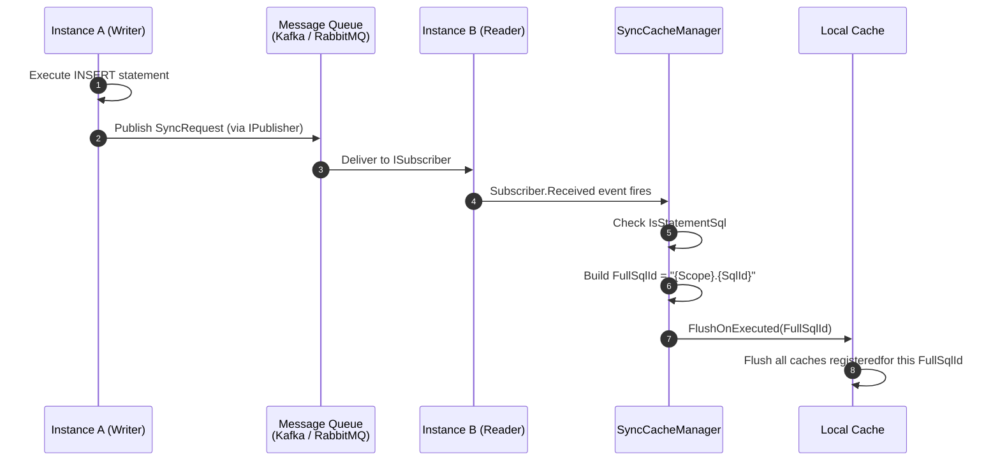
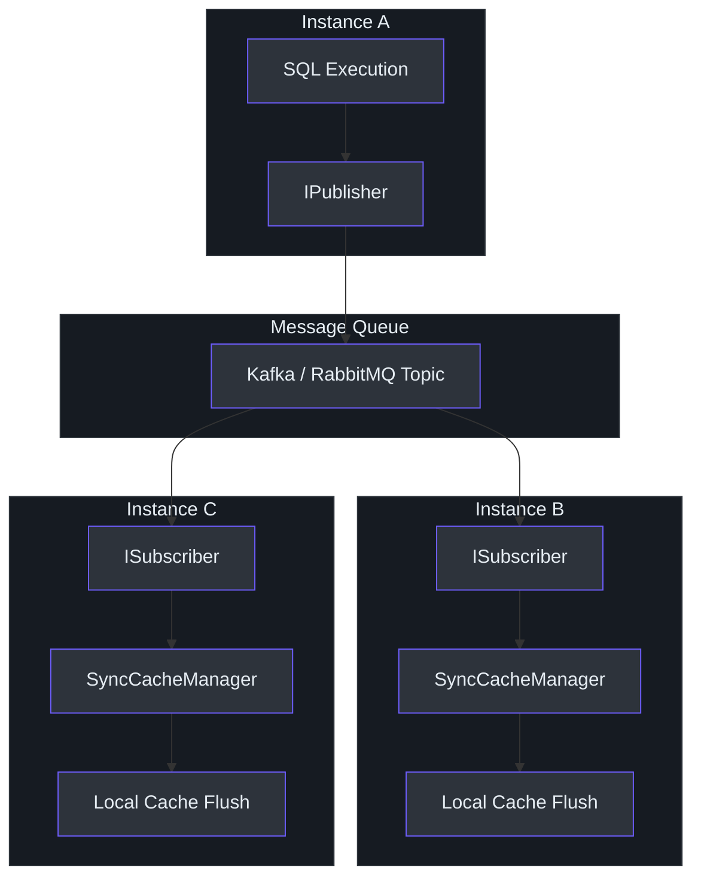

# 缓存同步

在多实例部署中，每个应用实例维护自己的本地缓存。当某个实例执行写操作（INSERT、UPDATE、DELETE）时，其他实例的缓存会变得过时。`SmartSql.Cache.Sync` 包通过监听 [InvokeSync](./invoke-sync.md) 扩展发布的消息队列事件，在其他实例上执行数据变更 SQL 语句时刷新本地缓存，从而解决这一问题。

## 一览表

| 特性 | 描述 |
|---------|-------------|
| 包名 | `SmartSql.Cache.Sync` |
| 关键类 | `SyncCacheManager` |
| 继承自 | `AbstractCacheManager` |
| 依赖于 | `SmartSql.InvokeSync`（`ISubscriber`） |
| 机制 | 订阅 `ISubscriber.Received` 事件，刷新匹配的缓存 |

## 工作原理

`SyncCacheManager` 扩展了标准的 `AbstractCacheManager`，并覆盖了 `ListenInvokeSucceeded()` 以订阅消息队列事件，替代（或补充）本地调用事件：



<!-- Sources: src/SmartSql.Cache.Sync/SyncCacheManager.cs:9, src/SmartSql.Cache.Sync/SyncCacheManager.cs:22 -->

## 架构



<!-- Sources: src/SmartSql.Cache.Sync/SyncCacheManager.cs:9 -->

## SyncCacheManager 内部实现

实现非常简洁。`SyncCacheManager` 覆盖了 `AbstractCacheManager` 的 `ListenInvokeSucceeded()` 钩子：

```csharp
protected override void ListenInvokeSucceeded()
{
    _subscriber.Received += SubscriberOnReceived;
}

private void SubscriberOnReceived(object sender, SyncRequest e)
{
    if (!e.IsStatementSql)
    {
        return;
    }
    FlushOnExecuted($"{e.Scope}.{e.SqlId}");
}
```

关键行为：
1. 仅处理 `IsStatementSql == true` 的请求（跳过非 SQL 操作）。
2. 从 `SyncRequest` 的 `Scope` 和 `SqlId` 构造 `FullSqlId`。
3. 调用 `FlushOnExecuted()`，触发为该语句注册的所有缓存刷新处理器。

## 配置

### 注册

```csharp
services
    .AddSmartSql("SmartSql")
    .AddInvokeSync(options =>
    {
        options.StatementType = StatementType.Write;
    })
    .AddKafkaPublisher(options =>
    {
        options.Servers = "localhost:9092";
        options.Topic = "smartsql-sync";
    })
    .AddKafkaSubscriber(options =>
    {
        options.Servers = "localhost:9092";
        options.Topic = "smartsql-sync";
    });

// In Configure():
app.ApplicationServices.UseSmartSqlSync();
app.ApplicationServices.UseSmartSqlSubscriber(syncRequest => { });
```

### 替换默认缓存管理器

要使用 `SyncCacheManager` 替代默认缓存管理器，注入 `ISubscriber` 并手动创建：

```csharp
var subscriber = sp.GetRequiredService<ISubscriber>();
builder.UseCacheManager(new SyncCacheManager(subscriber));
```

## SyncRequest 结构

`SyncRequest` 对象携带触发同步的 SQL 操作的所有信息：

| 属性 | 类型 | 描述 |
|---|---|---|
| `Id` | `Guid` | 唯一请求标识符 |
| `Scope` | `string` | XML SqlMap scope（如 "User"） |
| `SqlId` | `string` | 语句 ID（如 "Insert"、"Update"） |
| `IsStatementSql` | `bool` | 是否为真实 SQL 语句 |
| `StatementType` | `StatementType?` | Select、Insert、Update、Delete |
| `Parameters` | `IDictionary<string, object>` | 使用的 SQL 参数 |
| `Result` | `object` | 执行结果 |

## 交叉参考

- **[InvokeSync 与消息传递](./invoke-sync.md)** -- 创建 `SyncRequest` 消息的发布端。
- **[Redis 缓存](./redis-cache.md)** -- 可被同步的基于 Redis 的缓存。
- **[DI 集成](./di-extension.md)** -- 如何在 DI 中配置 `SyncCacheManager`。

## 参考资料

- [SyncCacheManager.cs](https://github.com/dotnetcore/SmartSql/blob/master/src/SmartSql.Cache.Sync/SyncCacheManager.cs) -- 完整实现
- [AbstractCacheManager.cs](https://github.com/dotnetcore/SmartSql/blob/master/src/SmartSql/Cache/AbstractCacheManager.cs) -- 带 FlushOnExecute 支持的基类
- [ISubscriber.cs](https://github.com/dotnetcore/SmartSql/blob/master/src/SmartSql.InvokeSync/ISubscriber.cs) -- SyncCacheManager 消费的订阅者接口
- [SyncRequest.cs](https://github.com/dotnetcore/SmartSql/blob/master/src/SmartSql.InvokeSync/SyncRequest.cs) -- 消息负载结构
