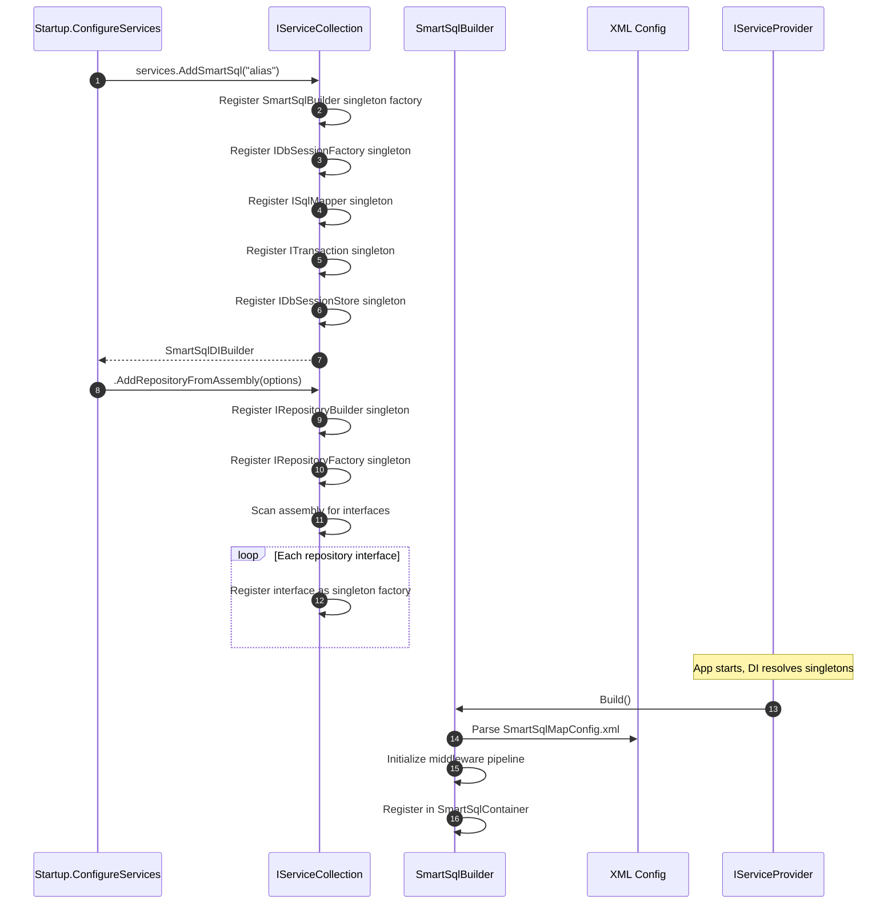
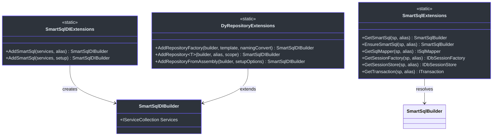
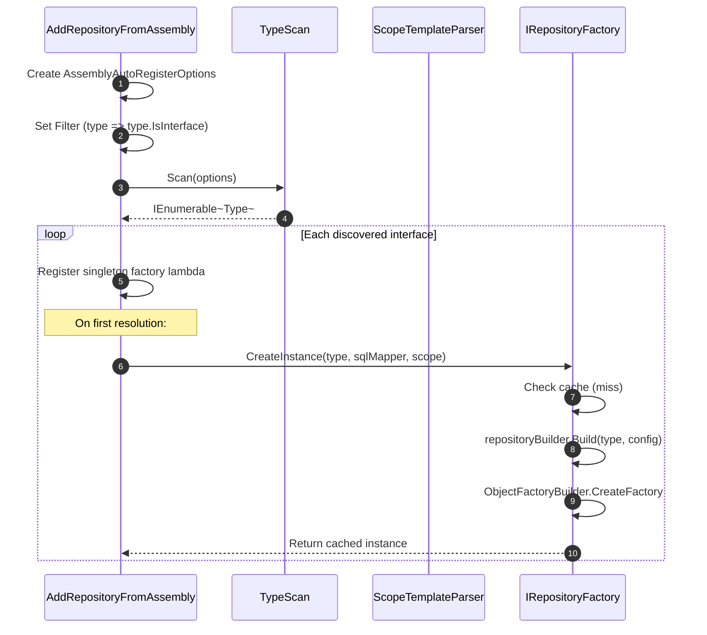
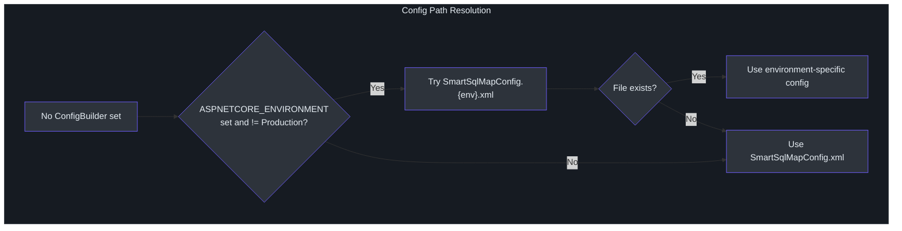

# DI 集成

`SmartSql.DIExtension` 包提供了与 ASP.NET Core 依赖注入容器的无缝集成。它将 `SmartSqlBuilder`、`ISqlMapper`、`IDbSessionFactory` 和动态仓储代理注册为单例服务，这样你的控制器和服务就能通过构造函数注入接收它们，无需手动接线。

## 一览表

| 特性 | 描述 |
|---------|-------------|
| 包名 | `SmartSql.DIExtension` |
| 入口 | `services.AddSmartSql()` |
| 实例查找 | 按 `Alias`（默认：`"SmartSql"`） |
| 仓储注册 | 单个 `AddRepository<T>()` 或通过 `AddRepositoryFromAssembly()` 程序集扫描 |
| 自动配置解析 | 解析 `SmartSqlMapConfig.xml` 或环境特定变体 |
| 所需框架 | ASP.NET Core 2.0+ / Microsoft.Extensions.DependencyInjection |

## 注册流程

当调用 `services.AddSmartSql()` 时，将发生以下流程：



<!-- Sources: src/SmartSql.DIExtension/SmartSqlDIExtensions.cs:16, src/SmartSql.DIExtension/DyRepositoryExtensions.cs:65 -->

## 服务注册详情

`AddSmartSql()` 扩展方法将以下核心服务注册为单例：

| 服务类型 | 解析方式 |
|---|---|
| `SmartSqlBuilder` | 工厂 lambda，构建一次，共享使用 |
| `ISqlMapper` | `builder.SqlMapper` |
| `IDbSessionFactory` | `builder.DbSessionFactory` |
| `ITransaction` | `builder.SqlMapper`（同一实例） |
| `IDbSessionStore` | `builder.SmartSqlConfig.SessionStore` |



<!-- Sources: src/SmartSql.DIExtension/SmartSqlDIBuilder.cs:9, src/SmartSql.DIExtension/SmartSqlExtensions.cs:12, src/SmartSql.DIExtension/DyRepositoryExtensions.cs:11 -->

## 命名实例支持

SmartSql 支持多个命名实例，每个实例通过 `Alias` 标识。当你的应用连接多个数据库时，这非常有用：

```csharp
// Register first instance (default alias "SmartSql")
services.AddSmartSql("MasterDb");

// Register second instance
services.AddSmartSql("SlaveDb");

// Resolve by alias
var masterMapper = sp.GetSqlMapper("MasterDb");
var slaveMapper = sp.GetSqlMapper("SlaveDb");
```

## 仓储注册

### 注册单个仓储

```csharp
services.AddSmartSql("MyDb")
    .AddRepository<IUserRepository>("MyDb");
```

### 从程序集注册所有仓储

`AddRepositoryFromAssembly` 方法扫描程序集中的接口并将其注册为动态仓储单例：



<!-- Sources: src/SmartSql.DIExtension/DyRepositoryExtensions.cs:65, src/SmartSql.DyRepository/RepositoryFactory.cs:24 -->

`AssemblyAutoRegisterOptions` 类控制扫描行为：

| 属性 | 类型 | 默认值 | 描述 |
|---|---|---|---|
| `SmartSqlAlias` | `string` | `"SmartSql"` | 绑定到哪个 SmartSql 实例 |
| `ScopeTemplate` | `string` | `"I{Scope}Repository"` | 从类型名提取 scope 的模板 |
| `AssemblyString` | `string` | -- | 要扫描的程序集名称 |
| `Filter` | `Func<Type, bool>` | `type.IsInterface` | 额外的类型过滤器 |

## 自动配置路径解析

当未提供显式配置时，`AddSmartSql()` 会自动解析 XML 配置路径：



<!-- Sources: src/SmartSql.DIExtension/SmartSqlDIExtensions.cs:53 -->

## 完整示例

来自示例 ASP.NET Core 应用：

```csharp
public class Startup
{
    public IServiceProvider ConfigureServices(IServiceCollection services)
    {
        services.AddControllers();
        services
            .AddSmartSql((sp, builder) =>
            {
                builder.UseProperties(Configuration);
            })
            .AddRepositoryFromAssembly(o =>
            {
                o.AssemblyString = "SmartSql.Sample.AspNetCore";
                o.Filter = (type) =>
                    type.Namespace == "SmartSql.Sample.AspNetCore.DyRepositories";
            });

        services.AddSingleton<UserService>();
        return services.BuildAspectInjectorProvider();
    }
}
```

## API 参考

### SmartSqlDIExtensions

| 方法 | 返回值 | 描述 |
|---|---|---|
| `AddSmartSql(services, alias)` | `SmartSqlDIBuilder` | 使用默认配置路径注册 |
| `AddSmartSql(services, setup)` | `SmartSqlDIBuilder` | 使用自定义构建器配置注册 |
| `AddSmartSql(services, Func<ISP, SmartSqlBuilder>)` | `SmartSqlDIBuilder` | 使用完整工厂控制注册 |

### DyRepositoryExtensions

| 方法 | 返回值 | 描述 |
|---|---|---|
| `AddRepositoryFactory(builder)` | `SmartSqlDIBuilder` | 注册 `IRepositoryBuilder` 和 `IRepositoryFactory` |
| `AddRepository<T>(builder, alias, scope)` | `SmartSqlDIBuilder` | 注册单个仓储接口 |
| `AddRepositoryFromAssembly(builder, options)` | `SmartSqlDIBuilder` | 从程序集扫描批量注册仓储 |

### SmartSqlExtensions

| 方法 | 返回值 | 描述 |
|---|---|---|
| `GetSmartSql(sp, alias)` | `SmartSqlBuilder` | 按 alias 解析（可为 null） |
| `EnsureSmartSql(sp, alias)` | `SmartSqlBuilder` | 按 alias 解析（缺失时抛异常） |
| `GetSqlMapper(sp, alias)` | `ISqlMapper` | 获取指定 alias 的 mapper |
| `GetSessionFactory(sp, alias)` | `IDbSessionFactory` | 获取指定 alias 的会话工厂 |
| `GetSessionStore(sp, alias)` | `IDbSessionStore` | 获取指定 alias 的会话存储 |

## 交叉参考

- **[动态仓储](./dy-repository.md)** -- 生成代理内部工作原理的详情。
- **[Options 模式](./options.md)** -- 使用 `IOptions<SmartSqlConfigOptions>` 代替 XML 配置。
- **[AOP 事务](./aop.md)** -- 通过 AspectCore 集成为服务方法添加 `[Transaction]`。
- **[InvokeSync](./invoke-sync.md)** -- 在 SmartSql 旁注册消息队列发布者/订阅者。

## 参考资料

- [SmartSqlDIExtensions.cs](https://github.com/dotnetcore/SmartSql/blob/master/src/SmartSql.DIExtension/SmartSqlDIExtensions.cs) -- 核心 DI 注册
- [DyRepositoryExtensions.cs](https://github.com/dotnetcore/SmartSql/blob/master/src/SmartSql.DIExtension/DyRepositoryExtensions.cs) -- 仓储 DI 注册
- [SmartSqlDIBuilder.cs](https://github.com/dotnetcore/SmartSql/blob/master/src/SmartSql.DIExtension/SmartSqlDIBuilder.cs) -- AddSmartSql 返回的流式构建器
- [SmartSqlExtensions.cs](https://github.com/dotnetcore/SmartSql/blob/master/src/SmartSql.DIExtension/SmartSqlExtensions.cs) -- 服务解析辅助方法
- [AssemblyAutoRegisterOptions.cs](https://github.com/dotnetcore/SmartSql/blob/master/src/SmartSql.DIExtension/AssemblyAutoRegisterOptions.cs) -- 程序集扫描选项
- [SmartSqlBuilderExtensions.cs](https://github.com/dotnetcore/SmartSql/blob/master/src/SmartSql.DIExtension/SmartSqlBuilderExtensions.cs) -- IConfiguration 集成
- [Startup.cs](https://github.com/dotnetcore/SmartSql/blob/master/sample/SmartSql.Sample.AspNetCore/Startup.cs) -- 完整示例应用
