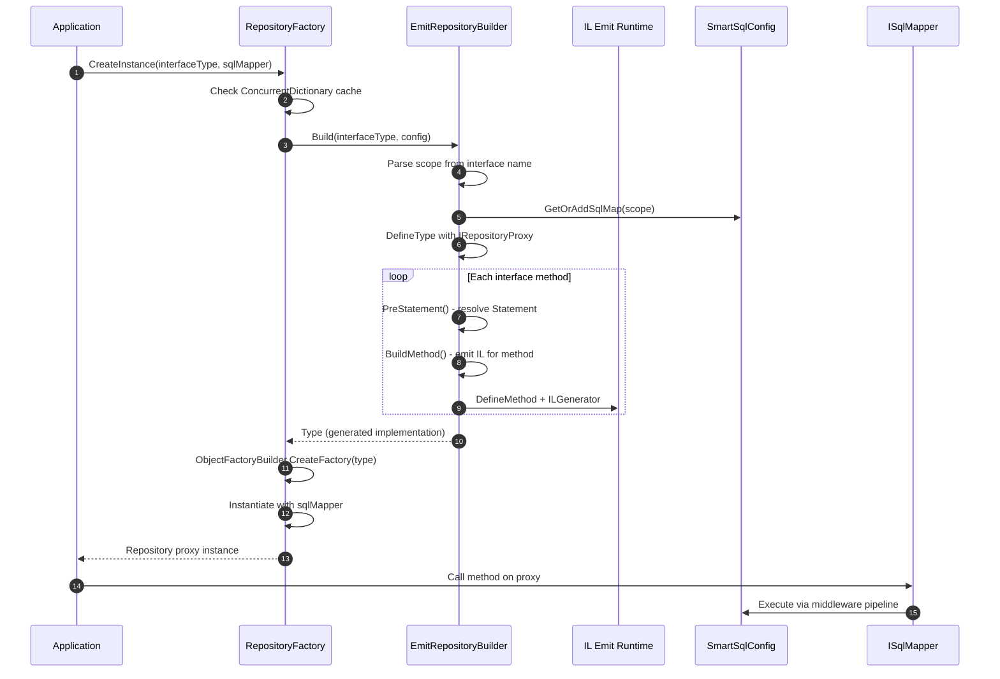
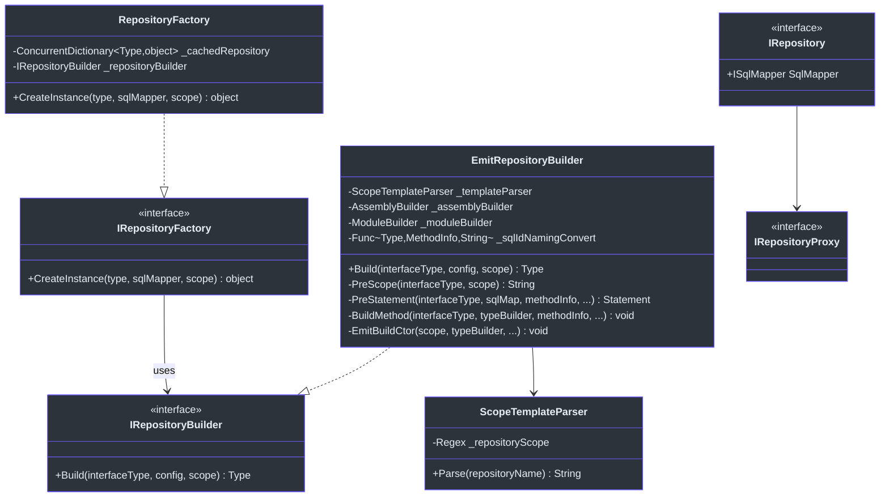
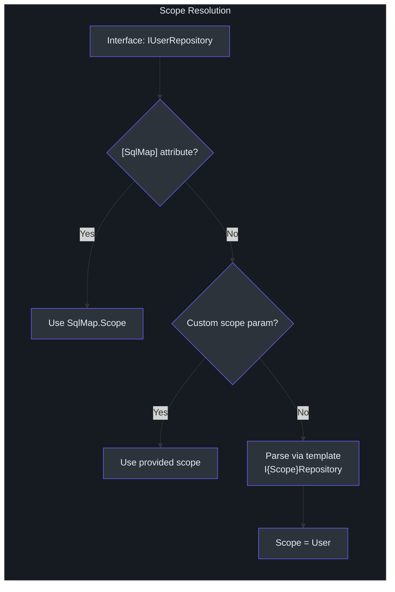
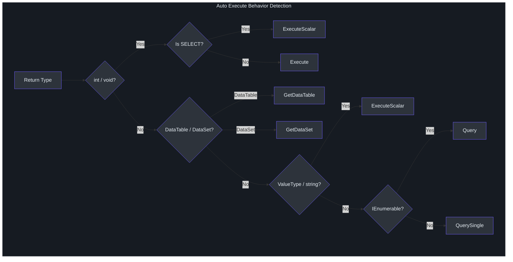

# 动态仓储

编写重复的 CRUD 仓储类是数据访问代码中最乏味的部分之一。`SmartSql.DyRepository` 扩展彻底消除了这一问题：你只需定义一个 C# 接口，SmartSql 便会在运行时使用 IL emit 生成功能完整的实现。生成的代理通过命名约定将每个方法映射到 XML 配置中的 SQL 语句，并支持通过注解对执行行为、参数、缓存和事务进行细粒度控制。

## 一览表

| 特性 | 描述 |
|---------|-------------|
| 代理生成 | 通过 `EmitRepositoryBuilder` 在运行时进行 IL emit |
| Scope 解析 | 由 `ScopeTemplateParser` 解析接口名称（默认模板：`I{Scope}Repository`） |
| 语句映射 | 方法名映射到 XML 配置中的 `Statement.Id` |
| 执行行为 | 从返回类型自动检测或通过 `[Statement]` 指定 |
| 参数 | 单个复杂对象或带 `[Param]` 的多个参数 |
| 事务 | DyRepository 接口使用 `[UseTransaction]` 属性 |
| 缓存 | 接口级别使用 `[Cache]`，方法级别使用 `[ResultCache]` |
| 同步/异步 | 同步和基于 `Task` 的异步方法均受支持 |

## 工作原理

当你从 `RepositoryFactory` 请求仓储实例时，将发生以下流程：



<!-- Sources: src/SmartSql.DyRepository/RepositoryFactory.cs:24, src/SmartSql.DyRepository/EmitRepositoryBuilder.cs:703 -->

## 类层次结构

下图展示了仓储代理生成涉及的关键类型：



<!-- Sources: src/SmartSql.DyRepository/IRepositoryFactory.cs:7, src/SmartSql.DyRepository/IRepositoryBuilder.cs:7, src/SmartSql.DyRepository/RepositoryFactory.cs:8, src/SmartSql.DyRepository/EmitRepositoryBuilder.cs:21, src/SmartSql.DyRepository/IRepository.cs:9 -->

## Scope 解析

`ScopeTemplateParser` 从仓储接口名称解析 XML `SqlMap.Scope`。默认模板为 `I{Scope}Repository`：

- 接口 `IUserRepository` 解析为 scope `User`
- 接口 `IOrderDetailRepository` 解析为 scope `OrderDetail`

你可以通过 `[SqlMap]` 属性或向 `EmitRepositoryBuilder` 传入自定义模板来自定义模板。



<!-- Sources: src/SmartSql.DyRepository/ScopeTemplateParser.cs:10, src/SmartSql.DyRepository/EmitRepositoryBuilder.cs:264, src/SmartSql.DyRepository/Annotations/SqlMapAttribute.cs:6 -->

## 命名约定

默认情况下，仓储接口上的方法名直接映射到 XML 配置中的 `Statement.Id`。对于异步方法，在查找前会去除 `Async` 后缀：

| 接口方法 | Statement Id |
|---|---|
| `Insert(entity)` | `Insert` |
| `GetById(id)` | `GetEntity`（通过 `[Statement]`） |
| `QueryAsync(params)` | `Query` |
| `DeleteByIdAsync(id)` | `Delete`（通过 `[Statement]`） |

你也可以提供自定义的 `sqlIdNamingConvert` 函数来以编程方式转换方法名。

## 执行行为

当 `ExecuteBehavior` 为 `Auto`（默认值）时，系统会从返回类型推断正确的执行策略：

| 返回类型 | 执行行为 |
|---|---|
| `int` / `void` / `Task<int>` / `Task` | `Execute`（受影响行数） |
| SELECT 语句上的 `int` | `ExecuteScalar`（第一行第一列） |
| 值类型 / `string` | `ExecuteScalar` |
| `IEnumerable<T>` / `IList<T>` | `Query` |
| 单个实体 | `QuerySingle` |
| `ValueTuple` | `QuerySingle` |
| `DataTable` | `GetDataTable` |
| `DataSet` | `GetDataSet` |



<!-- Sources: src/SmartSql.DyRepository/EmitRepositoryBuilder.cs:365, src/SmartSql.DyRepository/Annotations/StatementAttribute.cs:40 -->

## 注解

### `[SqlMap]` -- 接口级别

应用于仓储接口以覆盖 scope 解析：

```csharp
[SqlMap(Scope = "CustomScope")]
public interface IMyRepository
{
    // Maps to XML statement: CustomScope.Query
    IList<MyEntity> Query(object reqParams);
}
```

### `[Statement]` -- 方法级别

覆盖默认的语句映射行为：

| 属性 | 类型 | 描述 |
|---|---|---|
| `Id` | `string` | 自定义语句 ID（默认为方法名） |
| `Sql` | `string` | 内联 SQL（绕过 XML 查找） |
| `Execute` | `ExecuteBehavior` | 覆盖自动检测 |
| `CommandType` | `CommandType` | `Text` 或 `StoredProcedure` |
| `SourceChoice` | `DataSourceChoice` | 强制使用读或写数据源 |
| `ReadDb` | `string` | 指定读数据库名称 |
| `CommandTimeout` | `int` | 自定义命令超时时间 |
| `EnablePropertyChangedTrack` | `bool` | 启用属性变更跟踪 |

### `[Param]` -- 参数级别

将方法参数映射到 SQL 参数名：

```csharp
[Statement(Id = "Delete")]
int DeleteById([Param("Id")] long id);
```

| 属性 | 类型 | 描述 |
|---|---|---|
| `Name` | `string` | SQL 参数名 |
| `TypeHandler` | `string` | 使用的命名类型处理器 |

### `[UseTransaction]` -- 方法级别

将方法调用包装在数据库事务中。DyRepository 接口优先使用此注解而非 `[Transaction]`：

```csharp
[UseTransaction(Level = IsolationLevel.ReadCommitted)]
[Statement(Id = "Insert")]
long InsertWithTx(AllPrimitive entity);
```

### `[Cache]` -- 接口级别

在仓储接口上定义缓存配置：

```csharp
[Cache(Id = "AllPrimitives", Type = "LRU", CacheSize = 50, FlushInterval = 60)]
public interface IAllPrimitiveRepository { ... }
```

### `[ResultCache]` -- 方法级别

将方法结果与 `[Cache]` 定义的缓存关联：

```csharp
[ResultCache("AllPrimitives", Key = "QueryByPage:{PageSize}:{Page}")]
IList<AllPrimitive> QueryByPage(object reqParams);
```

## 内置 CRUD 接口

`SmartSql.DyRepository.CURD` 命名空间提供了预构建的泛型接口，可自动映射到标准的 CUD 操作：

```mermaid
classDiagram
    class IRepository {
        <<interface>>
        +ISqlMapper SqlMapper
    }
    class IRepository~TEntity,TPrimary~ {
        <<interface>>
    }
    class IInsert~TEntity~ {
        <<interface>>
        +Insert(entity) int
    }
    class IUpdate~TEntity~ {
        <<interface>>
        +Update(entity) int
        +DyUpdate(dyObj) int
    }
    class IDelete~TPrimary~ {
        <<interface>>
        +Delete(reqParams) int
        +DeleteById(id) int
    }
    class IGetEntity~TEntity,TPrimary~ {
        <<interface>>
        +GetEntity(reqParams) TEntity
        +GetById(id) TEntity
    }
    class IQuery~TEntity~ {
        <<interface>>
        +Query(reqParams) IList~TEntity~
    }
    class IQueryByPage~TEntity~ {
        <<interface>>
        +QueryByPage(reqParams) IList~TEntity~
    }
    class IIsExist {
        <<interface>>
    }

    IRepository~TEntity,TPrimary~ --|> IRepository
    IRepository~TEntity,TPrimary~ --|> IInsert
    IRepository~TEntity,TPrimary~ --|> IUpdate
    IRepository~TEntity,TPrimary~ --|> IDelete
    IRepository~TEntity,TPrimary~ --|> IGetEntity
    IRepository~TEntity,TPrimary~ --|> IQuery
    IRepository~TEntity,TPrimary~ --|> IQueryByPage
    IRepository~TEntity,TPrimary~ --|> IIsExist

    style IRepository fill:#2d333b,stroke:#6d5dfc,color:#e6edf3
    style IRepository fill:#2d333b,stroke:#6d5dfc,color:#e6edf3
    style IInsert fill:#2d333b,stroke:#6d5dfc,color:#e6edf3
    style IUpdate fill:#2d333b,stroke:#6d5dfc,color:#e6edf3
    style IDelete fill:#2d333b,stroke:#6d5dfc,color:#e6edf3
    style IGetEntity fill:#2d333b,stroke:#6d5dfc,color:#e6edf3
    style IQuery fill:#2d333b,stroke:#6d5dfc,color:#e6edf3
    style IQueryByPage fill:#2d333b,stroke:#6d5dfc,color:#e6edf3
    style IIsExist fill:#2d333b,stroke:#6d5dfc,color:#e6edf3
```



<!-- Sources: src/SmartSql.DyRepository/IRepository.cs:18, src/SmartSql.DyRepository/CURD/IInsert.cs:8, src/SmartSql.DyRepository/CURD/IUpdate.cs:9, src/SmartSql.DyRepository/CURD/IDelete.cs:9, src/SmartSql.DyRepository/CURD/IGetEntity.cs:9, src/SmartSql.DyRepository/CURD/IQuery.cs:9, src/SmartSql.DyRepository/CURD/IQueryByPage.cs:9 -->

## 示例

### 基本仓储

来自测试套件：

```csharp
public interface IAllPrimitiveRepository
{
    [Statement(Id = "QueryByTaken", Sql = "SELECT T.* From T_AllPrimitive T limit ?Taken")]
    IList<AllPrimitive> Query([Param("Taken")] int taken);

    long Insert(AllPrimitive entity);

    [UseTransaction]
    [Statement(Id = "Insert")]
    long InsertByAnnotationTransaction(AllPrimitive entity);

    [Statement(Sql = "SELECT NumericalEnum FROM T_AllPrimitive WHERE NumericalEnum = ?numericalEnum")]
    List<NumericalEnum11> GetNumericalEnums(int numericalEnum);

    [Statement(Sql = "truncate table T_AllPrimitive")]
    void Truncate();
}
```

### 存储过程仓储

```csharp
public interface IUserRepository
{
    long Insert(User user);
    IEnumerable<User> Query();

    [Statement(CommandType = CommandType.StoredProcedure, Sql = "SP_Query")]
    IEnumerable<AllPrimitive> SP_Query(SqlParameterCollection sqlParameterCollection);
}
```

### 手动事务包装

`RepositoryExtensions` 类提供了 `TransactionWrap` 和 `TransactionWrapAsync` 扩展方法：

```csharp
repository.TransactionWrap(() =>
{
    repository.Insert(entity1);
    repository.Update(entity2);
});
```

## 交叉参考

- **[DI 集成](./di-extension.md)** -- 使用 `AddRepositoryFromAssembly()` 自动注册仓储接口。
- **[AOP 事务](./aop.md)** -- 使用 AspectCore 进行服务层事务管理。
- **[配置](../guide/configuration.md)** -- 定义仓储方法映射的 XML `Statement` 元素。

## 参考资料

- [EmitRepositoryBuilder.cs](https://github.com/dotnetcore/SmartSql/blob/master/src/SmartSql.DyRepository/EmitRepositoryBuilder.cs) -- IL emit 代理生成
- [RepositoryFactory.cs](https://github.com/dotnetcore/SmartSql/blob/master/src/SmartSql.DyRepository/RepositoryFactory.cs) -- 带缓存实例的工厂
- [ScopeTemplateParser.cs](https://github.com/dotnetcore/SmartSql/blob/master/src/SmartSql.DyRepository/ScopeTemplateParser.cs) -- 基于正则表达式的 scope 解析
- [IRepository.cs](https://github.com/dotnetcore/SmartSql/blob/master/src/SmartSql.DyRepository/IRepository.cs) -- 基础仓储接口
- [StatementAttribute.cs](https://github.com/dotnetcore/SmartSql/blob/master/src/SmartSql.DyRepository/Annotations/StatementAttribute.cs) -- 方法级别注解
- [UseTransactionAttribute.cs](https://github.com/dotnetcore/SmartSql/blob/master/src/SmartSql.DyRepository/Annotations/UseTransactionAttribute.cs) -- 事务注解
- [CacheAttribute.cs](https://github.com/dotnetcore/SmartSql/blob/master/src/SmartSql.DyRepository/Annotations/CacheAttribute.cs) -- 缓存配置注解
- [IAllPrimitiveRepository.cs](https://github.com/dotnetcore/SmartSql/blob/master/src/SmartSql.Test/Repositories/IAllPrimitiveRepository.cs) -- 测试仓储示例
- [IUserRepository.cs](https://github.com/dotnetcore/SmartSql/blob/master/src/SmartSql.Test/Repositories/IUserRepository.cs) -- 测试仓储示例
