# 扩展概览

SmartSql 提供了一个模块化的扩展系统，允许你在核心 ORM 功能之外添加各种能力。每个扩展作为独立的 NuGet 包分发，因此你只需引入项目实际需要的扩展。扩展范围涵盖 ASP.NET Core DI 集成、动态仓储代理、批量插入、分布式缓存同步以及基于消息队列的数据复制。

## 一览表

| 包名 | 用途 | 关键文件 |
|---------|---------|----------|
| `SmartSql.DyRepository` | 通过 IL emit 动态生成仓储代理 | [EmitRepositoryBuilder.cs](https://github.com/dotnetcore/SmartSql/blob/master/src/SmartSql.DyRepository/EmitRepositoryBuilder.cs) |
| `SmartSql.DIExtension` | ASP.NET Core 依赖注入集成 | [SmartSqlDIExtensions.cs](https://github.com/dotnetcore/SmartSql/blob/master/src/SmartSql.DIExtension/SmartSqlDIExtensions.cs) |
| `SmartSql.Options` | 通过 Options 模式从 `appsettings.json` 配置 | [SmartSqlConfigOptions.cs](https://github.com/dotnetcore/SmartSql/blob/master/src/SmartSql.Options/SmartSqlConfigOptions.cs) |
| `SmartSql.AOP` | 基于 AspectCore 的 AOP 事务管理 | [TransactionAttribute.cs](https://github.com/dotnetcore/SmartSql/blob/master/src/SmartSql.AOP/TransactionAttribute.cs) |
| `SmartSql.Bulk` | 批量插入抽象与基类 | [IBulkInsert.cs](https://github.com/dotnetcore/SmartSql/blob/master/src/SmartSql.Bulk/IBulkInsert.cs) |
| `SmartSql.Bulk.SqlServer` | 通过 `SqlBulkCopy` 实现 SqlServer 批量插入 | [BulkInsert.cs](https://github.com/dotnetcore/SmartSql/blob/master/src/SmartSql.Bulk.SqlServer/BulkInsert.cs) |
| `SmartSql.Bulk.MsSqlServer` | 通过 `Microsoft.Data.SqlClient` 实现 MsSqlServer 批量插入 | [BulkInsert.cs](https://github.com/dotnetcore/SmartSql/blob/master/src/SmartSql.Bulk.MsSqlServer/BulkInsert.cs) |
| `SmartSql.Bulk.MySql` | 通过 `MySqlBulkLoader` 实现 MySQL 批量插入 | [BulkInsert.cs](https://github.com/dotnetcore/SmartSql/blob/master/src/SmartSql.Bulk.MySql/BulkInsert.cs) |
| `SmartSql.Bulk.MySqlConnector` | 通过 MySqlConnector 驱动实现 MySQL 批量插入 | [BulkInsert.cs](https://github.com/dotnetcore/SmartSql/blob/master/src/SmartSql.Bulk.MySqlConnector/BulkInsert.cs) |
| `SmartSql.Bulk.PostgreSql` | 通过 `NpgsqlConnection.BeginBinaryImport` 实现 PostgreSQL 批量插入 | [BulkInsert.cs](https://github.com/dotnetcore/SmartSql/blob/master/src/SmartSql.Bulk.PostgreSql/BulkInsert.cs) |
| `SmartSql.TypeHandler` | JSON、XML 和加密类型处理器 | [JsonTypeHandler.cs](https://github.com/dotnetcore/SmartSql/blob/master/src/SmartSql.TypeHandler/JsonTypeHandler.cs) |
| `SmartSql.TypeHandler.PostgreSql` | PostgreSQL 专用类型处理器（数组、几何类型） | [JsonTypeHandler.cs](https://github.com/dotnetcore/SmartSql/blob/master/src/SmartSql.TypeHandler.PostgreSql/JsonTypeHandler.cs) |
| `SmartSql.Cache.Redis` | 基于 Redis 的缓存提供程序 | [RedisCacheProvider.cs](https://github.com/dotnetcore/SmartSql/blob/master/src/SmartSql.Cache.Redis/RedisCacheProvider.cs) |
| `SmartSql.Cache.Sync` | 通过发布/订阅实现分布式缓存同步 | [SyncCacheManager.cs](https://github.com/dotnetcore/SmartSql/blob/master/src/SmartSql.Cache.Sync/SyncCacheManager.cs) |
| `SmartSql.InvokeSync` | 通过消息队列实现数据同步抽象 | [SyncService.cs](https://github.com/dotnetcore/SmartSql/blob/master/src/SmartSql.InvokeSync/SyncService.cs) |
| `SmartSql.InvokeSync.Kafka` | 基于 Kafka 的调用同步 | [KafkaPublisher.cs](https://github.com/dotnetcore/SmartSql/blob/master/src/SmartSql.InvokeSync.Kafka/KafkaPublisher.cs) |
| `SmartSql.InvokeSync.RabbitMQ` | 基于 RabbitMQ 的调用同步 | [RabbitMQPublisher.cs](https://github.com/dotnetcore/SmartSql/blob/master/src/SmartSql.InvokeSync.RabbitMQ/RabbitMQPublisher.cs) |
| `SmartSql.ScriptTag` | 基于 JavaScript 的脚本标签，用于动态 SQL 条件 | [Script.cs](https://github.com/dotnetcore/SmartSql/blob/master/src/SmartSql.ScriptTag/Script.cs) |
| `SmartSql.Oracle` | Oracle 数据库提供程序支持 | [SmartSqlBuilderExtensions.cs](https://github.com/dotnetcore/SmartSql/blob/master/src/SmartSql.Oracle/SmartSqlBuilderExtensions.cs) |

## 扩展架构

下图展示了扩展包与 SmartSql 核心库之间的关系。核心库（`SmartSql`）提供基础抽象，而扩展在特定接入点进行插拔。

```mermaid
graph TB
    subgraph Extensions["Extensions"]
        style Extensions fill:#161b22,stroke:#30363d,color:#e6edf3
        DyRepo["SmartSql.DyRepository"]
        DI["SmartSql.DIExtension"]
        Options["SmartSql.Options"]
        AOP["SmartSql.AOP"]
        Bulk["SmartSql.Bulk.*"]
        TypeH["SmartSql.TypeHandler"]
        TypeHPg["SmartSql.TypeHandler.PostgreSql"]
        CacheRedis["SmartSql.Cache.Redis"]
        CacheSync["SmartSql.Cache.Sync"]
        InvokeSync["SmartSql.InvokeSync"]
        InvKafka["SmartSql.InvokeSync.Kafka"]
        InvRabbit["SmartSql.InvokeSync.RabbitMQ"]
        ScriptTag["SmartSql.ScriptTag"]
        Oracle["SmartSql.Oracle"]
    end

    subgraph Core["SmartSql Core"]
        style Core fill:#161b22,stroke:#30363d,color:#e6edf3
        SmartSqlBuilder["SmartSqlBuilder"]
        SqlMapper["ISqlMapper"]
        Pipeline["Middleware Pipeline"]
        Cache["Cache System"]
        Config["SmartSqlConfig"]
    end

    DI --> DyRepo
    DI --> SmartSqlBuilder
    Options --> SmartSqlBuilder
    DyRepo --> SqlMapper
    AOP --> SmartSqlBuilder
    Bulk --> SqlMapper
    TypeH --> Config
    TypeHPg --> Config
    CacheRedis --> Cache
    CacheSync --> InvokeSync
    CacheSync --> Cache
    InvokeSync --> Pipeline
    InvKafka --> InvokeSync
    InvRabbit --> InvokeSync
    ScriptTag --> Config
    Oracle --> SmartSqlBuilder

    style DyRepo fill:#2d333b,stroke:#6d5dfc,color:#e6edf3
    style DI fill:#2d333b,stroke:#6d5dfc,color:#e6edf3
    style Options fill:#2d333b,stroke:#6d5dfc,color:#e6edf3
    style AOP fill:#2d333b,stroke:#6d5dfc,color:#e6edf3
    style Bulk fill:#2d333b,stroke:#6d5dfc,color:#e6edf3
    style TypeH fill:#2d333b,stroke:#6d5dfc,color:#e6edf3
    style TypeHPg fill:#2d333b,stroke:#6d5dfc,color:#e6edf3
    style CacheRedis fill:#2d333b,stroke:#6d5dfc,color:#e6edf3
    style CacheSync fill:#2d333b,stroke:#6d5dfc,color:#e6edf3
    style InvokeSync fill:#2d333b,stroke:#6d5dfc,color:#e6edf3
    style InvKafka fill:#2d333b,stroke:#6d5dfc,color:#e6edf3
    style InvRabbit fill:#2d333b,stroke:#6d5dfc,color:#e6edf3
    style ScriptTag fill:#2d333b,stroke:#6d5dfc,color:#e6edf3
    style Oracle fill:#2d333b,stroke:#6d5dfc,color:#e6edf3
    style SmartSqlBuilder fill:#2d333b,stroke:#6d5dfc,color:#e6edf3
    style SqlMapper fill:#2d333b,stroke:#6d5dfc,color:#e6edf3
    style Pipeline fill:#2d333b,stroke:#6d5dfc,color:#e6edf3
    style Cache fill:#2d333b,stroke:#6d5dfc,color:#e6edf3
    style Config fill:#2d333b,stroke:#6d5dfc,color:#e6edf3
```

<!-- Sources: src/SmartSql.DyRepository/EmitRepositoryBuilder.cs:1, src/SmartSql.DIExtension/SmartSqlDIExtensions.cs:1, src/SmartSql.Options/SmartSqlConfigOptions.cs:1, src/SmartSql.AOP/TransactionAttribute.cs:1, src/SmartSql.Bulk/IBulkInsert.cs:1 -->

## 扩展分类

### 数据访问扩展

这些扩展增强了 SmartSql 与数据库交互和数据映射的能力：

- **[动态仓储](./dy-repository.md)** -- 通过 IL emit 在运行时从接口定义自动生成实现，消除样板仓储代码。
- **[批量插入](./bulk-insert.md)** -- 使用数据库特定的原生 API（SqlBulkCopy、MySqlBulkLoader、COPY BINARY）实现高性能批量数据加载。
- **[类型处理器](./type-handlers.md)** -- 为 JSON、XML、加密以及 PostgreSQL 特定类型（如数组和几何形状）提供自定义序列化。
- **[Oracle 支持](./oracle.md)** -- Oracle 特定的命令执行器配置，兼容 `OracleCommand`。

### 配置与 DI 扩展

这些扩展将 SmartSql 与 ASP.NET Core 生态系统集成：

- **[DI 集成](./di-extension.md)** -- 将 `SmartSqlBuilder`、`ISqlMapper` 和动态仓储注册到 ASP.NET Core 服务容器中。
- **[Options 模式](./options.md)** -- 使用 `IOptions<SmartSqlConfigOptions>` 完全通过 `appsettings.json` 配置 SmartSql。
- **[AOP 事务](./aop.md)** -- 通过 AspectCore `[Transaction]` 拦截器属性实现声明式事务管理。

### 缓存与同步扩展

这些扩展将 SmartSql 的缓存能力扩展到分布式环境：

- **[Redis 缓存](./redis-cache.md)** -- 将查询结果缓存存储在 Redis 中，实现多个应用实例之间的共享缓存。
- **[缓存同步](./cache-sync.md)** -- 监听消息队列事件，在其他实例数据变更时刷新本地缓存。

### 数据同步扩展

这些扩展通过消息队列将 SQL 操作复制到其他系统：

- **[InvokeSync 与消息传递](./invoke-sync.md)** -- 将 SQL 调用事件发布到 Kafka 或 RabbitMQ，供下游消费者消费。

### 动态 SQL 扩展

- **[脚本标签](./script-tag.md)** -- 在 XML SQL 映射中启用基于 JavaScript 的表达式，实现复杂条件逻辑。

## 交叉参考

- 参见 [中间件管线](../architecture/middleware-pipeline.md) 了解扩展如何接入 SQL 执行流程。
- 参见 [配置](../guide/configuration.md) 了解与 Options 模式互补的 XML 配置。
- 参见 [缓存](../architecture/caching.md) 了解 Redis 和缓存同步所构建的核心缓存抽象。

## 参考资料

- [SmartSql.csproj 解决方案结构](https://github.com/dotnetcore/SmartSql/blob/master/SmartSql.sln)
- [SmartSqlBuilder.cs](https://github.com/dotnetcore/SmartSql/blob/master/src/SmartSql/SmartSqlBuilder.cs) -- 扩展注册所用的中央构建器
- [SmartSqlConfig.cs](https://github.com/dotnetcore/SmartSql/blob/master/src/SmartSql/Configuration/SmartSqlConfig.cs) -- 保存所有扩展注册信息的配置对象
