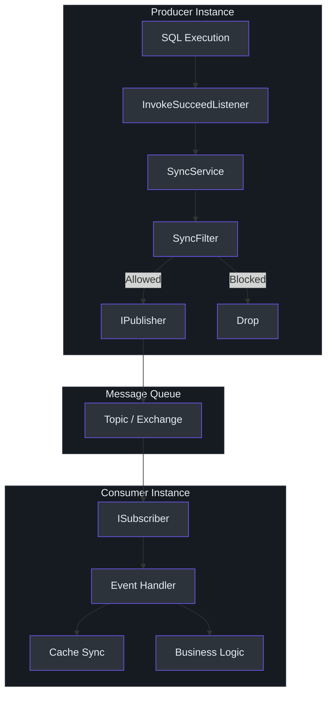
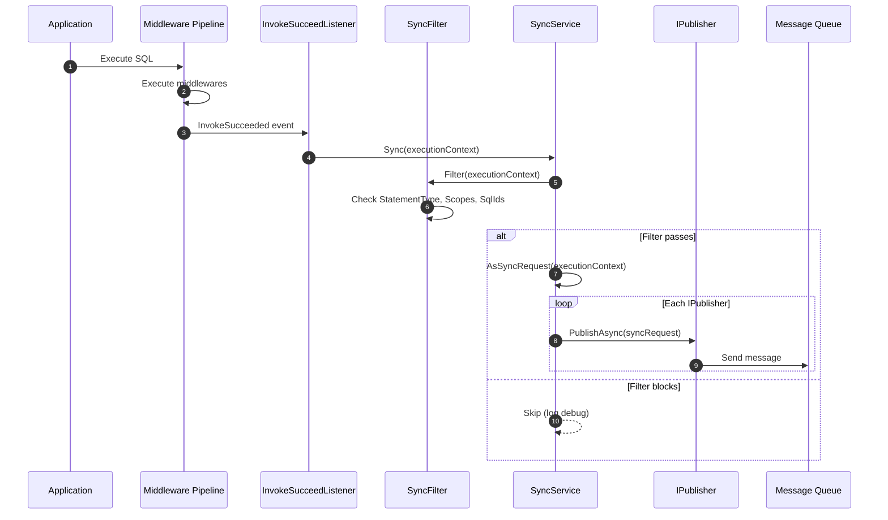
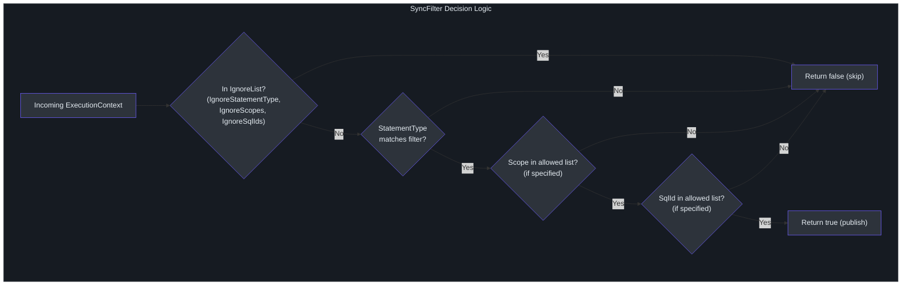
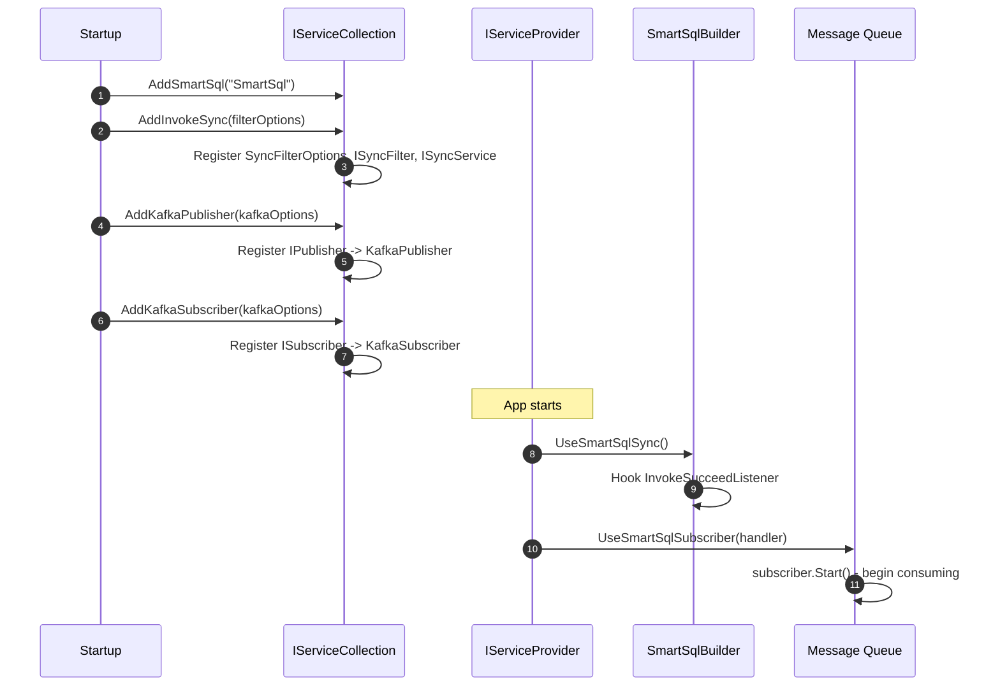

# InvokeSync 与消息传递

现代分布式系统通常需要将数据库变更复制到其他服务、搜索索引或数据仓库。`SmartSql.InvokeSync` 包提供了一个将 SQL 调用事件发布到消息队列的框架，使下游消费者能够响应数据变更。配合 Kafka 和 RabbitMQ 的伴侣包，你只需最少的配置即可接入任一消息基础设施。

## 一览表

| 包名 | 用途 |
|---|---|
| `SmartSql.InvokeSync` | 核心抽象：`IPublisher`、`ISubscriber`、`ISyncService`、`ISyncFilter` |
| `SmartSql.InvokeSync.Kafka` | 基于 Kafka 的发布者和订阅者 |
| `SmartSql.InvokeSync.RabbitMQ` | 基于 RabbitMQ 的发布者和订阅者 |

## 架构



<!-- Sources: src/SmartSql.InvokeSync/SyncService.cs:8, src/SmartSql.InvokeSync/IPublisher.cs:6, src/SmartSql.InvokeSync/ISubscriber.cs:6 -->

## 同步流程时序



<!-- Sources: src/SmartSql.InvokeSync/SyncService.cs:23, src/SmartSql.InvokeSync/SyncFilter.cs:16, src/SmartSql.InvokeSync/SmartSqlDIExtensions.cs:22 -->

## 核心接口

### IPublisher

向消息队列发布 `SyncRequest` 消息：

| 成员 | 类型 | 描述 |
|---|---|---|
| `PublishAsync(SyncRequest)` | `Task` | 向队列发送同步请求 |
| `Dispose()` | `void` | 清理连接 |

### ISubscriber

从消息队列接收 `SyncRequest` 消息：

| 成员 | 类型 | 描述 |
|---|---|---|
| `Received` | `event EventHandler<SyncRequest>` | 消息到达时触发 |
| `Start()` | `void` | 开始消费消息 |
| `Stop()` | `void` | 停止消费消息 |

### ISyncService

通过应用过滤器和发布来协调同步流程：

| 成员 | 类型 | 描述 |
|---|---|---|
| `Sync(ExecutionContext)` | `Task` | 过滤并发布执行上下文 |

### ISyncFilter

决定是否应发布给定的执行：

| 成员 | 类型 | 描述 |
|---|---|---|
| `Filter(ExecutionContext)` | `bool` | 如果执行应被同步则返回 true |

## SyncFilter 配置

`SyncFilter` 应用多层过滤器来确定哪些 SQL 执行应被发布：



<!-- Sources: src/SmartSql.InvokeSync/SyncFilter.cs:16, src/SmartSql.InvokeSync/SyncFilterOptions.cs:7 -->

### SyncFilterOptions

| 属性 | 类型 | 默认值 | 描述 |
|---|---|---|---|
| `StatementType` | `StatementType` | `Write` | 同步哪些语句类型 |
| `Scopes` | `IEnumerable<string>` | null | scope 白名单（null = 全部） |
| `SqlIds` | `IEnumerable<string>` | null | SQL ID 白名单 |
| `FullSqlIds` | `IEnumerable<string>` | null | 完整 SQL ID 白名单（Scope.SqlId） |
| `IgnoreStatementType` | `StatementType?` | null | 排除的语句类型 |
| `IgnoreScopes` | `IEnumerable<string>` | null | 排除的 scope |
| `IgnoreSqlIds` | `IEnumerable<string>` | null | 排除的 SQL ID |
| `IgnoreFullSqlIds` | `IEnumerable<string>` | null | 排除的完整 SQL ID |

## Kafka 实现

### KafkaOptions

| 属性 | 类型 | 默认值 | 描述 |
|---|---|---|---|
| `Servers` | `string` | -- | Kafka 代理地址 |
| `Topic` | `string` | -- | Kafka 主题名称 |
| `Config` | `IDictionary<string, string>` | 空 | 额外的 Confluent.Kafka 配置 |

### 注册

```csharp
services
    .AddSmartSql("SmartSql")
    .AddInvokeSync(options =>
    {
        options.StatementType = StatementType.Write;
    })
    .AddKafkaPublisher(options =>
    {
        options.Servers = "localhost:9092";
        options.Topic = "smartsql-sync";
    })
    .AddKafkaSubscriber(options =>
    {
        options.Servers = "localhost:9092";
        options.Topic = "smartsql-sync";
    });
```

Kafka 发布者使用 Confluent.Kafka 的 `IProducer<string, string>`。消息以 `{Scope}.{SqlId}` 作为 Key，用于分区局部性。

## RabbitMQ 实现

### RabbitMQOptions

| 属性 | 类型 | 默认值 | 描述 |
|---|---|---|---|
| `HostName` | `string` | `"localhost"` | RabbitMQ 主机 |
| `VirtualHost` | `string` | `"/"` | 虚拟主机 |
| `UserName` | `string` | -- | 认证用户名 |
| `Password` | `string` | -- | 认证密码 |
| `Exchange` | `string` | `"smartsql"` | 交换机名称 |
| `ExchangeType` | `string` | `"direct"` | 交换机类型 |
| `RoutingKey` | `string` | `"sync"` | 路由键 |
| `RequestedHeartbeat` | `ushort` | `60` | 心跳间隔 |
| `AutomaticRecoveryEnabled` | `bool` | `true` | 自动重连 |

### 注册

```csharp
services
    .AddSmartSql("SmartSql")
    .AddInvokeSync(options => { })
    .AddRabbitMQPublisher(options =>
    {
        options.HostName = "localhost";
        options.UserName = "guest";
        options.Password = "guest";
        options.Exchange = "smartsql";
        options.RoutingKey = "smartsql.sync";
    })
    .AddRabbitMQSubscriber(options =>
    {
        options.HostName = "localhost";
        options.Exchange = "smartsql";
        options.RoutingKey = "smartsql.sync";
    });
```

## 完整配置

以下时序展示了包含发布者和订阅者注册的完整启动流程：



<!-- Sources: src/SmartSql.InvokeSync/SmartSqlDIExtensions.cs:11, src/SmartSql.InvokeSync.Kafka/SmartSqlDIExtensions.cs:11, src/SmartSql.InvokeSync.RabbitMQ/SmartSqlDIExtensions.cs:11 -->

## SyncRequest 载荷

发布到消息队列的 `SyncRequest` 对象包含：

| 属性 | 类型 | 描述 |
|---|---|---|
| `Id` | `Guid` | 唯一消息标识符 |
| `Scope` | `string` | SQL 映射 scope |
| `SqlId` | `string` | 语句 ID |
| `StatementType` | `StatementType?` | Select、Insert、Update、Delete |
| `RealSql` | `string` | 实际执行的 SQL |
| `Parameters` | `IDictionary<string, object>` | SQL 参数值 |
| `Result` | `object` | 执行结果（行数、实体等） |
| `DataSourceChoice` | `DataSourceChoice` | 使用的读或写数据源 |
| `Transaction` | `IsolationLevel?` | 活动事务的隔离级别 |
| `IsStatementSql` | `bool` | 是否为真实 SQL 操作 |

## 交叉参考

- **[缓存同步](./cache-sync.md)** -- 使用 `ISubscriber` 在远程变更时使本地缓存失效。
- **[Redis 缓存](./redis-cache.md)** -- 受益于缓存同步的分布式缓存。
- **[DI 集成](./di-extension.md)** -- 与 SmartSql DI 共享的注册模式。
- **[AOP 事务](./aop.md)** -- 事务可包含多个触发同步的操作。

## 参考资料

- [SyncService.cs](https://github.com/dotnetcore/SmartSql/blob/master/src/SmartSql.InvokeSync/SyncService.cs) -- 核心同步协调
- [IPublisher.cs](https://github.com/dotnetcore/SmartSql/blob/master/src/SmartSql.InvokeSync/IPublisher.cs) -- 发布者接口
- [ISubscriber.cs](https://github.com/dotnetcore/SmartSql/blob/master/src/SmartSql.InvokeSync/ISubscriber.cs) -- 订阅者接口
- [SyncFilter.cs](https://github.com/dotnetcore/SmartSql/blob/master/src/SmartSql.InvokeSync/SyncFilter.cs) -- 过滤器实现
- [SyncFilterOptions.cs](https://github.com/dotnetcore/SmartSql/blob/master/src/SmartSql.InvokeSync/SyncFilterOptions.cs) -- 过滤器配置
- [SyncRequest.cs](https://github.com/dotnetcore/SmartSql/blob/master/src/SmartSql.InvokeSync/SyncRequest.cs) -- 消息负载
- [ExecutionContextExtensions.cs](https://github.com/dotnetcore/SmartSql/blob/master/src/SmartSql.InvokeSync/ExecutionContextExtensions.cs) -- AsSyncRequest 映射
- [KafkaPublisher.cs](https://github.com/dotnetcore/SmartSql/blob/master/src/SmartSql.InvokeSync.Kafka/KafkaPublisher.cs) -- Kafka 发布者
- [KafkaSubscriber.cs](https://github.com/dotnetcore/SmartSql/blob/master/src/SmartSql.InvokeSync.Kafka/KafkaSubscriber.cs) -- Kafka 订阅者
- [RabbitMQPublisher.cs](https://github.com/dotnetcore/SmartSql/blob/master/src/SmartSql.InvokeSync.RabbitMQ/RabbitMQPublisher.cs) -- RabbitMQ 发布者
