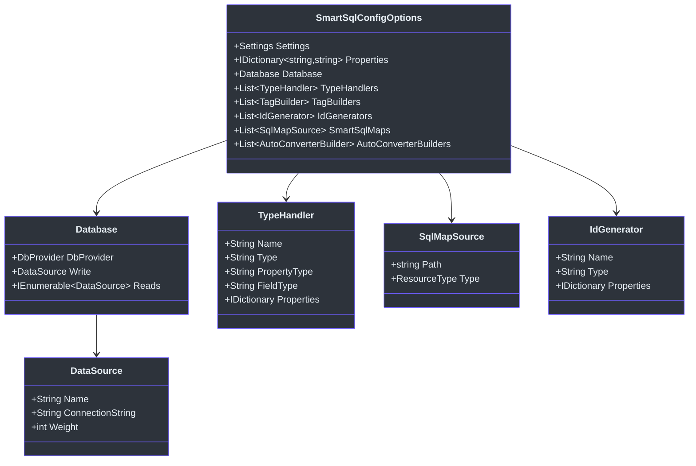
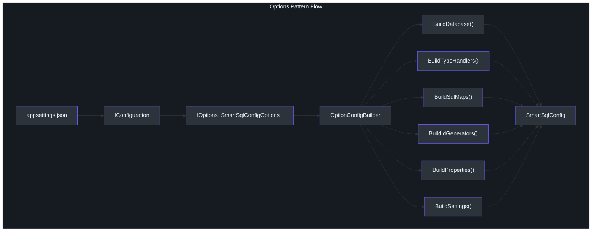
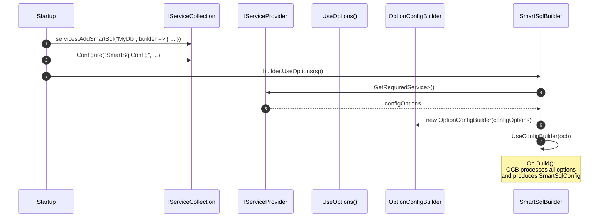

# Options 模式配置

`SmartSql.Options` 包允许你使用标准的 ASP.NET Core Options 模式，完全从 `appsettings.json`（或任何 `IConfiguration` 源）配置 SmartSql。你无需编写和维护 XML 配置文件，而是直接在 JSON 中定义数据库连接、类型处理器、SQL 映射源和设置，并通过 `IOptions<SmartSqlConfigOptions>` 绑定。

## 一览表

| 特性 | 描述 |
|---------|-------------|
| 包名 | `SmartSql.Options` |
| 入口 | `SmartSqlBuilder.UseOptions(serviceProvider)` |
| Options 类 | `SmartSqlConfigOptions` |
| 配置构建器 | `OptionConfigBuilder`（继承 `AbstractConfigBuilder`） |
| 绑定模式 | 按 alias 键控的 `IOptionsSnapshot<SmartSqlConfigOptions>` |
| 仍支持 | JSON 中引用的 XML SqlMap 文件 |

## 配置结构

`SmartSqlConfigOptions` 类定义了完整的 JSON 结构：



<!-- Sources: src/SmartSql.Options/SmartSqlConfigOptions.cs:8, src/SmartSql.Options/Database.cs:8, src/SmartSql.Options/DataSource.cs:7, src/SmartSql.Options/SqlMapSource.cs:7 -->

## JSON 配置示例

```json
{
  "SmartSqlConfig": {
    "Settings": {
      "IgnoreParameterCase": true,
      "ParameterPrefix": "?"
    },
    "Properties": {
      "ConnectionString": "Server=localhost;Database=SmartSqlDb;Uid=root;Pwd=123456;"
    },
    "Database": {
      "DbProvider": {
        "Name": "MySql",
        "ParameterPrefix": "?"
      },
      "Write": {
        "Name": "Write",
        "ConnectionString": "${ConnectionString}"
      },
      "Reads": [
        {
          "Name": "Read",
          "ConnectionString": "${ConnectionString}",
          "Weight": 100
        }
      ]
    },
    "TypeHandlers": [
      {
        "Name": "Json",
        "Type": "SmartSql.TypeHandler.JsonTypeHandler, SmartSql.TypeHandler"
      }
    ],
    "SmartSqlMaps": [
      {
        "Path": "Maps",
        "Type": "Directory"
      }
    ]
  }
}
```

## 工作原理

`OptionConfigBuilder` 继承 `AbstractConfigBuilder`，将选项转换为与 XML 配置产生的相同的内部 `SmartSqlConfig` 结构：



<!-- Sources: src/SmartSql.Options/OptionConfigBuilder.cs:14, src/SmartSql.Options/SmartSqlOptionsExtensions.cs:12 -->

## 在 ASP.NET Core 中使用



<!-- Sources: src/SmartSql.Options/SmartSqlOptionsExtensions.cs:12, src/SmartSql.Options/OptionConfigBuilder.cs:14 -->

## API 参考

### SmartSqlOptionsExtensions

| 方法 | 描述 |
|---|---|
| `SmartSqlBuilder.UseOptions(IServiceProvider)` | 将构建器绑定到从 DI 解析的选项，按构建器的 alias 键控 |

### OptionConfigBuilder（内部）

| 方法 | 描述 |
|---|---|
| `BuildDatabase()` | 将 `Database.Write` 和 `Database.Reads` 映射到 `WriteDataSource` / `ReadDataSource` |
| `BuildTypeHandlers()` | 注册每个 `TypeHandler` 条目，解析泛型类型参数 |
| `BuildSqlMaps()` | 按 `ResourceType` 和 `Path` 加载每个 `SqlMapSource` |
| `BuildIdGenerators()` | 构建并注册命名的 ID 生成器 |
| `BuildProperties()` | 将键值属性导入 `SmartSqlConfig.Properties` |
| `BuildSettings()` | 应用 `Settings`（IgnoreParameterCase、ParameterPrefix 等） |
| `BuildTagBuilders()` | 注册自定义标签构建器类型 |

## 关键类

| 类 | 文件 | 描述 |
|---|---|---|
| `SmartSqlConfigOptions` | [SmartSqlConfigOptions.cs](https://github.com/dotnetcore/SmartSql/blob/master/src/SmartSql.Options/SmartSqlConfigOptions.cs) | 根选项对象 |
| `Database` | [Database.cs](https://github.com/dotnetcore/SmartSql/blob/master/src/SmartSql.Options/Database.cs) | DB 提供程序 + 写/读源 |
| `DataSource` | [DataSource.cs](https://github.com/dotnetcore/SmartSql/blob/master/src/SmartSql.Options/DataSource.cs) | 名称、连接字符串、权重 |
| `TypeHandler` | [TypeHandler.cs](https://github.com/dotnetcore/SmartSql/blob/master/src/SmartSql.Options/TypeHandler.cs) | 类型处理器注册 |
| `SqlMapSource` | [SqlMapSource.cs](https://github.com/dotnetcore/SmartSql/blob/master/src/SmartSql.Options/SqlMapSource.cs) | SQL 映射文件路径和资源类型 |
| `IdGenerator` | [IdGenerator.cs](https://github.com/dotnetcore/SmartSql/blob/master/src/SmartSql.Options/IdGenerator.cs) | 命名的 ID 生成器配置 |
| `TagBuilder` | [TagBuilder.cs](https://github.com/dotnetcore/SmartSql/blob/master/src/SmartSql.Options/TagBuilder.cs) | 自定义标签构建器注册 |
| `OptionConfigBuilder` | [OptionConfigBuilder.cs](https://github.com/dotnetcore/SmartSql/blob/master/src/SmartSql.Options/OptionConfigBuilder.cs) | 将选项转换为 SmartSqlConfig |

## 交叉参考

- **[DI 集成](./di-extension.md)** -- 将 `AddSmartSql()` 与 `UseOptions()` 结合使用，实现完全基于 DI 的配置。
- **[类型处理器](./type-handlers.md)** -- 在 `TypeHandlers` 数组中注册类型处理器。
- **[配置（XML）](../guide/configuration.md)** -- Options 模式可通过 `SmartSqlMaps` 引用的 XML 配置。

## 参考资料

- [SmartSqlConfigOptions.cs](https://github.com/dotnetcore/SmartSql/blob/master/src/SmartSql.Options/SmartSqlConfigOptions.cs)
- [OptionConfigBuilder.cs](https://github.com/dotnetcore/SmartSql/blob/master/src/SmartSql.Options/OptionConfigBuilder.cs)
- [SmartSqlOptionsExtensions.cs](https://github.com/dotnetcore/SmartSql/blob/master/src/SmartSql.Options/SmartSqlOptionsExtensions.cs)
- [Database.cs](https://github.com/dotnetcore/SmartSql/blob/master/src/SmartSql.Options/Database.cs)
- [DataSource.cs](https://github.com/dotnetcore/SmartSql/blob/master/src/SmartSql.Options/DataSource.cs)
- [SqlMapSource.cs](https://github.com/dotnetcore/SmartSql/blob/master/src/SmartSql.Options/SqlMapSource.cs)
