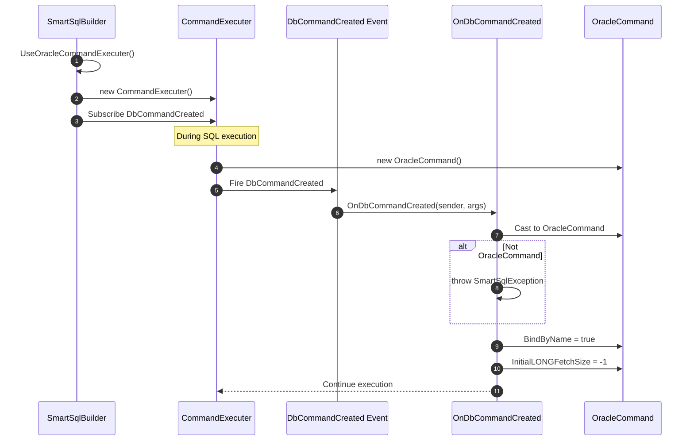

# Oracle 支持

虽然 SmartSql 的核心可以与任何 ADO.NET 提供程序配合使用，但 Oracle 的 `OracleCommand` 需要偏离标准 ADO.NET 行为的特定配置。`SmartSql.Oracle` 包提供了一个自定义的 `CommandExecuter`，在每个命令执行前配置 Oracle 特定属性（`BindByName`、`InitialLONGFetchSize`）。

## 一览表

| 特性 | 描述 |
|---------|-------------|
| 包名 | `SmartSql.Oracle` |
| 提供程序 | Oracle.ManagedDataAccess（ODP.NET） |
| 关键特性 | 自动设置 `BindByName = true` 和 `InitialLONGFetchSize = -1` |
| 入口 | `SmartSqlBuilder.UseOracleCommandExecuter()` |

## 为什么 Oracle 需要特殊处理

默认情况下，Oracle 的 ODP.NET 驱动按位置而非按名称绑定参数。这与 SmartSql 基于 XML 的参数绑定冲突，后者使用命名参数（`:Name`、`:Age` 等）。在每个 `OracleCommand` 上设置 `BindByName = true` 可解决此问题，`SmartSql.Oracle` 包自动执行该配置。


<!-- Sources: src/SmartSql.Oracle/SmartSqlBuilderExtensions.cs:10, src/SmartSql.Oracle/SmartSqlBuilderExtensions.cs:24 -->

## 工作原理

该扩展挂钩到 `CommandExecuter` 的 `DbCommandCreated` 事件。每次创建新的 `DbCommand` 时，处理器都会检查它是否为 `OracleCommand` 并配置所需属性：



<!-- Sources: src/SmartSql.Oracle/SmartSqlBuilderExtensions.cs:24 -->

## 设置的配置属性

| 属性 | 值 | 用途 |
|---|---|---|
| `BindByName` | `true` | 启用命名参数绑定（对 SmartSql XML 映射至关重要） |
| `InitialLONGFetchSize` | `-1` | 获取完整的 LONG/LONG RAW 列值（Oracle 默认为 0，仅返回长度） |

## 配置

### 基本注册

```csharp
var smartSqlBuilder = new SmartSqlBuilder()
    .UseOracleCommandExecuter()
    .UseXmlConfig(ResourceType.File, "SmartSqlMapConfig.xml")
    .Build();
```

### 与 DI 集成

```csharp
services.AddSmartSql((sp, builder) =>
{
    builder
        .UseProperties(Configuration)
        .UseOracleCommandExecuter(sp.GetService<ILoggerFactory>());
});
```

### 使用自定义 LoggerFactory

```csharp
builder.UseOracleCommandExecuter(loggerFactory);
```

两个重载都接受可选的 `ILoggerFactory`。无参数版本使用已配置的 `SmartSqlBuilder.LoggerFactory`。

## Oracle 的 XML 配置

你的 SmartSql XML 配置应指定 Oracle 数据库提供程序：

```xml
<SmartSqlMapConfig>
  <Database>
    <DbProvider Name="Oracle" ParameterPrefix=":"/>
    <Write Name="Write" ConnectionString="Data Source=...;User Id=...;Password=...;"/>
    <Reads>
      <Read Name="Read" ConnectionString="Data Source=...;User Id=...;Password=...;" Weight="100"/>
    </Reads>
  </Database>
  <SmartSqlMaps>
    <SmartSqlMap Path="Maps" Type="Directory"/>
  </SmartSqlMaps>
</SmartSqlMapConfig>
```

::: warning
Oracle 的参数前缀是 `:`，而非 `@`（SqlServer）或 `?`（MySql）。确保你的 XML 映射使用正确的前缀，或在数据库提供程序设置中配置 `ParameterPrefix`。
:::

## 错误处理

如果 `DbCommandCreated` 事件触发但命令不是 `OracleCommand`（例如配置了错误的 ADO.NET 提供程序），处理器将抛出 `SmartSqlException`：

```
The ADO.NET Driver is not [Oracle.ManagedDataAccess.Core].
```

这确保在注册了 Oracle 扩展但使用了错误数据库提供程序时实现快速失败。

## API 参考

### SmartSqlBuilderExtensions（Oracle）

| 方法 | 描述 |
|---|---|
| `UseOracleCommandExecuter(SmartSqlBuilder)` | 使用构建器的日志工厂注册 Oracle 命令执行器 |
| `UseOracleCommandExecuter(SmartSqlBuilder, ILoggerFactory)` | 使用显式日志工厂注册 Oracle 命令执行器 |

## 交叉参考

- **[DI 集成](./di-extension.md)** -- 将 Oracle 支持与 ASP.NET Core DI 结合使用。
- **[配置（XML）](../guide/configuration.md)** -- XML 数据库提供程序配置。
- **[批量插入](./bulk-insert.md)** -- 注意：没有 Oracle 特定的批量插入提供程序；对 Oracle 请使用 SmartSql 的标准插入机制。

## 参考资料

- [SmartSqlBuilderExtensions.cs](https://github.com/dotnetcore/SmartSql/blob/master/src/SmartSql.Oracle/SmartSqlBuilderExtensions.cs) -- 带事件挂钩的完整实现
- [SmartSqlBuilder.cs](https://github.com/dotnetcore/SmartSql/blob/master/src/SmartSql/SmartSqlBuilder.cs) -- 中央构建器（UseCommandExecuter 方法）
