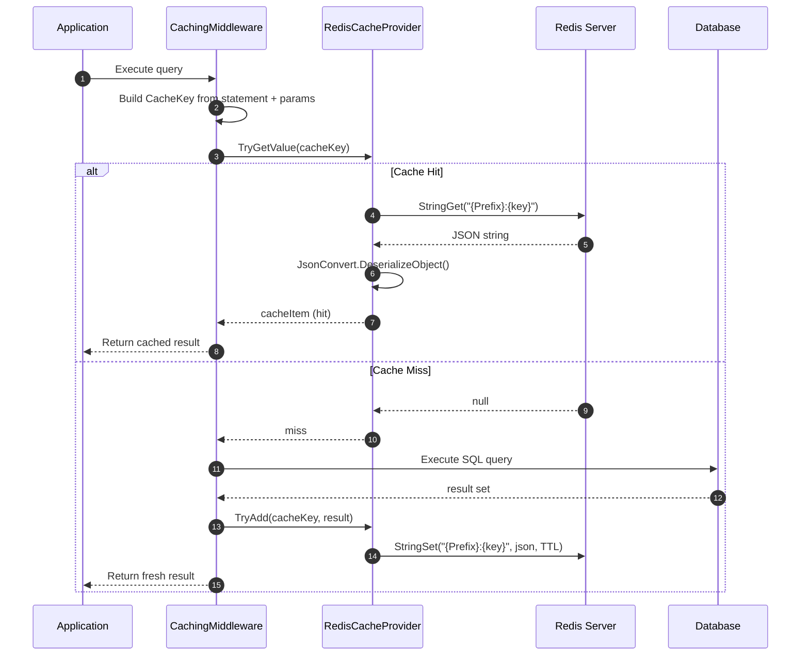
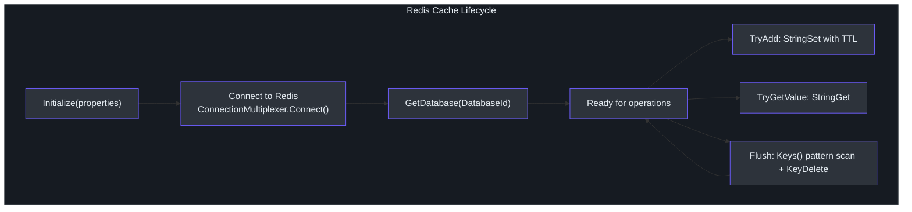
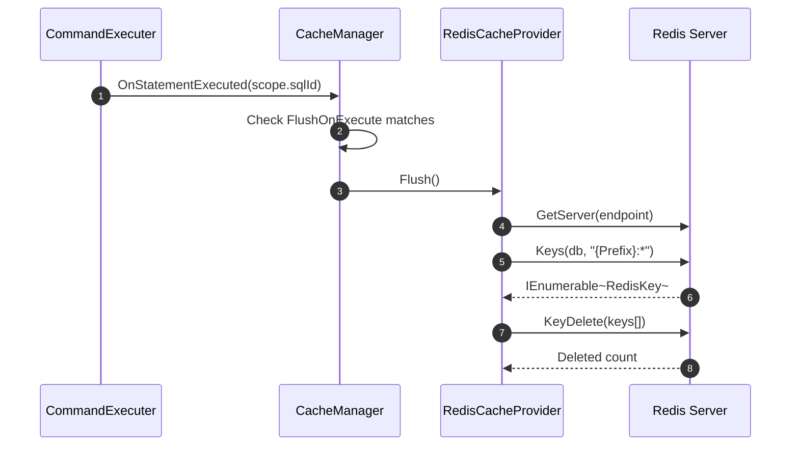

# Redis 缓存提供程序

SmartSql 的内置缓存开箱即用地支持基于内存的提供程序，但内存缓存仅限于单个应用实例。在多实例部署（Web 农场、容器、微服务）中，每个实例维护自己的隔离缓存，导致数据过时和数据库查询冗余。`SmartSql.Cache.Redis` 包提供了一个基于 Redis 的缓存提供程序，可在所有应用实例之间共享缓存的查询结果。

## 一览表

| 特性 | 描述 |
|---------|-------------|
| 包名 | `SmartSql.Cache.Redis` |
| 接口 | `ICacheProvider` |
| 序列化 | JSON（通过 Newtonsoft.Json） |
| Key 格式 | `{Prefix}:{CacheKey}` |
| 过期 | 通过 `FlushInterval` 映射到 Redis TTL |
| 刷新支持 | 基于模式的 Key 删除（`{Prefix}:*`） |
| 数据库选择 | 通过 `DatabaseId` 属性可配置 |

## Redis 缓存工作原理



<!-- Sources: src/SmartSql.Cache.Redis/RedisCacheProvider.cs:49, src/SmartSql.Cache.Redis/RedisCacheProvider.cs:66 -->

## 配置

`RedisCacheProvider` 通过 XML 缓存配置中定义的属性进行配置：

### XML 配置

```xml
<Cache Id="UserCache" Type="LRU">
  <Properties>
    <Property Key="CacheSize" Value="100"/>
    <Property Key="FlushInterval" Value="300"/>
    <Property Key="ConnectionString" Value="localhost:6379,password=123456"/>
    <Property Key="Prefix" Value="SmartSql:UserCache"/>
    <Property Key="DatabaseId" Value="0"/>
  </Properties>
  <FlushOnExecute Statement="User.Insert"/>
  <FlushOnExecute Statement="User.Update"/>
  <FlushOnExecute Statement="User.Delete"/>
</Cache>
```

### 配置属性

| 属性 | 必需 | 默认值 | 描述 |
|---|---|---|---|
| `ConnectionString` | 是 | -- | Redis 连接字符串（StackExchange.Redis 格式） |
| `Prefix` | 否 | Cache.Id | Redis 中的 Key 前缀 |
| `FlushInterval` | 否 | 无 | TTL（秒）；映射到 Redis Key 过期时间 |
| `DatabaseId` | 否 | Default（0） | Redis 数据库编号 |

## 缓存生命周期



<!-- Sources: src/SmartSql.Cache.Redis/RedisCacheProvider.cs:19 -->

## 刷新行为

当执行标记了 `FlushOnExecute` 的语句（如 INSERT、UPDATE 或 DELETE）时，缓存会被刷新。`Flush()` 方法执行基于模式的扫描和删除：

1. 连接到第一个 Redis 端点
2. 扫描所有匹配 `{Prefix}:*` 的 Key
3. 批量删除所有匹配的 Key



<!-- Sources: src/SmartSql.Cache.Redis/RedisCacheProvider.cs:55 -->

## API 参考

### RedisCacheProvider

| 方法 | 描述 |
|---|---|
| `Initialize(IDictionary<string, object>)` | 解析属性，连接到 Redis |
| `TryAdd(CacheKey, object)` | 序列化并带 TTL 存储 |
| `TryGetValue(CacheKey, out object)` | 从 Redis 获取并反序列化 |
| `Flush()` | 删除所有匹配前缀模式的 Key |
| `Dispose()` | 关闭 Redis 连接 |

| 属性 | 类型 | 描述 |
|---|---|---|
| `SupportExpire` | `bool` | 始终为 `true` -- Redis 原生支持 TTL |

### 序列化

所有缓存值使用 `Newtonsoft.Json.JsonConvert` 序列化为 JSON：

- **写入**：`JsonConvert.SerializeObject(cacheItem)`
- **读取**：`JsonConvert.DeserializeObject(cacheStr, cacheKey.ResultType)`

`CacheKey.ResultType` 确保反序列化的对象匹配预期的查询结果类型。

## 与缓存同步的集成

在分布式环境中，你可以将 Redis 缓存与 [缓存同步](./cache-sync.md) 扩展结合使用，通过消息队列通知在其他实例数据变更时刷新本地 Redis 缓存。

## 交叉参考

- **[缓存同步](./cache-sync.md)** -- 通过发布/订阅实现分布式缓存失效。
- **[类型处理器](./type-handlers.md)** -- Redis 缓存中使用的 JSON 序列化与 JsonTypeHandler 类似。
- **[配置](../guide/configuration.md)** -- 在 XML SmartSqlMap 文件中定义缓存元素。

## 参考资料

- [RedisCacheProvider.cs](https://github.com/dotnetcore/SmartSql/blob/master/src/SmartSql.Cache.Redis/RedisCacheProvider.cs) -- 完整实现
- [ICacheProvider.cs](https://github.com/dotnetcore/SmartSql/blob/master/src/SmartSql/Cache/ICacheProvider.cs) -- 核心缓存提供程序接口
- [ICacheManager.cs](https://github.com/dotnetcore/SmartSql/blob/master/src/SmartSql/Cache/ICacheManager.cs) -- 缓存管理器接口
- [AbstractCacheManager.cs](https://github.com/dotnetcore/SmartSql/blob/master/src/SmartSql/Cache/AbstractCacheManager.cs) -- 带 FlushOnExecute 支持的基础缓存管理器
