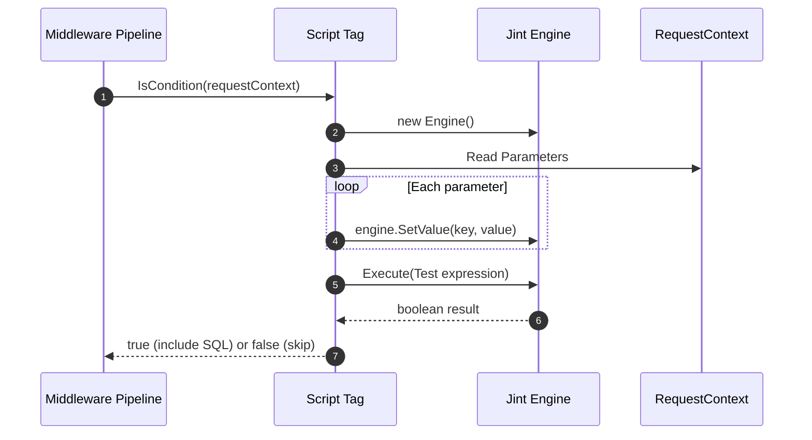
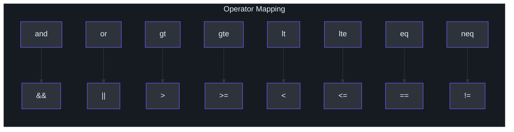

# 脚本标签

SmartSql 内置的 XML 标签（`<IsNotEmpty>`、`<IsEqual>`、`<Switch>` 等）能处理大多数条件 SQL 生成，但有时你需要更具表达力的逻辑。`SmartSql.ScriptTag` 包添加了 `<Script>` 标签，使用 [Jint](https://github.com/sebastienros/jint) 引擎执行 JavaScript 表达式，让你直接在 XML 映射中对 SQL 生成拥有完全的编程控制。

## 一览表

| 特性 | 描述 |
|---------|-------------|
| 包名 | `SmartSql.ScriptTag` |
| JS 引擎 | Jint（纯 C# JavaScript 解释器） |
| 标签名 | `<Script>` |
| 属性 | `Test` -- 求值为布尔值的 JavaScript 表达式 |
| 运算符映射 | 自动将文本运算符转换为 JS 运算符 |

## 工作原理

`Script` 标签扩展了 SmartSql 的 `Tag` 基类。当中间件管线处理语句时，`Script` 标签会根据当前请求参数对其 `Test` 表达式求值：



<!-- Sources: src/SmartSql.ScriptTag/Script.cs:38, src/SmartSql.ScriptTag/Script.cs:45 -->

## 运算符映射

`Script` 标签自动将人类友好的文本运算符转换为 JavaScript 运算符。这使 XML 更具可读性：



<!-- Sources: src/SmartSql.ScriptTag/Script.cs:11 -->

该映射在构造时通过正则替换应用，因此你可以这样写：

```xml
<Script Test="age gt 18 and status neq 'inactive'">
```

它会在内部转换为：

```javascript
age > 18 && status != 'inactive'
```

## 在 XML 映射中的用法

### 基本条件子句

```xml
<Statement Id="QueryUsers">
  SELECT * FROM Users
  <Where>
    <Script Test="age gt 0">
      AND Age > ?Age
    </Script>
    <IsNotEmpty Prepend="And" Property="Name">
      AND Name LIKE CONCAT('%', ?Name, '%')
    </IsNotEmpty>
  </Where>
</Statement>
```

### 复杂表达式

Script 标签支持 Jint 能执行的任何 JavaScript 表达式：

```xml
<Script Test="minPrice neq null and maxPrice neq null and minPrice lt maxPrice">
  AND Price BETWEEN ?MinPrice AND ?MaxPrice
</Script>
```

### 与其他标签组合

Script 标签可以像其他 SmartSql 标签一样嵌套在 `<Where>`、`<Switch>` 或其他动态标签中：

```xml
<Statement Id="AdvancedQuery">
  SELECT * FROM Products
  <Where>
    <Script Test="categoryIds.length gt 0">
      AND CategoryId IN
      <For Property="categoryIds" Open="(" Close=")" Separator=",">
        ?categoryIds
      </For>
    </Script>
    <IsEqual Property="Status" CompareValue="1">
      AND IsActive = 1
    </IsEqual>
  </Where>
</Statement>
```

## 标签构建器注册

`ScriptBuilder` 类将 `<Script>` 标签注册到 SmartSql 的标签构建器系统。它继承 `AbstractTagBuilder` 并从 XML 节点创建 `Script` 实例：

| 方法 | 描述 |
|---|---|
| `Build(XmlNode, Statement)` | 从 XML 节点的 `Test` 属性创建 `Script` 标签 |

要启用 Script 标签，在配置中注册标签构建器：

```xml
<SmartSqlMapConfig>
  <TagBuilders>
    <TagBuilder Name="Script"
      Type="SmartSql.ScriptTag.ScriptBuilder, SmartSql.ScriptTag"/>
  </TagBuilders>
</SmartSqlMapConfig>
```

或通过 Options 模式：

```json
{
  "TagBuilders": [
    {
      "Name": "Script",
      "Type": "SmartSql.ScriptTag.ScriptBuilder, SmartSql.ScriptTag"
    }
  ]
}
```

## Jint 引擎配置

Script 标签使用以下设置创建 Jint 引擎：

| 设置 | 值 | 用途 |
|---|---|---|
| `Strict` | `false` | 允许非严格 JavaScript |
| `DebugMode` | `false` | 无调试支持 |
| `AllowDebuggerStatement` | `false` | 防止 debugger 语句 |

当 `context.Parameters` 为 null 时，表达式将在不设置任何变量的情况下求值。

## 交叉参考

- **[Options 模式](./options.md)** -- 在 `appsettings.json` 中注册 `TagBuilders`。
- **[配置（XML）](../guide/configuration.md)** -- Script 扩展的 XML 标签系统。
- **[动态仓储](./dy-repository.md)** -- 仓储方法可使用包含 Script 标签的语句。

## 参考资料

- [Script.cs](https://github.com/dotnetcore/SmartSql/blob/master/src/SmartSql.ScriptTag/Script.cs) -- 核心 Script 标签实现
- [ScriptBuilder.cs](https://github.com/dotnetcore/SmartSql/blob/master/src/SmartSql.ScriptTag/ScriptBuilder.cs) -- 用于 XML 注册的标签构建器
