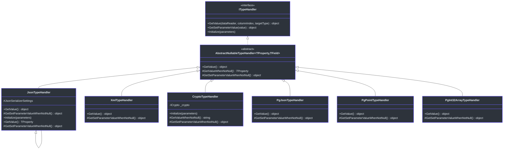
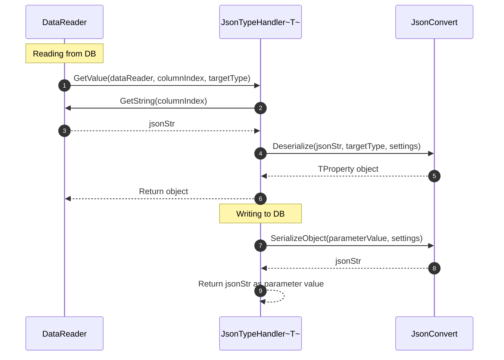
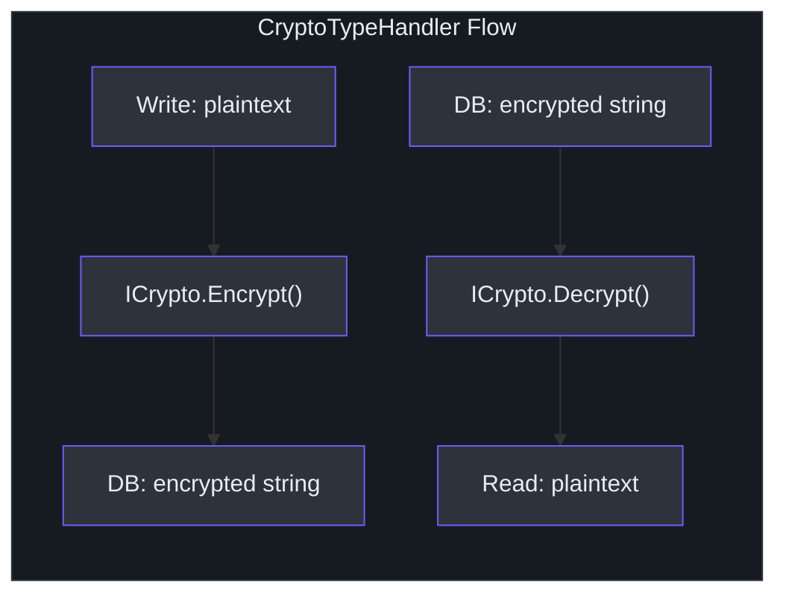

# 类型处理器

SmartSql 的类型处理器系统弥合了 .NET 类型和数据库列类型之间的差距。虽然核心库为标准基本类型提供了处理器，但 `SmartSql.TypeHandler` 和 `SmartSql.TypeHandler.PostgreSql` 包为复杂的序列化需求添加了处理器：存储在文本列中的 JSON 对象、加密字符串、XML 序列化值，以及 PostgreSQL 特定类型如数组、几何形状和网络地址。

## 一览表

| 包名 | 用途 | 关键处理器 |
|---|---|---|
| `SmartSql.TypeHandler` | JSON、XML、加密序列化 | `JsonTypeHandler`、`XmlTypeHandler`、`CryptoTypeHandler` |
| `SmartSql.TypeHandler.PostgreSql` | PostgreSQL 原生类型 | `JsonTypeHandler`、`PointTypeHandler`、数组处理器等 |

## 类型处理器层次结构



<!-- Sources: src/SmartSql.TypeHandler/JsonTypeHandler.cs:10, src/SmartSql.TypeHandler/JsonTypeHandler`1.cs:11, src/SmartSql.TypeHandler/XmlTypeHandler.cs:10, src/SmartSql.TypeHandler/CryptoTypeHandler.cs:9 -->

## JSON 类型处理器

`JsonTypeHandler<TProperty>` 将复杂的 .NET 对象序列化/反序列化为存储在数据库文本列中的 JSON 字符串。它支持可配置的命名策略和日期格式。

### 工作原理



<!-- Sources: src/SmartSql.TypeHandler/JsonTypeHandler`1.cs:52, src/SmartSql.TypeHandler/JsonTypeHandler`1.cs:59 -->

### 配置属性

| 属性 | 值 | 描述 |
|---|---|---|
| `DateFormat` | 例如 `"yyyy-MM-dd"` | 自定义序列化日期格式 |
| `NamingStrategy` | `"Camel"`、`"Snake"`、默认值 | JSON 中的属性命名约定 |

### XML 配置

```xml
<TypeHandlers>
  <TypeHandler Name="Json"
    Type="SmartSql.TypeHandler.JsonTypeHandler`1, SmartSql.TypeHandler">
    <Properties>
      <Property Key="NamingStrategy" Value="Camel"/>
      <Property Key="DateFormat" Value="yyyy-MM-dd"/>
    </Properties>
  </TypeHandler>
</TypeHandlers>
```

### 非泛型用法

非泛型的 `JsonTypeHandler` 继承自 `JsonTypeHandler<Object>`，可作为任何类型的即插即用替代：

```xml
<TypeHandler Name="Json"
  Type="SmartSql.TypeHandler.JsonTypeHandler, SmartSql.TypeHandler"/>
```

## XML 类型处理器

`XmlTypeHandler` 将对象序列化为 XML 字符串，使用 `System.Xml.Serialization` 反序列化：

```csharp
// Reading: xmlStr -> XmlDeserialize -> object
// Writing: object -> XmlSerialize -> xmlStr
```

## 加密类型处理器

`CryptoTypeHandler` 使用可插拔的 `ICrypto` 实现在写入时透明加密数据、读取时透明解密：



<!-- Sources: src/SmartSql.TypeHandler/CryptoTypeHandler.cs:9 -->

加密实现通过 `Initialize(parameters)` 方法选择。在 XML 中配置时，提供 `CryptoFactory.Create()` 能识别的属性。

## PostgreSQL 类型处理器

`SmartSql.TypeHandler.PostgreSql` 包为 PostgreSQL 特定类型提供了处理器：

| 处理器 | .NET 类型 | PostgreSQL 类型 |
|---|---|---|
| `JsonTypeHandler` | `object` | `json` / `jsonb` |
| `JsonTypeHandler<T>` | `T` | `json` / `jsonb` |
| `PointTypeHandler` | `NpgsqlPoint` | `point` |
| `LineTypeHandler` | `NpgsqlLine` | `line` |
| `LineSegmentTypeHandler` | `NpgsqlLSeg` | `lseg` |
| `BoxTypeHandler` | `NpgsqlBox` | `box` |
| `PathTypeHandler` | `NpgsqlPath` | `path` |
| `PolygonTypeHandler` | `NpgsqlPolygon` | `polygon` |
| `CircleTypeHandler` | `NpgsqlCircle` | `circle` |
| `InetTypeHandler` | `NpgsqlInet` | `inet` |
| `StringArrayTypeHandler` | `string[]` | `text[]` |
| `Int16ArrayTypeHandler` | `short[]` | `smallint[]` |
| `Int32ArrayTypeHandler` | `int[]` | `integer[]` |
| `Int64ArrayTypeHandler` | `long[]` | `bigint[]` |
| `DecimalArrayTypeHandler` | `decimal[]` | `numeric[]` |
| `GuidArrayTypeHandler` | `Guid[]` | `uuid[]` |
| `DictionaryTypeHandler` | `Dictionary` | `hstore` |

### 数组处理器用法

```xml
<TypeHandler Name="IntArray"
  Type="SmartSql.TypeHandler.PostgreSql.Int32ArrayTypeHandler, SmartSql.TypeHandler.PostgreSql"/>
```

## 注册自定义类型处理器

### 在 XML 配置中

```xml
<SmartSqlMap Scope="MyScope">
  <TypeHandlers>
    <TypeHandler Name="MyJson"
      Type="SmartSql.TypeHandler.JsonTypeHandler`1, SmartSql.TypeHandler">
      <Properties>
        <Property Key="NamingStrategy" Value="Camel"/>
      </Properties>
    </TypeHandler>
  </TypeHandlers>
</SmartSqlMap>
```

### 在 Options 模式中（appsettings.json）

```json
{
  "TypeHandlers": [
    {
      "Name": "Json",
      "Type": "SmartSql.TypeHandler.JsonTypeHandler`1, SmartSql.TypeHandler",
      "Properties": {
        "NamingStrategy": "Camel"
      }
    }
  ]
}
```

### 在 SmartSqlBuilder 中

```csharp
builder.AddTypeHandler(typeof(MyEntity), new JsonTypeHandler<MyEntity>());
```

### 通过仓储上的 `[Param]` 属性

```csharp
[Statement(Sql = "INSERT INTO Orders (Data) VALUES (?data)")]
int InsertOrder([Param("data", TypeHandler = "Json")] OrderData data);
```

## 类型处理器与批量插入的集成

当使用 `BulkExtensions.ToDataTable<T>()` 时，实体元数据缓存使用注册的类型处理器将属性值转换为 `DataTable` 中的数据库兼容值：

```csharp
// In BulkExtensions.ToDataTable:
if (columnIndex.Value.Handler != null)
{
    dataRow[columnIndex.Key] = columnIndex.Value.Handler.GetSetParameterValue(propertyVal);
}
```

## 交叉参考

- **[Options 模式](./options.md)** -- 在 `appsettings.json` 中注册类型处理器。
- **[批量插入](./bulk-insert.md)** -- 类型处理器影响批量数据转换。
- **[动态仓储](./dy-repository.md)** -- 使用 `[Param(TypeHandler = "...")]` 为每个参数指定处理器。

## 参考资料

- [JsonTypeHandler.cs](https://github.com/dotnetcore/SmartSql/blob/master/src/SmartSql.TypeHandler/JsonTypeHandler.cs) -- 非泛型 JSON 处理器
- [JsonTypeHandler`1.cs](https://github.com/dotnetcore/SmartSql/blob/master/src/SmartSql.TypeHandler/JsonTypeHandler%601.cs) -- 带设置的泛型 JSON 处理器
- [XmlTypeHandler.cs](https://github.com/dotnetcore/SmartSql/blob/master/src/SmartSql.TypeHandler/XmlTypeHandler.cs) -- XML 序列化处理器
- [CryptoTypeHandler.cs](https://github.com/dotnetcore/SmartSql/blob/master/src/SmartSql.TypeHandler/CryptoTypeHandler.cs) -- 加密/解密处理器
- [PointTypeHandler.cs](https://github.com/dotnetcore/SmartSql/blob/master/src/SmartSql.TypeHandler.PostgreSql/PointTypeHandler.cs) -- PostgreSQL point 类型
- [Int32ArrayTypeHandler.cs](https://github.com/dotnetcore/SmartSql/blob/master/src/SmartSql.TypeHandler.PostgreSql/Int32ArrayTypeHandler.cs) -- PostgreSQL 整数数组
- [BulkExtensions.cs](https://github.com/dotnetcore/SmartSql/blob/master/src/SmartSql.Bulk/BulkExtensions.cs) -- ToDataTable 使用类型处理器
