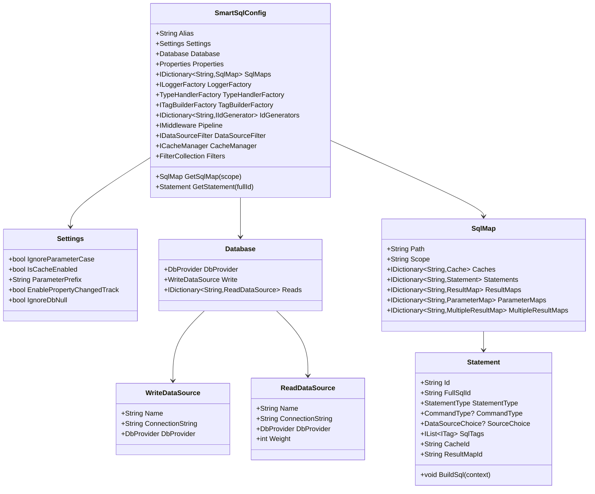
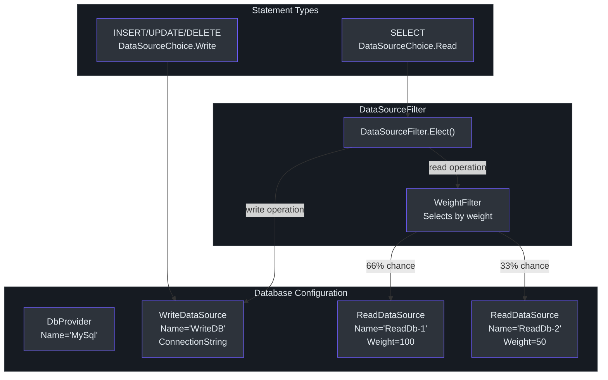
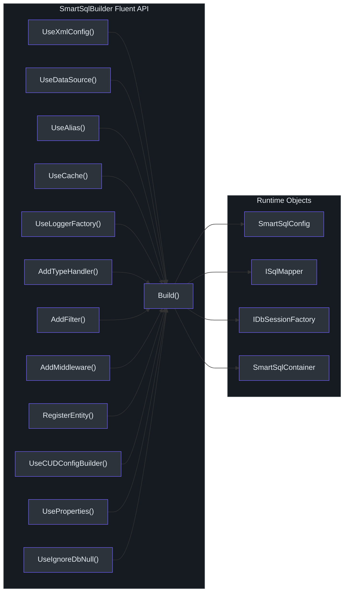

# 配置

SmartSql 支持两种配置方式：通过 `SmartSqlMapConfig.xml` 的 **XML 配置** 和通过 `SmartSqlBuilder` 流式 API 的 **编程式配置**。两者在运行时产生相同的 `SmartSqlConfig` 对象。XML 方式是主要且最常用的方法。

## 配置层级


<!-- Sources: src/SmartSql/Configuration/SmartSqlConfig.cs:21-112, src/SmartSql/Configuration/SqlMap.cs:8-75, src/SmartSql/Configuration/Statement.cs:10-48, src/SmartSql/DataSource/Database.cs:8-12 -->

## XML 配置结构

`SmartSqlMapConfig.xml` 的根元素是 `<SmartSqlMapConfig>`。其子元素定义所有配置节：

```xml
<?xml version="1.0" encoding="utf-8" ?>
<SmartSqlMapConfig xmlns="http://SmartSql.net/schemas/SmartSqlMapConfig.xsd">
  <Settings />
  <Properties />
  <Database />
  <TypeHandlers />
  <TagBuilders />
  <IdGenerators />
  <SmartSqlMaps />
</SmartSqlMapConfig>
```

### 完整示例

此示例基于 [src/SmartSql.Test/SmartSqlMapConfig.xml](https://github.com/dotnetcore/SmartSql/blob/master/src/SmartSql.Test/SmartSqlMapConfig.xml) 中的实际测试配置：

```xml
<?xml version="1.0" encoding="utf-8" ?>
<SmartSqlMapConfig xmlns="http://SmartSql.net/schemas/SmartSqlMapConfig.xsd">
  <Settings IgnoreParameterCase="false"
            ParameterPrefix="$"
            IsCacheEnabled="true"
            EnablePropertyChangedTrack="true" />
  <Properties>
    <Property Name="JsonTypeHandler`"
              Value="SmartSql.TypeHandler.JsonTypeHandler`1,SmartSql.TypeHandler" />
    <Property Name="Redis" Value="127.0.0.1" />
  </Properties>
  <Database>
    <DbProvider Name="SqlServer" />
    <Write Name="WriteDB" ConnectionString="${ConnectionString}" />
    <Read Name="ReadDb-1" ConnectionString="${ConnectionString}" Weight="100" />
    <Read Name="ReadDb-2" ConnectionString="${ConnectionString}" Weight="100" />
  </Database>
  <TypeHandlers>
    <TypeHandler Name="Json" Type="${JsonTypeHandler}">
      <Properties>
        <Property Name="DateFormat" Value="yyyy-MM-dd mm:ss" />
        <Property Name="NamingStrategy" Value="Camel" />
      </Properties>
    </TypeHandler>
    <TypeHandler PropertyType="SmartSql.Test.Entities.NumericalEnum,SmartSql.Test"
                 Type="SmartSql.TypeHandlers.EnumTypeHandler`1, SmartSql" />
  </TypeHandlers>
  <TagBuilders>
    <TagBuilder Name="Script" Type="${ScriptBuilder}" />
  </TagBuilders>
  <IdGenerators>
    <IdGenerator Name="SnowflakeId" Type="SnowflakeId">
      <Properties>
        <Property Name="WorkerIdBits" Value="8" />
        <Property Name="WorkerId" Value="8" />
        <Property Name="Sequence" Value="1" />
      </Properties>
    </IdGenerator>
  </IdGenerators>
  <SmartSqlMaps>
    <SmartSqlMap Path="Maps" Type="Directory" />
  </SmartSqlMaps>
</SmartSqlMapConfig>
```

## Settings

`<Settings>` 元素配置全局运行时行为。默认值定义在 [src/SmartSql/Configuration/SmartSqlConfig.cs:115-131](https://github.com/dotnetcore/SmartSql/blob/master/src/SmartSql/Configuration/SmartSqlConfig.cs#L115-L131)：

| 属性 | 类型 | 默认值 | 描述 |
|------|------|--------|------|
| `IgnoreParameterCase` | `bool` | `false` | 为 `true` 时，参数名匹配不区分大小写 |
| `ParameterPrefix` | `string` | `"$"` | XML 中用于模板变量的前缀（例如 `${PropertyName}`） |
| `IsCacheEnabled` | `bool` | `false` | 启用管道中的缓存中间件 |
| `EnablePropertyChangedTrack` | `bool` | `false` | 跟踪实体属性变化以用于部分 UPDATE 语句 |
| `IgnoreDbNull` | `bool` | `false` | 为 `true` 时，参数绑定时忽略 DBNull 值 |

```xml
<Settings IgnoreParameterCase="false"
          ParameterPrefix="$"
          IsCacheEnabled="true"
          EnablePropertyChangedTrack="false"
          IgnoreDbNull="false" />
```

## Properties

`<Properties>` 节定义了可以在配置其他地方使用 `${PropertyName}` 语法引用的变量。这由 `RootConfigBuilder` 在配置初始化期间处理（[src/SmartSql/SmartSqlBuilder.cs:157](https://github.com/dotnetcore/SmartSql/blob/master/src/SmartSql/SmartSqlBuilder.cs#L157)）。

```xml
<Properties>
  <Property Name="ConnectionString"
            Value="Server=localhost;Database=MyDB;Uid=root;Pwd=123456;" />
  <Property Name="JsonTypeHandler"
            Value="SmartSql.TypeHandler.JsonTypeHandler,SmartSql.TypeHandler" />
</Properties>
```

属性也可以通过编程方式注入：

```csharp
var builder = new SmartSqlBuilder()
    .UseProperties(new Dictionary<string, string>
    {
        { "ConnectionString", "Server=localhost;..." }
    })
    .UseXmlConfig()
    .Build();
```

或从环境变量加载：

```csharp
builder.UsePropertiesFromEnv(EnvironmentVariableTarget.Process);
```

## Database

`<Database>` 元素定义数据源配置。SmartSql 支持读写分离，并为读副本提供加权负载均衡。


<!-- Sources: src/SmartSql/DataSource/Database.cs:8-12, src/SmartSql/DataSource/DataSourceFilter.cs:24-63 -->

### DbProvider

指定使用哪个 ADO.NET 提供程序：

| 提供程序名称 | 数据库 | NuGet 包 |
|-------------|--------|----------|
| `MySql` | MySQL | `MySqlConnector` 或 `MySql.Data` |
| `PostgreSql` | PostgreSQL | `Npgsql` |
| `SqlServer` | SQL Server | `System.Data.SqlClient` |
| `SQLite` | SQLite | `Microsoft.Data.Sqlite` |
| `Oracle` | Oracle | `Oracle.ManagedDataAccess` |

```xml
<Database>
  <DbProvider Name="MySql" />
</Database>
```

### 写入数据源

需要一个写入数据源：

```xml
<Write Name="WriteDB" ConnectionString="${ConnectionString}" />
```

### 读取数据源（读写分离）

零个或多个读取数据源，带 `Weight` 用于加权轮询选择：

```xml
<Read Name="ReadDb-1" ConnectionString="${ConnectionString}" Weight="100" />
<Read Name="ReadDb-2" ConnectionString="${ConnectionString}" Weight="50" />
```

`DataSourceFilter` 根据语句的 `StatementType` 选择读或写（[src/SmartSql/DataSource/DataSourceFilter.cs:33-62](https://github.com/dotnetcore/SmartSql/blob/master/src/SmartSql/DataSource/DataSourceFilter.cs#L33-L62)）：
- `INSERT`、`UPDATE`、`DELETE` 语句路由到写入源
- `SELECT` 语句路由到读取源，按权重选择
- 如果未定义读取源，所有操作使用写入源
- 语句可以通过 `ReadDb="ReadDb-1"` 强制指定特定读取源
- 活跃事务始终使用与会话相同的数据源

### 编程式数据源

```csharp
var builder = new SmartSqlBuilder()
    .UseDataSource("MySql", "Server=localhost;Database=MyDB;Uid=root;Pwd=123456;")
    .Build();
```

或完全控制：

```csharp
var writeSource = new WriteDataSource
{
    Name = "Write",
    ConnectionString = "...",
    DbProvider = DbProviderManager.Instance.Get("MySql")
};
var builder = new SmartSqlBuilder()
    .UseDataSource(writeSource)
    .Build();
```

## TypeHandlers

类型处理器控制 .NET 类型与数据库参数和结果列之间的转换。`<TypeHandlers>` 节注册自定义处理器。

### 命名类型处理器

通过 `TypeHandler="Json"` 在 SQL 映射中按名称引用：

```xml
<TypeHandlers>
  <TypeHandler Name="Json" Type="${JsonTypeHandler}">
    <Properties>
      <Property Name="DateFormat" Value="yyyy-MM-dd" />
    </Properties>
  </TypeHandler>
</TypeHandlers>
```

### 属性类型绑定的类型处理器

自动应用于指定 .NET 类型的所有属性：

```xml
<TypeHandler PropertyType="SmartSql.Test.Entities.UserInfo,SmartSql.Test"
             Type="${JsonTypeHandler`}">
  <Properties>
    <Property Name="DateFormat" Value="yyyy-MM-dd mm:ss" />
  </Properties>
</TypeHandler>
```

### 内置类型处理器

| 处理器 | 类型 | 描述 |
|--------|------|------|
| `EnumTypeHandler<T>` | 枚举 | 将枚举值映射到/从数据库整数 |
| `JsonTypeHandler` | 任意对象 | 序列化/反序列化 JSON 字符串（在 `SmartSql.TypeHandler` 包中） |

### 编程式注册

```csharp
builder.AddTypeHandler(new MyCustomTypeHandler());
```

## TagBuilders

标签构建器使用自定义标签扩展 XML 标签系统。`<TagBuilders>` 节注册自定义 `ITagBuilder` 实现。

```xml
<TagBuilders>
  <TagBuilder Name="Script" Type="${ScriptBuilder}" />
</TagBuilders>
```

内置标签构建器自动处理所有标准标签（`Where`、`IsNotEmpty`、`Switch` 等）。仅当需要扩展标签（如来自 `SmartSql.ScriptTag` 包的 `Script`）时才需要自定义标签构建器。

## IdGenerators

`<IdGenerators>` 节配置 SQL 映射中 `<IdGenerator>` 标签使用的 ID 生成策略。

```xml
<IdGenerators>
  <IdGenerator Name="SnowflakeId" Type="SnowflakeId">
    <Properties>
      <Property Name="WorkerIdBits" Value="8" />
      <Property Name="WorkerId" Value="8" />
      <Property Name="Sequence" Value="1" />
    </Properties>
  </IdGenerator>
</IdGenerators>
```

| 生成器 | Type 值 | 描述 |
|--------|---------|------|
| SnowflakeId | `SnowflakeId` | Twitter Snowflake 分布式 ID 算法（默认，始终注册） |
| DbSequence | `DbSequence` | 基于数据库序列的 ID 生成 |

`SnowflakeId.Default` 实例始终在 `SmartSqlConfig` 中自动注册（[src/SmartSql/Configuration/SmartSqlConfig.cs:101-104](https://github.com/dotnetcore/SmartSql/blob/master/src/SmartSql/Configuration/SmartSqlConfig.cs#L101-L104)）。

## SmartSqlMaps

`<SmartSqlMaps>` 节告诉 SmartSql 在哪里查找 XML SQL 映射文件：

```xml
<SmartSqlMaps>
  <!-- 从目录加载所有 .xml 文件 -->
  <SmartSqlMap Path="Maps" Type="Directory" />

  <!-- 加载单个文件 -->
  <SmartSqlMap Path="Maps/Custom.xml" Type="File" />
</SmartSqlMaps>
```

| 类型 | 描述 |
|------|------|
| `Directory` | 从指定目录加载所有 `.xml` 文件 |
| `File` | 加载单个 XML 文件 |

每个加载的文件成为以其 `Scope` 属性为键的 `SqlMap` 对象。其中的语句以 `Scope.Id`（完整 SQL ID）为键。

## SmartSqlBuilder 流式 API

`SmartSqlBuilder`（[src/SmartSql/SmartSqlBuilder.cs](https://github.com/dotnetcore/SmartSql/blob/master/src/SmartSql/SmartSqlBuilder.cs)）提供了 XML 配置的编程式替代方案。


<!-- Sources: src/SmartSql/SmartSqlBuilder.cs:283-530 -->

### 流式 API 方法

| 方法 | 描述 |
|------|------|
| `UseXmlConfig()` | 加载 `SmartSqlMapConfig.xml`（默认路径） |
| `UseXmlConfig(ResourceType, path)` | 从文件或嵌入资源加载 |
| `UseDataSource(dbProviderName, connStr)` | 编程式数据源（无需 XML） |
| `UseDataSource(WriteDataSource)` | 完全控制写入数据源 |
| `UseNativeConfig(SmartSqlConfig)` | 使用预构建的 `SmartSqlConfig` 对象 |
| `UseAlias("MyAlias")` | 设置实例别名（默认：`"SmartSql"`） |
| `UseCache()` | 启用缓存中间件 |
| `UseCacheManager(ICacheManager)` | 自定义缓存管理器（例如 Redis） |
| `UseLoggerFactory(ILoggerFactory)` | 注入日志记录 |
| `UseIgnoreDbNull(true)` | 忽略 DBNull 参数 |
| `UseProperties(dict)` | 注入配置属性 |
| `UsePropertiesFromEnv()` | 从环境变量加载属性 |
| `UseDataSourceFilter(IDataSourceFilter)` | 自定义数据源选择逻辑 |
| `UseCommandExecuter(ICommandExecuter)` | 自定义命令执行逻辑 |
| `AddTypeHandler(handler)` | 注册类型处理器 |
| `AddFilter<TFilter>()` | 注册管道过滤器 |
| `AddFilter(IFilter)` | 注册管道过滤器实例 |
| `AddDeserializer(deserializer)` | 注册自定义 DataReader 反序列化器 |
| `AddMiddleware(middleware)` | 向管道添加自定义中间件 |
| `RegisterEntity(type)` | 注册实体以用于 CUD / 元数据缓存 |
| `RegisterEntity(TypeScanOptions)` | 通过程序集扫描注册实体 |
| `UseCUDConfigBuilder()` | 启用自动生成的 CUD 语句 |
| `RegisterToContainer(false)` | 跳过在 `SmartSqlContainer` 中的注册 |
| `ListenInvokeSucceeded(callback)` | 钩入命令成功执行 |

### 最小流式设置

```csharp
var builder = new SmartSqlBuilder()
    .UseDataSource("MySql", "Server=localhost;Database=MyDB;Uid=root;Pwd=123456;")
    .Build();

ISqlMapper mapper = builder.GetSqlMapper();
```

这创建了一个无需任何 XML 文件的工作设置 -- 适用于简单场景。

### 完整流式设置

```csharp
var builder = new SmartSqlBuilder()
    .UseAlias("UserDB")
    .UseLoggerFactory(loggerFactory)
    .UseXmlConfig()
    .UseCache()
    .UseCacheManager(new RedisCacheManager(redisConnection))
    .AddTypeHandler(new JsonTypeHandler())
    .AddFilter<CustomAuditFilter>()
    .RegisterEntity(typeof(User))
    .RegisterEntity(typeof(Order))
    .UseCUDConfigBuilder()
    .AddMiddleware(new CustomLoggingMiddleware())
    .ListenInvokeSucceeded(ctx =>
    {
        logger.LogInformation("Executed: {0}", ctx.Request.FullSqlId);
    })
    .Build();
```

## ASP.NET Core 集成

`SmartSql.DIExtension` 包提供了 `AddSmartSql()` 用于服务注册：

```csharp
services.AddSmartSql((sp, builder) =>
{
    builder.UseProperties(Configuration);
    // 通过 IServiceProvider 访问其他服务：
    // var loggerFactory = sp.GetRequiredService<ILoggerFactory>();
    // builder.UseLoggerFactory(loggerFactory);
});
```

这将 `ISqlMapper` 和 `IDbSessionFactory` 注册为单例。对于动态仓储：

```csharp
services.AddSmartSql((sp, builder) => { ... })
    .AddRepositoryFromAssembly(o =>
    {
        o.AssemblyString = "MyApp";
        o.Filter = (type) => type.Namespace == "MyApp.Repositories";
    });
```

## 过滤器

过滤器是在中间件调用前后执行的钩子。它们实现 `IFilter` 并可以通过构建器注册：

```csharp
builder.AddFilter<CustomAuditFilter>();
```

内置过滤器接口包括：
- `IPrepareStatementFilter` -- 钩入 `PrepareStatementMiddleware`
- `IInvokeMiddlewareFilter` -- 通用中间件调用钩子

## 配置解析顺序

当 XML 和编程式设置同时存在时，编程式设置覆盖 XML 值：

1. XML `SmartSqlMapConfig.xml` 首先由 `XmlConfigBuilder` 解析
2. `SmartSqlBuilder` 应用覆盖：`IsCacheEnabled`、`IgnoreDbNull`、`DataSourceFilter`、`CommandExecuter`
3. 构建器注册的 `TypeHandlers`、`Filters`、`Deserializers` 和 `Middlewares` 被合并到配置中
4. 中间件管道最后构建

## 相关页面

- [快速上手](./quick-start.md) -- 基本设置入门
- [XML SQL 映射](./xml-sql-maps.md) -- 编写 SmartSqlMap XML 文件
- [更新日志](./changelog.md) -- 版本历史

## 参考资料

- [SmartSqlConfig.cs](https://github.com/dotnetcore/SmartSql/blob/master/src/SmartSql/Configuration/SmartSqlConfig.cs) -- 包含 `Settings` 默认值的中央配置类
- [SmartSqlBuilder.cs](https://github.com/dotnetcore/SmartSql/blob/master/src/SmartSql/SmartSqlBuilder.cs) -- 流式构建器 API
- [Database.cs](https://github.com/dotnetcore/SmartSql/blob/master/src/SmartSql/DataSource/Database.cs) -- 数据库模型（写入 + 读取源）
- [DataSourceFilter.cs](https://github.com/dotnetcore/SmartSql/blob/master/src/SmartSql/DataSource/DataSourceFilter.cs) -- 加权读写选择
- [ReadDataSource.cs](https://github.com/dotnetcore/SmartSql/blob/master/src/SmartSql/DataSource/ReadDataSource.cs) -- 带 `Weight` 属性的读取源
- [XmlConfigBuilder.cs](https://github.com/dotnetcore/SmartSql/blob/master/src/SmartSql/ConfigBuilder/XmlConfigBuilder.cs) -- XML 配置解析器
- [SmartSqlMapConfig.xml（测试）](https://github.com/dotnetcore/SmartSql/blob/master/src/SmartSql.Test/SmartSqlMapConfig.xml) -- 完整配置示例
