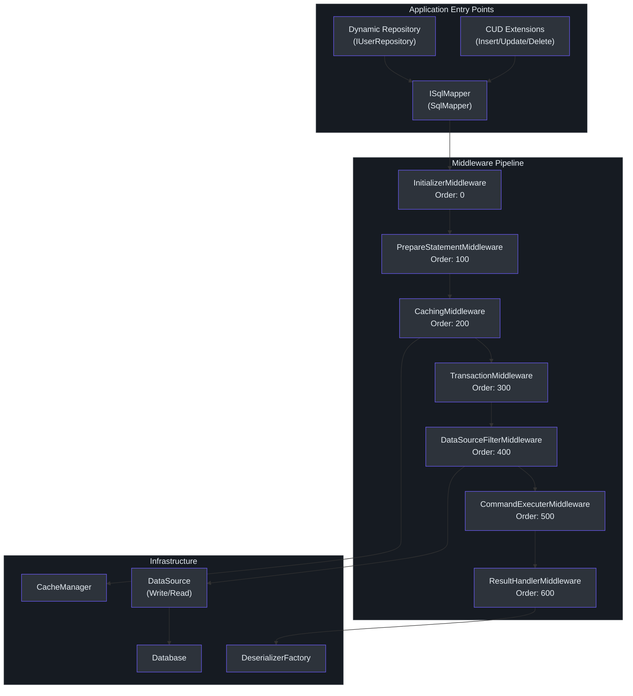
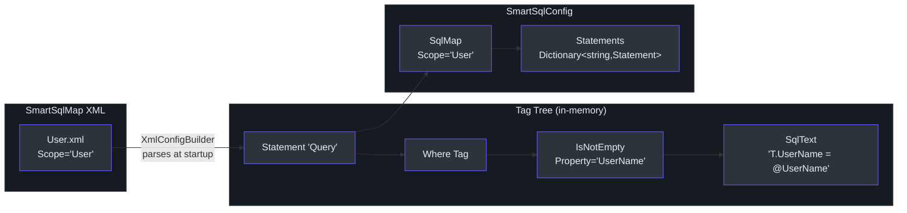
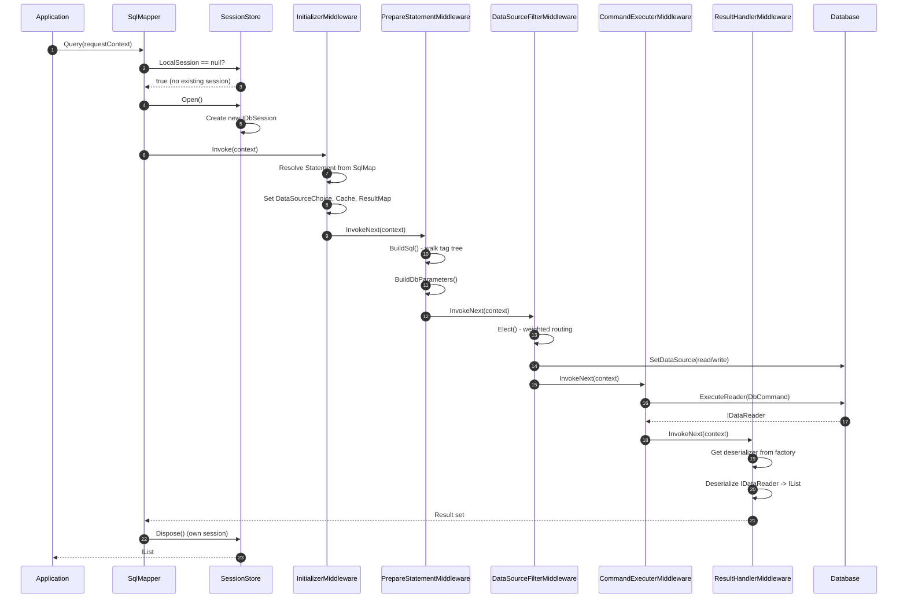

# SmartSql 介绍

SmartSql 是一个受 [MyBatis](https://mybatis.org/mybatis-3/) 启发的 .NET ORM 库。与将 SQL 隐藏在 LINQ 表达式或代码生成工具之后不同，SmartSql 将 SQL 作为一等公民 -- 管理在外部 XML 文件中，而非散落在 C# 代码里。它以 `netstandard2.0` 和 C# 7.3 为目标，使其兼容 .NET Framework 4.6.1+ 和 .NET Core/.NET 5+。

## 为什么选择 SmartSql？

.NET 生态系统提供了多种数据访问方式。Entity Framework Core 为你提供了带有 LINQ 的完整变更跟踪 ORM。Dapper 为你提供了使用手写 SQL 映射的原始速度。SmartSql 占据了一个深思熟虑的中间地带：它提供了 **Dapper 的 SQL 控制能力** 以及 **ORM 的基础设施特性** -- 缓存、读写分离、动态仓储、批量插入、AOP 事务和诊断 -- 而无需你手动编写数据访问代码。

其核心理念很简单：**SQL 属于 XML，而不是 C# 源代码。** 这种分离允许 DBA 独立审查和优化查询，支持使用条件标签进行动态 SQL 构建，并使 SQL 映射可以在项目间复用。

## 概要

| 特性 | 描述 |
|------|------|
| XML 管理的 SQL | 所有 SQL 语句存放在 `.xml` SmartSqlMap 文件中 |
| 动态 SQL 标签 | 条件标签如 `Where`、`IsNotEmpty`、`Switch`、`Set`、`For`、`Include` |
| 读写分离 | 自动将读操作路由到副本，支持加权负载均衡 |
| 缓存 | 内置 LRU/FIFO 内存缓存和 Redis 缓存，支持执行时刷新 |
| 动态仓储 | 通过 IL emit 实现接口到实现的代理生成 |
| CUD 扩展 | 基于约定的 Insert/Update/Delete/GetById，无需 XML |
| 批量插入 | 原生批量复制，支持 SqlServer、MySQL、PostgreSQL |
| AOP 事务 | `[Transaction]` 属性用于声明式事务管理 |
| 诊断 | `DiagnosticSource` 事件用于 APM 工具集成 |
| 中间件管道 | 可扩展的执行链，支持自定义中间件和过滤器 |

## 与其他 ORM 的对比

| 方面 | SmartSql | EF Core | Dapper |
|------|----------|---------|--------|
| SQL 管理 | 外部 XML 文件 | LINQ / 原始 SQL 片段 | 内联 C# 字符串 |
| 动态 SQL | 丰富的 XML 标签系统 | 手动字符串构建 | 手动字符串构建 |
| 读写分离 | 内置加权路由 | 手动或通过库 | 手动 |
| 缓存 | 内置内存 + Redis | 二级缓存（第三方） | 无 |
| 仓储抽象 | 通过接口的动态代理 | DbContext 模式 | 无 |
| 批量操作 | 原生批量复制提供程序 | EF Extensions / 第三方 | 无 |
| 学习曲线 | 中等（XML 标签） | 低至中 | 低 |
| 性能 | 高（无变更跟踪开销） | 中 | 高 |
| 变更跟踪 | 可选（`EnablePropertyChangedTrack`） | 内置 | 无 |

## 架构概览

SmartSql 通过中间件管道组织执行。每个 SQL 操作 -- 无论是简单查询还是分页报表 -- 都流经相同的中间件组件链，每个组件负责特定的关注点。

<!-- Sources: src/SmartSql/SmartSqlBuilder.cs:240-281, src/SmartSql/Middlewares/InitializerMiddleware.cs:10-215 -->

## 中间件管道

管道是一个 `IMiddleware` 实现的链表，每个实现都有一个 `Order` 属性来确定执行顺序。`PipelineBuilder` 按顺序排序中间件并通过 `Next` 指针链接它们（[src/SmartSql/PipelineBuilder.cs:25-39](https://github.com/dotnetcore/SmartSql/blob/master/src/SmartSql/PipelineBuilder.cs#L25-L39)）。

| 中间件 | 顺序 | 职责 |
|--------|------|------|
| `InitializerMiddleware` | 0 | 从配置中解析 `Statement`，设置数据源选择、缓存、结果映射 |
| `PrepareStatementMiddleware` | 100 | 从 XML 标签构建最终 SQL 字符串，创建 `DbParameter` 实例 |
| `CachingMiddleware` | 200 | 读操作时检查缓存；执行后填充缓存（当 `IsCacheEnabled=true` 时） |
| `TransactionMiddleware` | 300 | 当语句指定了 `Transaction` 时，将执行包装在 `DbTransaction` 中 |
| `DataSourceFilterMiddleware` | 400 | 根据语句类型选择写入或加权读取数据源 |
| `CommandExecuterMiddleware` | 500 | 执行 `DbCommand`（`ExecuteNonQuery`、`ExecuteScalar`、`ExecuteReader`） |
| `ResultHandlerMiddleware` | 600 | 通过反序列化链反序列化 `IDataReader` 结果 |

每个中间件可以通过设置 `executionContext.Result.End = true` 来短路管道。`CachingMiddleware` 在找到缓存命中时正是这样做的 -- 它返回缓存结果而不执行 SQL。

## 反序列化链

当结果从数据库返回时，`DeserializerFactory` 按顺序尝试反序列化器（[src/SmartSql/SmartSqlBuilder.cs:219-236](https://github.com/dotnetcore/SmartSql/blob/master/src/SmartSql/SmartSqlBuilder.cs#L219-L236)）：

1. **MultipleResultDeserializer** -- 处理多结果集（例如，分页查询同时返回数据和计数）
2. **ValueTupleDeserializer** -- 处理 `ValueTuple` 返回类型
3. **ValueTypeDeserializer** -- 处理基本类型（`int`、`string`、`Guid` 等）
4. **DynamicDeserializer** -- 处理 `dynamic` / `ExpandoObject` 返回
5. **EntityDeserializer** -- 将列映射到强类型实体属性（默认回退）

自定义反序列化器可以通过 `SmartSqlBuilder.AddDeserializer()` 注册到链的前端。

## XML 管理的 SQL 理念

SmartSql 将所有 SQL 存储在称为 **SmartSqlMaps** 的 XML 文件中。每个映射有一个 `Scope`（命名空间），并包含定义各个 SQL 操作的 `Statement` 元素。XML 在启动时由 `XmlConfigBuilder` 处理，并转换为带有标签树的内存 `Statement` 对象。

<!-- Sources: src/SmartSql/Configuration/SqlMap.cs:1-75, src/SmartSql/Configuration/Statement.cs:1-48 -->

在运行时，当你调用 `ISqlMapper.Query<T>(requestContext)` 时，`PrepareStatementMiddleware` 调用 `Statement.BuildSql()` 来遍历标签树。每个标签根据当前请求参数评估其条件，如果条件通过则追加其 SQL 片段。这产生最终的 SQL，只包含相关的 WHERE 子句、SET 列或 ORDER BY 列。

## 核心组件

| 组件 | 文件 | 用途 |
|------|------|------|
| `SmartSqlBuilder` | [src/SmartSql/SmartSqlBuilder.cs](https://github.com/dotnetcore/SmartSql/blob/master/src/SmartSql/SmartSqlBuilder.cs) | 构建整个运行时的流式构建器 |
| `SmartSqlConfig` | [src/SmartSql/Configuration/SmartSqlConfig.cs](https://github.com/dotnetcore/SmartSql/blob/master/src/SmartSql/Configuration/SmartSqlConfig.cs) | 保存所有已解析设置的中央配置 |
| `SqlMapper` | [src/SmartSql/SqlMapper.cs](https://github.com/dotnetcore/SmartSql/blob/master/src/SmartSql/SqlMapper.cs) | 包装 `IDbSession` 的主入口点 |
| `SqlMap` | [src/SmartSql/Configuration/SqlMap.cs](https://github.com/dotnetcore/SmartSql/blob/master/src/SmartSql/Configuration/SqlMap.cs) | 单个 XML 文件模型（scope、statements、caches、result maps） |
| `Statement` | [src/SmartSql/Configuration/Statement.cs](https://github.com/dotnetcore/SmartSql/blob/master/src/SmartSql/Configuration/Statement.cs) | 带有标签树的单个 SQL 操作 |
| `DataSourceFilter` | [src/SmartSql/DataSource/DataSourceFilter.cs](https://github.com/dotnetcore/SmartSql/blob/master/src/SmartSql/DataSource/DataSourceFilter.cs) | 加权读写数据源选择 |
| `Database` | [src/SmartSql/DataSource/Database.cs](https://github.com/dotnetcore/SmartSql/blob/master/src/SmartSql/DataSource/Database.cs) | 保存写入源 + 读取源 |
| `PipelineBuilder` | [src/SmartSql/PipelineBuilder.cs](https://github.com/dotnetcore/SmartSql/blob/master/src/SmartSql/PipelineBuilder.cs) | 构建中间件链表 |

## 查询如何流经系统

<!-- Sources: src/SmartSql/SqlMapper.cs:90-111, src/SmartSql/Middlewares/InitializerMiddleware.cs:14-20, src/SmartSql/Middlewares/PrepareStatementMiddleware.cs:26-35, src/SmartSql/Middlewares/DataSourceFilterMiddleware.cs:11-18, src/SmartSql/Middlewares/CommandExecuterMiddleware.cs:12-53, src/SmartSql/Middlewares/ResultHandlerMiddleware.cs:15-37 -->

## 何时选择 SmartSql

**在以下情况下选择 SmartSql：**
- 想要对 SQL 有完全控制，同时不牺牲 ORM 基础设施特性
- 需要开箱即用的加权负载均衡读写分离
- 偏好 DBA 可以审查和优化的外部化 SQL
- 想要基于约定的动态仓储而无需编写实现代码
- 需要内置缓存（内存或 Redis）而无需额外库
- 想要通过 `DiagnosticSource` 集成 APM

**在以下情况下考虑替代方案：**
- 偏好代码优先的数据库迁移（EF Core 在这方面更强）
- 想要最小基础设施和最大简洁性（Dapper）
- 需要完整的变更跟踪和延迟加载 ORM 行为（EF Core）

## 后续步骤

- [快速上手](./quick-start.md) -- 5 分钟内上手运行
- [配置](./configuration.md) -- SmartSqlMapConfig.xml 和流式构建器 API 的完整指南
- [XML SQL 映射](./xml-sql-maps.md) -- 使用动态 SQL 标签编写 SmartSqlMap 文件

## 参考资料

- [SmartSqlBuilder.cs](https://github.com/dotnetcore/SmartSql/blob/master/src/SmartSql/SmartSqlBuilder.cs) -- 流式构建器
- [SqlMapper.cs](https://github.com/dotnetcore/SmartSql/blob/master/src/SmartSql/SqlMapper.cs) -- 主入口点
- [SmartSqlConfig.cs](https://github.com/dotnetcore/SmartSql/blob/master/src/SmartSql/Configuration/SmartSqlConfig.cs) -- 中央配置
- [PipelineBuilder.cs](https://github.com/dotnetcore/SmartSql/blob/master/src/SmartSql/PipelineBuilder.cs) -- 中间件管道构建
- [ExecutionContext.cs](https://github.com/dotnetcore/SmartSql/blob/master/src/SmartSql/ExecutionContext.cs) -- 承载所有状态的执行上下文
