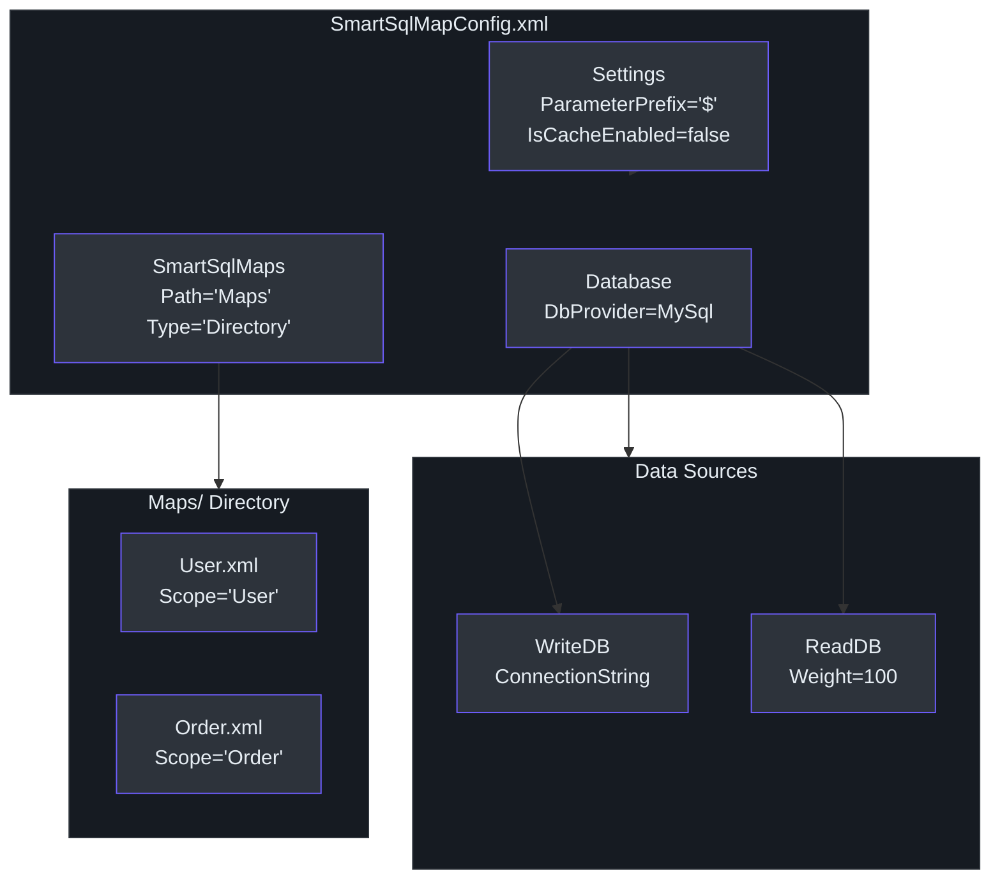
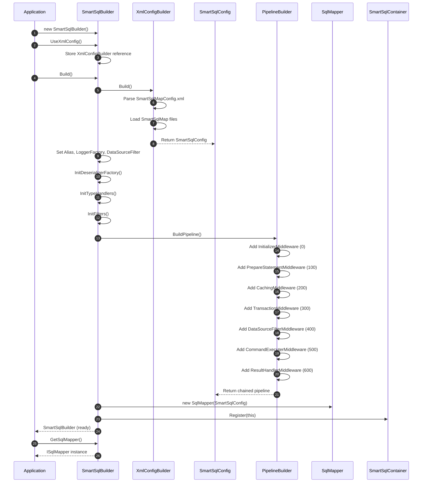
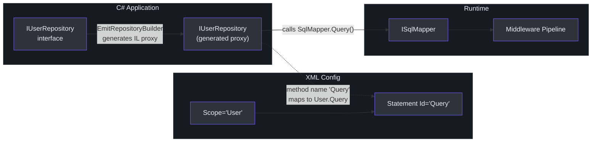

# 快速上手

本指南将带你从零开始搭建一个可工作的 SmartSql 环境。完成后，你将拥有一个通过 XML 配置的 `SmartSqlBuilder`、一个运行中的 `ISqlMapper`，以及一个对数据库执行查询的动态仓储接口。

## 安装

从 NuGet 安装核心包：

```bash
dotnet add package SmartSql
```

用于 ASP.NET Core 依赖注入集成：

```bash
dotnet add package SmartSql.DIExtension
```

用于动态仓储支持：

```bash
dotnet add package SmartSql.DyRepository
```

| 包名 | 用途 |
|------|------|
| `SmartSql` | 核心库 -- 构建器、映射器、中间件管道、XML 配置 |
| `SmartSql.DIExtension` | `services.AddSmartSql()` 和 `AddRepositoryFromAssembly()` |
| `SmartSql.DyRepository` | 动态代理仓储生成 |
| `SmartSql.Cache.Redis` | Redis 缓存提供程序 |
| `SmartSql.TypeHandler` | JSON 和自定义类型处理器 |
| `SmartSql.Bulk.MySqlConnector` | MySQL 批量插入（以及其他数据库的类似包） |

## 步骤 1：创建 XML 配置

每个 SmartSql 应用程序都需要一个 `SmartSqlMapConfig.xml` 文件。该文件定义数据库连接、设置、类型处理器以及 SQL 映射文件的位置。

在项目根目录下创建 `SmartSqlMapConfig.xml`：

```xml
<?xml version="1.0" encoding="utf-8" ?>
<SmartSqlMapConfig xmlns="http://SmartSql.net/schemas/SmartSqlMapConfig.xsd">
  <Settings IgnoreParameterCase="false"
            ParameterPrefix="$"
            IsCacheEnabled="false" />
  <Database>
    <DbProvider Name="MySql" />
    <Write Name="WriteDB"
           ConnectionString="Server=localhost;Database=SmartSqlDB;Uid=root;Pwd=123456;" />
    <Read Name="ReadDB"
          ConnectionString="Server=localhost;Database=SmartSqlDB;Uid=root;Pwd=123456;"
          Weight="100" />
  </Database>
  <SmartSqlMaps>
    <SmartSqlMap Path="Maps" Type="Directory" />
  </SmartSqlMaps>
</SmartSqlMapConfig>
```

将文件属性设置为 **复制到输出目录：如果较新则复制**。


<!-- Sources: src/SmartSql/SmartSqlBuilder.cs:468-472, src/SmartSql/ConfigBuilder/XmlConfigBuilder.cs -->

## 步骤 2：创建 SQL 映射

创建 `Maps/User.xml` 文件来定义 User 实体的 SQL 语句：

```xml
<?xml version="1.0" encoding="utf-8" ?>
<SmartSqlMap Scope="User"
             xmlns="http://SmartSql.net/schemas/SmartSqlMap.xsd">
  <Statements>
    <Statement Id="Insert">
      INSERT INTO T_User (UserName, Status)
      VALUES (@UserName, @Status)
      ;SELECT LAST_INSERT_ID();
    </Statement>

    <Statement Id="Delete">
      DELETE FROM T_User WHERE Id = @Id
    </Statement>

    <Statement Id="Update">
      UPDATE T_User
      <Set>
        <IsProperty Prepend="," Property="UserName">
          UserName = @UserName
        </IsProperty>
        <IsProperty Prepend="," Property="Status">
          Status = @Status
        </IsProperty>
      </Set>
      WHERE Id = @Id
    </Statement>

    <Statement Id="GetEntity">
      SELECT T.* FROM T_User T
      <Where>
        <IsNotEmpty Prepend="AND" Property="Id">
          T.Id = @Id
        </IsNotEmpty>
      </Where>
      LIMIT 1
    </Statement>

    <Statement Id="Query">
      SELECT T.* FROM T_User T
      <Where>
        <IsNotEmpty Prepend="AND" Property="UserName">
          T.UserName = @UserName
        </IsNotEmpty>
        <IsNotEmpty Prepend="AND" Property="Status">
          T.Status = @Status
        </IsNotEmpty>
      </Where>
      ORDER BY T.Id DESC
    </Statement>
  </Statements>
</SmartSqlMap>
```

`<SmartSqlMap>` 上的 `Scope` 属性充当命名空间。语句 ID 以 `Scope.Id` 的方式引用（例如 `User.Query`）。这是[示例应用程序](https://github.com/dotnetcore/SmartSql/blob/master/sample/SmartSql.Sample.AspNetCore/Maps/User.xml)中使用的模式。

## 步骤 3：使用流式 API 构建 SmartSqlMapper

### 控制台应用程序

```csharp
using SmartSql;

var smartSqlBuilder = new SmartSqlBuilder()
    .UseXmlConfig()                          // 加载 SmartSqlMapConfig.xml
    .UseCache()                              // 启用缓存
    .Build();

ISqlMapper sqlMapper = smartSqlBuilder.GetSqlMapper();
```

`SmartSqlBuilder.Build()` 方法（[src/SmartSql/SmartSqlBuilder.cs:60-76](https://github.com/dotnetcore/SmartSql/blob/master/src/SmartSql/SmartSqlBuilder.cs#L60-L76)）触发整个初始化链：

1. `XmlConfigBuilder` 解析 `SmartSqlMapConfig.xml`
2. 数据库提供程序、类型处理器和 ID 生成器被解析
3. SQL 映射 XML 文件被加载并解析为 `Statement` 对象
4. 中间件管道被组装
5. `SmartSqlBuilder` 被注册到 `SmartSqlContainer`


<!-- Sources: src/SmartSql/SmartSqlBuilder.cs:60-76, src/SmartSql/SmartSqlBuilder.cs:155-201, src/SmartSql/PipelineBuilder.cs:24-39 -->

### ASP.NET Core 应用程序

对于 ASP.NET Core，使用 [示例 Startup.cs](https://github.com/dotnetcore/SmartSql/blob/master/sample/SmartSql.Sample.AspNetCore/Startup.cs) 中所示的 DI 扩展方法：

```csharp
// 在 Startup.cs / ConfigureServices 中
services.AddSmartSql((sp, builder) =>
{
    builder.UseProperties(Configuration);
})
.AddRepositoryFromAssembly(o =>
{
    o.AssemblyString = "MyApp";
    o.Filter = (type) => type.Namespace == "MyApp.Repositories";
});
```

`AddSmartSql()` 将 `ISqlMapper`、`IDbSessionFactory` 和 `SmartSqlConfig` 注册为单例。`AddRepositoryFromAssembly()` 扫描指定程序集中的接口并生成动态代理实现。

## 步骤 4：使用 ISqlMapper

`ISqlMapper`（[src/SmartSql/ISqlMapper.cs](https://github.com/dotnetcore/SmartSql/blob/master/src/SmartSql/ISqlMapper.cs)）是主要 API。它包装了 `IDbSession`，具有自动会话生命周期管理 -- 如果不存在会话则打开一个会话，执行后销毁它。

| 方法 | 返回类型 | 描述 |
|------|----------|------|
| `Execute(requestContext)` | `int` | 执行非查询（INSERT/UPDATE/DELETE），返回受影响的行数 |
| `ExecuteScalar<T>(requestContext)` | `T` | 返回单个标量值 |
| `Query<T>(requestContext)` | `IList<T>` | 返回实体列表 |
| `QuerySingle<T>(requestContext)` | `T` | 返回单个实体 |
| `GetDataTable(requestContext)` | `DataTable` | 返回原始 `DataTable` |
| `GetDataSet(requestContext)` | `DataSet` | 返回包含多个结果集的原始 `DataSet` |
| 以上所有 | `Task<T>` | 异步变体（`ExecuteAsync`、`QueryAsync` 等） |

### 构建请求上下文

SmartSql 使用 `RequestContext` 对象来承载语句标识和参数。最常见的方式是使用 `AbstractRequestContext.Create` 工厂或直接构造：

```csharp
// 带参数的查询
var users = sqlMapper.Query<User>(new RequestContext
{
    Scope = "User",
    SqlId = "Query",
    Request = new { UserName = "SmartSql", Status = 1 }
});

// 通过 ID 获取单个实体
var user = sqlMapper.GetEntity<User, long>("User", "GetEntity", 42);

// 执行插入并返回受影响的行数
var rows = sqlMapper.Execute(new RequestContext
{
    Scope = "User",
    SqlId = "Insert",
    Request = new { UserName = "NewUser", Status = 1 }
});
```

## 步骤 5：使用动态仓储

动态仓储消除了直接调用 `ISqlMapper` 的需要。定义一个接口，SmartSql 在运行时使用 IL emit 生成实现（[src/SmartSql.DyRepository/](https://github.com/dotnetcore/SmartSql/tree/master/src/SmartSql.DyRepository)）。

```csharp
using SmartSql.DyRepository.Annotations;

public interface IUserRepository : IRepository
{
    long Insert(User entity);

    [Statement(Id = "GetEntity")]
    User GetById([Param("Id")] long id);

    IEnumerable<User> Query([Param("Taken")] int taken);

    [Statement(Id = "QueryByPage")]
    Task<TPageResult> GetByPage<TPageResult>(object request);

    Task<IEnumerable<User>> QueryAsync([Param("Taken")] int taken);

    int Update(User entity);
}
```

方法到语句的映射规则：

| 约定 | 映射到语句 |
|------|-----------|
| 方法名 `Insert` | `Scope.Insert` |
| 方法名 `Update` | `Scope.Update` |
| 方法名 `Query` | `Scope.Query` |
| `[Statement(Id = "GetEntity")]` | `Scope.GetEntity` |
| 参数 `[Param("Id")]` | 将参数名映射到 SQL 中的 `@Id` |

`Scope` 源自包含匹配语句的 `SmartSqlMap` 元素上的 XML `Scope` 属性。如果多个 scope 中有相同 ID 的语句，使用 `[Statement(Scope = "User")]` 来消除歧义。


<!-- Sources: src/SmartSql.DyRepository/IRepository.cs:1-39, sample/SmartSql.Sample.AspNetCore/DyRepositories/IUserRepository.cs:1-24 -->

## 步骤 6：使用 CUD 扩展

对于简单的 CRUD 操作，SmartSql 可以在运行时自动生成 SQL 语句 -- 无需 XML。CUD 系统使用实体元数据和列属性来构建 INSERT、UPDATE、DELETE 和 SELECT 语句（[src/SmartSql/CUD/CUDSqlGenerator.cs](https://github.com/dotnetcore/SmartSql/blob/master/src/SmartSql/CUD/CUDSqlGenerator.cs)）。

```csharp
// 在 SmartSqlBuilder 中启用 CUD
var builder = new SmartSqlBuilder()
    .UseXmlConfig()
    .RegisterEntity(typeof(AllPrimitive))
    .UseCUDConfigBuilder()
    .Build();

var mapper = builder.GetSqlMapper();

// 这些操作无需任何 XML 语句定义即可工作：
long id = mapper.Insert<AllPrimitive, long>(entity);
var entity = mapper.GetById<AllPrimitive, long>(id);
int updated = mapper.Update<AllPrimitive>(entity);
int deleted = mapper.DeleteById<AllPrimitive, long>(id);
int deleted = mapper.DeleteMany<AllPrimitive, long>(new[] { 1L, 2L, 3L });
```

`CUDSqlGenerator` 自动生成如下语句：

| 生成方法 | SQL |
|----------|-----|
| `Insert` | `INSERT INTO T_AllPrimitive (Col1, Col2, ...) VALUES (@Prop1, @Prop2, ...)` |
| `InsertReturnId` | 上述 + `SELECT LAST_INSERT_ID()`（数据库相关） |
| `Update` | `UPDATE T_AllPrimitive SET Col1=@Prop1, ... WHERE Id=@Id` |
| `DeleteById` | `DELETE FROM T_AllPrimitive WHERE Id=@Id` |
| `DeleteMany` | `DELETE FROM T_AllPrimitive WHERE Id IN @Ids` |
| `GetEntity` | `SELECT * FROM T_AllPrimitive WHERE Id=@Id` |

## 事务管理

### 手动事务

```csharp
try
{
    sqlMapper.BeginTransaction();
    sqlMapper.Execute(insertContext);
    sqlMapper.Execute(updateContext);
    sqlMapper.CommitTransaction();
}
catch
{
    sqlMapper.RollbackTransaction();
    throw;
}
```

### 语句级事务

你可以在 XML 中的 `<Statement>` 元素上直接声明事务隔离级别：

```xml
<Statement Id="InsertByStatementTransaction" Transaction="Unspecified">
    INSERT INTO T_AllPrimitive (...) VALUES (...)
</Statement>
```

`TransactionMiddleware`（[src/SmartSql/Middlewares/TransactionMiddleware.cs](https://github.com/dotnetcore/SmartSql/blob/master/src/SmartSql/Middlewares/TransactionMiddleware.cs)）会自动将此语句包装在事务中。

### AOP 事务（通过 SmartSql.AOP）

```csharp
[Transaction]
public long AddWithTranWrap(User user)
{
    var id = _userRepository.Insert(user);
    // 其他操作...
    return id;
}
```

## 处理多结果集

对于返回多个结果集的查询（在分页中很常见），使用 `MultipleResultMap` 和 `ValueTuple`：

```xml
<Statement Id="GetByPage_ValueTuple">
  SELECT T.* FROM T_AllPrimitive T
  <Include RefId="QueryParams"/>
  ORDER BY T.Id DESC
  LIMIT ?Offset, ?PageSize;

  SELECT COUNT(1) FROM T_AllPrimitive T
  <Include RefId="QueryParams"/>;
</Statement>
```

```csharp
var (list, total) = sqlMapper.GetByPage_ValueTuple<(IList<AllPrimitive>, int)>(
    new { Offset = 0, PageSize = 10 });
```

## 后续步骤

- [配置](./configuration.md) -- 深入了解 SmartSqlMapConfig.xml 和流式构建器
- [XML SQL 映射](./xml-sql-maps.md) -- 所有动态 SQL 标签及示例
- [更新日志](./changelog.md) -- 版本历史和里程碑

## 参考资料

- [SmartSqlBuilder.cs](https://github.com/dotnetcore/SmartSql/blob/master/src/SmartSql/SmartSqlBuilder.cs) -- 包含 `UseXmlConfig()`、`UseDataSource()`、`UseCache()` 等的流式构建器
- [ISqlMapper.cs](https://github.com/dotnetcore/SmartSql/blob/master/src/SmartSql/ISqlMapper.cs) -- 包含同步/异步方法的映射器接口
- [SqlMapper.cs](https://github.com/dotnetcore/SmartSql/blob/master/src/SmartSql/SqlMapper.cs) -- 映射器实现
- [IRepository.cs](https://github.com/dotnetcore/SmartSql/blob/master/src/SmartSql.DyRepository/IRepository.cs) -- 仓储基接口
- [CUDSqlGenerator.cs](https://github.com/dotnetcore/SmartSql/blob/master/src/SmartSql/CUD/CUDSqlGenerator.cs) -- 自动生成的 CRUD SQL
- [Startup.cs（示例）](https://github.com/dotnetcore/SmartSql/blob/master/sample/SmartSql.Sample.AspNetCore/Startup.cs) -- ASP.NET Core 集成示例
- [UserController.cs（示例）](https://github.com/dotnetcore/SmartSql/blob/master/sample/SmartSql.Sample.AspNetCore/Controllers/UserController.cs) -- 在控制器中使用动态仓储
