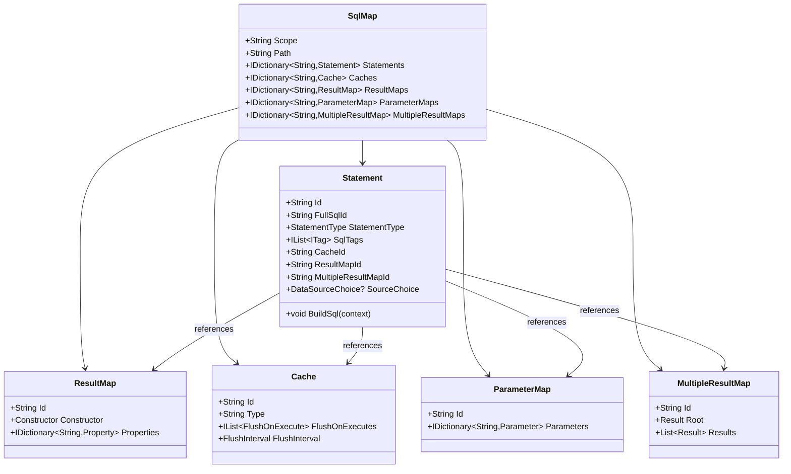
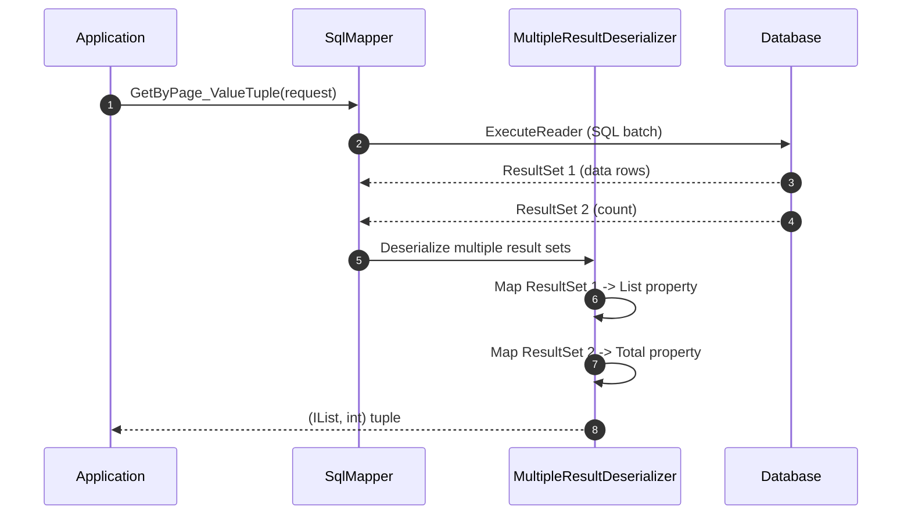
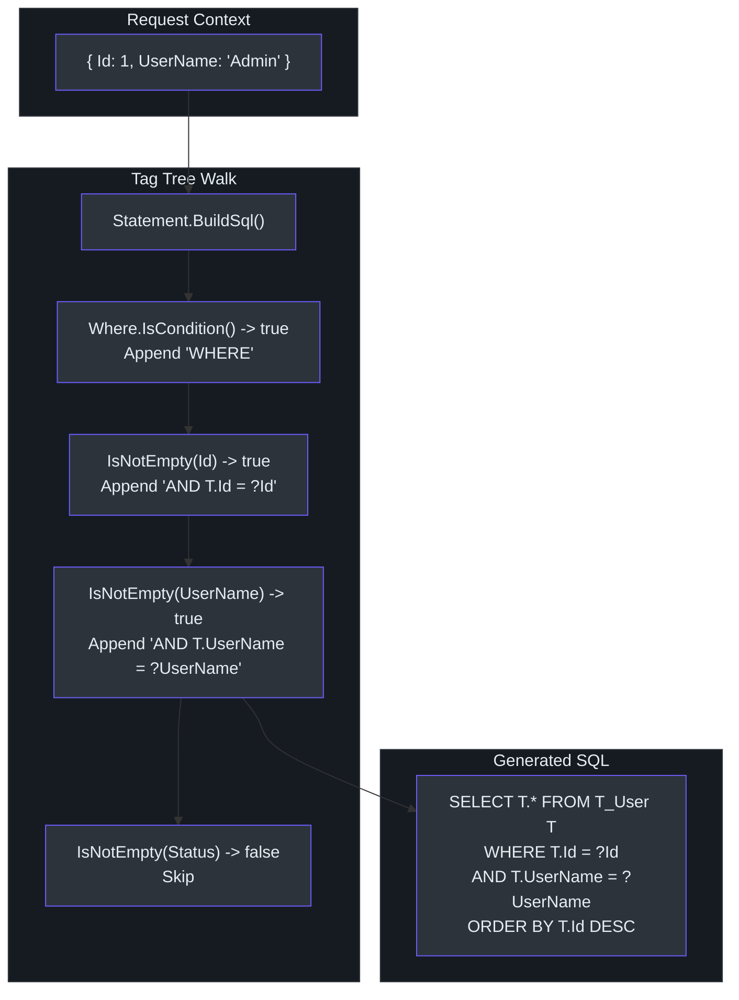

# XML SQL 映射

SmartSql 将所有 SQL 语句存储在称为 **SmartSqlMaps** 的 XML 文件中。每个文件定义一个 `Scope`（命名空间），并包含用于 SQL 操作的 `Statement` 元素、用于列到属性映射的 `ResultMap` 元素、用于缓存配置的 `Cache` 元素，以及用于参数类型绑定的 `ParameterMap` 元素。SQL 的这种外部化是 SmartSql 的核心特征 -- 它将数据访问逻辑与应用程序代码分离，允许 DBA 独立审查和优化查询。

## SmartSqlMap 结构

每个 `.xml` 文件遵循以下顶层结构：

```xml
<?xml version="1.0" encoding="utf-8" ?>
<SmartSqlMap Scope="User"
             xmlns="http://SmartSql.net/schemas/SmartSqlMap.xsd">
  <Caches>
    <!-- 缓存定义 -->
  </Caches>
  <ParameterMaps>
    <!-- 参数类型映射 -->
  </ParameterMaps>
  <ResultMaps>
    <!-- 列到属性的映射 -->
  </ResultMaps>
  <MultipleResultMaps>
    <!-- 多结果集映射 -->
  </MultipleResultMaps>
  <Statements>
    <!-- SQL 语句 -->
  </Statements>
</SmartSqlMap>
```

`Scope` 属性是此文件中所有语句的命名空间。语句以 `Scope.Id` 的方式引用（例如 `User.Query`、`User.Insert`）。此模型定义在 [src/SmartSql/Configuration/SqlMap.cs](https://github.com/dotnetcore/SmartSql/blob/master/src/SmartSql/Configuration/SqlMap.cs) 中。


<!-- Sources: src/SmartSql/Configuration/SqlMap.cs:8-75, src/SmartSql/Configuration/Statement.cs:10-48 -->

## Statement

`<Statement>` 定义单个 SQL 操作。它有一个 `Id` 属性（在其 scope 内唯一），并包含动态 SQL 标签作为子元素。

```xml
<Statement Id="Query">
  SELECT T.* FROM T_User T
  <Where>
    <IsNotEmpty Prepend="AND" Property="UserName">
      T.UserName = @UserName
    </IsNotEmpty>
    <IsNotEmpty Prepend="AND" Property="Status">
      T.Status = @Status
    </IsNotEmpty>
  </Where>
  ORDER BY T.Id DESC
</Statement>
```

### Statement 属性

| 属性 | 类型 | 描述 |
|------|------|------|
| `Id` | `string` | scope 内的唯一标识符。以 `Scope.Id` 的方式引用 |
| `ResultMap` | `string` | 用于列到属性映射的 `ResultMap` ID |
| `MultipleResultMap` | `string` | 用于多结果集的 `MultipleResultMap` ID |
| `Cache` | `string` | 此语句使用的 `Cache` ID |
| `ParameterMap` | `string` | 用于参数类型绑定的 `ParameterMap` ID |
| `CommandType` | `CommandType` | `Text`（默认）、`StoredProcedure` 或 `TableDirect` |
| `SourceChoice` | `DataSourceChoice` | 强制使用 `Read` 或 `Write` 数据源 |
| `ReadDb` | `string` | 按名称强制使用特定读取数据源 |
| `Transaction` | `IsolationLevel` | 将此语句包装在事务中（例如 `Unspecified`、`ReadCommitted`） |
| `EnablePropertyChangedTrack` | `bool` | 启用属性变更跟踪以用于部分更新 |
| `CommandTimeout` | `int` | 命令超时时间（秒） |

### StatementType

SmartSql 通过分析 SQL 文本自动判断语句是读操作还是写操作。这驱动了 `DataSourceFilterMiddleware` 中的数据源路由：

| 类型 | SQL 关键字 | 数据源 |
|------|-----------|--------|
| `Read` | `SELECT` | 读取（加权） |
| `Write` | `INSERT`、`UPDATE`、`DELETE` | 写入 |
| `Unknown` | 其他（例如存储过程） | 写入（默认） |

## ResultMap

`<ResultMap>` 将数据库列名映射到 .NET 属性名。当列名与属性名不同或需要嵌套属性访问时使用。

```xml
<ResultMaps>
  <ResultMap Id="NestedPropertyResultMap">
    <Result Column="Id" Property="Id" />
    <Result Column="String" Property="NestedProp1.NestedProp2.NestedProp3" />
  </ResultMap>
</ResultMaps>
```

在 Statement 中引用它：

```xml
<Statement Id="QueryNestedPropertyResult" ResultMap="NestedPropertyResultMap">
  SELECT T.* FROM T_AllPrimitive T ...
</Statement>
```

结果映射支持：
- 简单的列到属性映射
- 通过点号的嵌套/链式属性访问（例如 `NestedProp1.NestedProp2.NestedProp3`）
- 每列通过 `Handler` 属性自定义 `TypeHandler`

## MultipleResultMap

`<MultipleResultMap>` 将单个语句的多个结果集映射到响应对象的不同属性。这对于同时返回数据行和总数的分页查询至关重要。

```xml
<MultipleResultMaps>
  <MultipleResultMap Id="QueryByPageResult">
    <Result Property="List" />
    <Result Property="Total" />
    <Result Property="UserName" />
  </MultipleResultMap>
</MultipleResultMaps>
```

对应的语句使用分号分隔的多个 SQL 批次：

```xml
<Statement Id="QueryByPage" MultipleResultMap="QueryByPageResult">
  SELECT T.* FROM T_User T
  <Include RefId="QueryParams" />
  LIMIT @PageSize OFFSET 0;

  SELECT COUNT(1) FROM T_User T
  <Include RefId="QueryParams" />;

  SELECT 'SmartSql';
</Statement>
```

每个结果集按顺序映射到对应的 `<Result>`：第一个查询映射到 `List`，第二个映射到 `Total`，第三个映射到 `UserName`。

### 根结果

`<MultipleResultMap>` 可以选择性地指定一个 `<Root>` 结果，它映射到根对象本身而非某个属性：

```xml
<MultipleResultMap Id="MultiRoot">
  <Root />
  <Result Property="List" />
</MultipleResultMap>
```


<!-- Sources: src/SmartSql/Configuration/MultipleResultMap.cs:8-30, src/SmartSql.Test.Unit/Maps/AllPrimitive.xml:17-26 -->

## Cache

缓存在 `<Caches>` 节中按 scope 配置，并由个别语句引用。

```xml
<Caches>
  <Cache Id="UserCache" Type="Lru">
    <FlushOnExecute Statement="Update" />
    <FlushOnExecute Statement="Delete" />
  </Cache>
</Caches>
```

| 缓存类型 | 描述 |
|----------|------|
| `Lru` | 最近最少使用淘汰策略 |
| `Fifo` | 先进先出淘汰策略 |

### Cache 属性

| 属性 | 描述 |
|------|------|
| `Id` | scope 内的唯一缓存标识符 |
| `Type` | 缓存实现类型（`Lru` 或 `Fifo`） |

### FlushOnExecute

当指定的语句被执行时使缓存失效。这确保写操作自动清除过时的缓存读取：

```xml
<Cache Id="UserCache" Type="Lru">
  <FlushOnExecute Statement="Update" />
  <FlushOnExecute Statement="Delete" />
</Cache>
```

### FlushInterval

基于时间的缓存过期：

```xml
<Cache Id="UserCache" Type="Lru">
  <FlushInterval Hours="0" Minutes="5" Seconds="0" />
</Cache>
```

### 引用缓存

```xml
<Statement Id="GetEntity" Cache="UserCache">
  SELECT T.* FROM T_User T WHERE T.Id = @Id
</Statement>
```

缓存仅在 `<Settings>` 中设置了 `IsCacheEnabled="true"` 时才生效。启用后，`CachingMiddleware`（顺序：200）在 SQL 执行前检查缓存，在执行后填充缓存（[src/SmartSql/Middlewares/CachingMiddleware.cs:13-29](https://github.com/dotnetcore/SmartSql/blob/master/src/SmartSql/Middlewares/CachingMiddleware.cs#L13-L29)）。

## ParameterMap

`<ParameterMap>` 将参数名显式映射到数据库类型和类型处理器：

```xml
<ParameterMaps>
  <ParameterMap Id="UserParamMap">
    <Parameter Property="Id" DbType="Int64" />
    <Parameter Property="UserName" DbType="String" />
  </ParameterMap>
</ParameterMaps>
```

在 Statement 中引用它：

```xml
<Statement Id="GetEntity" ParameterMap="UserParamMap">
  ...
</Statement>
```

## 动态 SQL 标签

SmartSql 提供了一组丰富的 XML 标签，用于根据请求参数动态构建 SQL。在运行时，每个标签评估其 `IsCondition()` 方法，仅在条件通过时追加其 SQL 片段。标签树由 `Statement.BuildSql()` 遍历（[src/SmartSql/Configuration/Statement.cs:41-47](https://github.com/dotnetcore/SmartSql/blob/master/src/SmartSql/Configuration/Statement.cs#L41-L47)）。

```mermaid
flowchart TD
    subgraph tags["Tag Inheritance Hierarchy"]
        style tags fill:#161b22,stroke:#30363d,color:#e6edf3
        ITag["ITag<br>IsCondition(), BuildSql()"]
        TAG["Tag (abstract)<br>Prepend, Property, Required"]
        DYNAMIC["Dynamic<br>Min"]
        COMPARE["CompareTag&lt;T&gt;<br>CompareValue"]
        NC["NumericalCompareTag<br>(Decimal)"]
        SC["StringCompareTag<br>(String)"]
    end

    TAG --> ITag
    DYNAMIC --> TAG
    COMPARE --> TAG
    NC --> COMPARE
    SC --> COMPARE

    subgraph concrete["Concrete Tags"]
        style concrete fill:#161b22,stroke:#30363d,color:#e6edf3
        WHERE["Where"]
        SET["Set"]
        ISE["IsNotEmpty"]
        ISN["IsNotNull"]
        ISP["IsProperty"]
        EQ["IsEqual"]
        NE["IsNotEqual"]
        GT["IsGreaterThan"]
        LT["IsLessThan"]
        GE["IsGreaterEqual"]
        LE["IsLessEqual"]
        RNG["Range"]
        SW["Switch"]
        FOR["For"]
        INC["Include"]
        ENV["Env"]
        NOW["Now"]
        UUID["UUID"]
        IDG["IdGenerator"]
        PH["Placeholder"]
        OB["OrderBy"]
        IST["IsTrue"]
        ISF["IsFalse"]
        ISEm["IsEmpty"]
    end

    WHERE --> DYNAMIC
    SET --> DYNAMIC
    ISE --> TAG
    ISN --> TAG
    ISP --> TAG
    EQ --> SC
    NE --> SC
    GT --> NC
    LT --> NC
    GE --> NC
    LE --> NC
    RNG --> TAG
    SW --> TAG
    FOR --> TAG
    INC --> TAG
    ENV --> TAG
    NOW --> TAG
    UUID --> TAG
    PH --> TAG
    OB --> TAG
    IST --> TAG
    ISF --> TAG
    ISEm --> TAG

    style ITag fill:#2d333b,stroke:#6d5dfc,color:#e6edf3
    style TAG fill:#2d333b,stroke:#6d5dfc,color:#e6edf3
    style DYNAMIC fill:#2d333b,stroke:#6d5dfc,color:#e6edf3
    style COMPARE fill:#2d333b,stroke:#6d5dfc,color:#e6edf3
    style NC fill:#2d333b,stroke:#6d5dfc,color:#e6edf3
    style SC fill:#2d333b,stroke:#6d5dfc,color:#e6edf3
    style WHERE fill:#2d333b,stroke:#6d5dfc,color:#e6edf3
    style SET fill:#2d333b,stroke:#6d5dfc,color:#e6edf3
    style ISE fill:#2d333b,stroke:#6d5dfc,color:#e6edf3
    style ISN fill:#2d333b,stroke:#6d5dfc,color:#e6edf3
    style ISP fill:#2d333b,stroke:#6d5dfc,color:#e6edf3
    style EQ fill:#2d333b,stroke:#6d5dfc,color:#e6edf3
    style NE fill:#2d333b,stroke:#6d5dfc,color:#e6edf3
    style GT fill:#2d333b,stroke:#6d5dfc,color:#e6edf3
    style LT fill:#2d333b,stroke:#6d5dfc,color:#e6edf3
    style GE fill:#2d333b,stroke:#6d5dfc,color:#e6edf3
    style LE fill:#2d333b,stroke:#6d5dfc,color:#e6edf3
    style RNG fill:#2d333b,stroke:#6d5dfc,color:#e6edf3
    style SW fill:#2d333b,stroke:#6d5dfc,color:#e6edf3
    style FOR fill:#2d333b,stroke:#6d5dfc,color:#e6edf3
    style INC fill:#2d333b,stroke:#6d5dfc,color:#e6edf3
    style ENV fill:#2d333b,stroke:#6d5dfc,color:#e6edf3
    style NOW fill:#2d333b,stroke:#6d5dfc,color:#e6edf3
    style UUID fill:#2d333b,stroke:#6d5dfc,color:#e6edf3
    style PH fill:#2d333b,stroke:#6d5dfc,color:#e6edf3
    style OB fill:#2d333b,stroke:#6d5dfc,color:#e6edf3
    style IST fill:#2d333b,stroke:#6d5dfc,color:#e6edf3
    style ISF fill:#2d333b,stroke:#6d5dfc,color:#e6edf3
    style ISEm fill:#2d333b,stroke:#6d5dfc,color:#e6edf3
    style IDG fill:#2d333b,stroke:#6d5dfc,color:#e6edf3
```


<!-- Sources: src/SmartSql/Configuration/Tags/ITag.cs:8-16, src/SmartSql/Configuration/Tags/Tag.cs:8-62, src/SmartSql/Configuration/Tags/Dynamic.cs:9-59 -->

### 标签参考表

| 标签 | 基类 | 条件 | 描述 |
|------|------|------|------|
| `Where` | `Dynamic` | 至少一个子条件通过 | 前置 `WHERE` 并去除前导 `AND`/`OR` |
| `Set` | `Dynamic` | 至少一个子条件通过 | 前置 `SET` 并去除尾部逗号 |
| `Dynamic` | `Tag` | 至少一个子条件通过 | 通用容器，可配置 `Prepend` |
| `IsNotEmpty` | `Tag` | 属性存在且不为 null/空 | 最常用的条件标签 |
| `IsNotEmpty` + `Required` | `Tag` | 必须存在，缺失时抛出 `TagRequiredFailException` | 强制必填参数 |
| `IsNull` | `Tag` | 属性值为 null | |
| `IsNotNull` | `Tag` | 属性值不为 null | |
| `IsEmpty` | `Tag` | 属性为 null 或空字符串 | |
| `IsProperty` | `Tag` | 属性存在于参数中（不论值） | 在 `Set` 中用于部分更新 |
| `IsNotProperty` | `Tag` | 属性不存在于参数中 | |
| `IsEqual` | `StringCompareTag` | 属性值等于 `CompareValue` | 字符串比较 |
| `IsNotEqual` | `StringCompareTag` | 属性值不等于 `CompareValue` | |
| `IsGreaterThan` | `NumericalCompareTag` | 数值 > `CompareValue` | |
| `IsGreaterEqual` | `NumericalCompareTag` | 数值 >= `CompareValue` | |
| `IsLessThan` | `NumericalCompareTag` | 数值 < `CompareValue` | |
| `IsLessEqual` | `NumericalCompareTag` | 数值 <= `CompareValue` | |
| `IsTrue` | `Tag` | 布尔属性为 `true` | |
| `IsFalse` | `Tag` | 布尔属性为 `false` | |
| `Range` | `Tag` | 数值在 `Min` 和 `Max` 之间（含） | |
| `Switch` | `Tag` | 通过值匹配 `Case` 子元素，回退到 `Default` | |
| `For` | `Tag` | 集合属性非空 | 迭代集合 |
| `Include` | `Tag` | 被包含的语句有通过的条件 | 包含另一个语句的标签树 |
| `Env` | `Tag` | 当前 `DbProvider.Name` 匹配 | 特定于数据库提供程序的 SQL |
| `Now` | `Tag` | 始终为 true | 注入 `DateTime.Now` 作为参数 |
| `UUID` | `Tag` | 始终为 true | 注入 `Guid.NewGuid()` 作为参数 |
| `IdGenerator` | N/A | 始终为 true | 通过已配置的 `IIdGenerator` 生成 ID |
| `Placeholder` | `Tag` | 属性存在 | 原始字符串替换（非参数化） |
| `OrderBy` | `Tag` | 属性是 `KeyValuePair<string,string>` 或集合 | 动态 ORDER BY 子句 |

### 通用标签属性

| 属性 | 适用范围 | 描述 |
|------|---------|------|
| `Prepend` | 所有标签 | 条件通过时前置的 SQL 文本（例如 `"And"`、`","`） |
| `Property` | 所有标签 | 要检查的请求参数名 |
| `Required` | 所有标签 | 为 `true` 且条件失败时抛出 `TagRequiredFailException` |
| `CompareValue` | `IsEqual`、`IsGreaterThan` 等 | 要比较的值 |
| `Min` | `Where`、`Dynamic`、`Range` | 最少匹配的子标签数（用于 `Where`/`Dynamic`）或最小数值（用于 `Range`） |
| `Max` | `Range` | 最大数值 |

## Where

`<Where>` 标签仅在至少一个子条件通过时生成 `WHERE` 子句。它自动去除第一个包含片段中的前导 `AND`/`OR`（[src/SmartSql/Configuration/Tags/Where.cs:10-33](https://github.com/dotnetcore/SmartSql/blob/master/src/SmartSql/Configuration/Tags/Where.cs#L10-L33)）。

```xml
<Statement Id="QueryParams">
  <Where>
    <IsNotEmpty Prepend="AND" Property="Id">
      T.Id = ?Id
    </IsNotEmpty>
    <IsNotEmpty Prepend="AND" Property="UserName">
      T.UserName = ?UserName
    </IsNotEmpty>
    <IsNotEmpty Prepend="AND" Property="Status">
      T.Status = ?Status
    </IsNotEmpty>
  </Where>
</Statement>
```

当 `{ Id = 1, UserName = null, Status = null }` 时产生：`WHERE T.Id = ?Id`

当 `{ Id = null, UserName = null, Status = null }` 时不产生任何内容（无 WHERE 子句）。

`Min` 属性强制最少匹配条件数。如果匹配的子标签少于最小值，会抛出 `TagMinMatchedFailException`：

```xml
<Where Min="1">
  <IsNotEmpty Prepend="AND" Property="Id">
    T.Id = ?Id
  </IsNotEmpty>
</Where>
```

## Set

`<Set>` 标签为 UPDATE 语句生成 `SET` 子句，自动去除最后一个包含片段中的尾部逗号（[src/SmartSql/Configuration/Tags/Set.cs](https://github.com/dotnetcore/SmartSql/blob/master/src/SmartSql/Configuration/Tags/Set.cs)）。

```xml
<Statement Id="Update">
  UPDATE T_User
  <Set>
    <IsProperty Prepend="," Property="UserName">
      UserName = @UserName
    </IsProperty>
    <IsProperty Prepend="," Property="Status" PropertyChanged="Ignore">
      Status = @Status
    </IsProperty>
  </Set>
  WHERE Id = @Id
</Statement>
```

当 `{ Id = 1, UserName = "NewName" }`（无 Status）时产生：`UPDATE T_User SET UserName = @UserName WHERE Id = @Id`

`IsProperty` 上的 `PropertyChanged` 属性可以设置为 `Ignore` 以在属性变更跟踪期间跳过该字段，在 `EnablePropertyChangedTrack` 激活时很有用。

## IsNotEmpty

最常用的条件标签。当属性存在于请求中且不为 null、不为空字符串，且（对于集合）至少有一个元素时通过（[src/SmartSql/Configuration/Tags/IsNotEmpty.cs:10-27](https://github.com/dotnetcore/SmartSql/blob/master/src/SmartSql/Configuration/Tags/IsNotEmpty.cs#L10-L27)）。

```xml
<IsNotEmpty Prepend="AND" Property="UserName">
  T.UserName = @UserName
</IsNotEmpty>
```

使用 `Required="true"` 时，如果属性缺失或为空会抛出 `TagRequiredFailException`：

```xml
<IsNotEmpty Prepend="AND" Property="Id" Required="true">
  T.Id = ?Id
</IsNotEmpty>
```

## 比较标签

### IsEqual / IsNotEqual

基于字符串的相等性比较。可用于枚举（作为整数值比较）：

```xml
<IsEqual Prepend="AND" Property="Status" CompareValue="1">
  T.Status = 1
</IsEqual>
```

### IsGreaterThan / IsGreaterEqual / IsLessThan / IsLessEqual

数值比较标签。将属性值解析为 `Decimal` 并与 `CompareValue` 比较（[src/SmartSql/Configuration/Tags/IsGreaterThan.cs:10-26](https://github.com/dotnetcore/SmartSql/blob/master/src/SmartSql/Configuration/Tags/IsGreaterThan.cs#L10-L26)）：

```xml
<IsGreaterThan Property="Property" CompareValue="10">
  Property IsGreaterThan 10
</IsGreaterThan>
```

```xml
<IsLessThan Property="Property" CompareValue="10">
  Property IsLessThan 10
</IsLessThan>
```

### Range

检查数值属性值是否在 `[Min, Max]` 范围内（含）：

```xml
<Range Min="0" Max="10" Property="Property">
  Property BETWEEN 0 AND 10
</Range>
```

使用 `Required="true"` 时，如果值超出范围会抛出异常：

```xml
<Range Min="0" Max="10" Property="Property" Required="true">
  Property BETWEEN 0 AND 10
</Range>
```

## Switch

`<Switch>` 标签将属性值与 `<Case>` 元素匹配，类似于 C# 的 `switch` 语句。如果没有 `Case` 匹配，则使用 `<Default>` 块（[src/SmartSql/Configuration/Tags/Switch.cs:6-57](https://github.com/dotnetcore/SmartSql/blob/master/src/SmartSql/Configuration/Tags/Switch.cs#L6-L57)）。

```xml
<Statement Id="Query">
  SELECT T.* FROM T_User T
  <Include RefId="QueryParams" />
  <Switch Prepend="ORDER BY" Property="OrderBy">
    <Case CompareValue="1">T.UserName ASC</Case>
    <Case CompareValue="2">T.CreateTime DESC</Case>
    <Default>T.Id DESC</Default>
  </Switch>
</Statement>
```

嵌套 case 与其他动态标签：

```xml
<Switch Prepend="AND" Property="Index">
  <Case CompareValue="1">1=1</Case>
</Switch>
```

## For

`<For>` 标签迭代集合属性，为每个元素生成 SQL。支持直接值（基本类型、字符串）和复杂对象（[src/SmartSql/Configuration/Tags/For.cs:12-163](https://github.com/dotnetcore/SmartSql/blob/master/src/SmartSql/Configuration/Tags/For.cs#L12-L163)）。

### 直接值的 For

```xml
<Statement Id="ForWhenDirectValue">
  <For Property="Items" Open="(" Separator="," Close=")" Key="Item">
    ?Item
  </For>
</Statement>
```

当 `{ Items = [1, 2, 3] }` 时产生：`(1, 2, 3)`

### 复杂对象的 For

```xml
<Statement Id="ForWhenNotDirectValueWithKey">
  <For Property="Items" Open="(" Separator="," Close=")" Key="Item">
    ?Item.Id
  </For>
</Statement>
```

当 `{ Items = [{Id: 1}, {Id: 2}] }` 时产生：`(1, 2)`

### For 属性

| 属性 | 描述 |
|------|------|
| `Property` | 持有集合的请求参数名 |
| `Key` | 迭代中每个项的变量名 |
| `Open` | 迭代前前置的字符串（例如 `"("`) |
| `Separator` | 项之间的字符串（例如 `","`） |
| `Close` | 迭代后附加的字符串（例如 `")"`） |

## Include

`<Include>` 标签通过 `RefId` 引用同一 scope 中另一个语句的标签树。这实现了 SQL 片段的复用（[src/SmartSql/Configuration/Tags/Include.cs:7-30](https://github.com/dotnetcore/SmartSql/blob/master/src/SmartSql/Configuration/Tags/Include.cs#L7-L30)）。

首先，定义一个可复用的片段：

```xml
<Statement Id="QueryParams">
  <Where>
    <IsNotEmpty Prepend="AND" Property="Id">
      T.Id = ?Id
    </IsNotEmpty>
    <IsNotEmpty Prepend="AND" Property="UserName">
      T.UserName = ?UserName
    </IsNotEmpty>
  </Where>
</Statement>
```

然后在其他语句中包含它：

```xml
<Statement Id="Query">
  SELECT T.* FROM T_User T
  <Include RefId="QueryParams" />
  ORDER BY T.Id DESC
</Statement>

<Statement Id="GetRecord">
  SELECT COUNT(1) FROM T_User T
  <Include RefId="QueryParams" />
</Statement>

<Statement Id="GetEntity">
  SELECT T.* FROM T_User T
  <Where Min="1">
    <IsNotEmpty Prepend="AND" Property="Id">
      T.Id = @Id
    </IsNotEmpty>
  </Where>
  LIMIT 1
</Statement>
```

使用 `Required="true"` 时，如果没有任何子条件通过则 include 会抛出异常。

## Env

`<Env>` 标签根据当前数据库提供程序有条件地包含 SQL。这允许在单个映射文件中编写特定于数据库的 SQL（[src/SmartSql/Configuration/Tags/Env.cs:7-15](https://github.com/dotnetcore/SmartSql/blob/master/src/SmartSql/Configuration/Tags/Env.cs#L7-L15)）。

```xml
<Statement Id="Env">
  <Env DbProvider="SqlServer" Prepend="AND">
    SqlServer
  </Env>
  <Env DbProvider="MySql">
    <IsNotEmpty Property="Property">
      Mysql
    </IsNotEmpty>
  </Env>
</Statement>
```

`DbProvider` 属性与 `SmartSqlConfig.Database.DbProvider.Name` 匹配。

## Now

`<Now>` 标签将当前日期/时间作为参数注入。`Kind` 属性控制 UTC 与本地时间（[src/SmartSql/Configuration/Tags/Now.cs](https://github.com/dotnetcore/SmartSql/blob/master/src/SmartSql/Configuration/Tags/Now.cs)）：

```xml
<Statement Id="Now">
  <Now Property="NowTime" />
  ?NowTime
</Statement>
```

```xml
<!-- UTC 变体 -->
<Now Property="CreateTime" Kind="UTC" />
```

## UUID

`<UUID>` 标签将新的 `Guid` 作为参数注入。可选的 `Format` 属性应用格式字符串（[src/SmartSql/Configuration/Tags/UUID.cs](https://github.com/dotnetcore/SmartSql/blob/master/src/SmartSql/Configuration/Tags/UUID.cs)）：

```xml
<Statement Id="UUID">
  <UUID Property="UUID" />
  ?UUID
</Statement>
```

使用 `Format="N"` 时，GUID 格式化为不带连字符：

```xml
<UUID Property="UUID" Format="N" />
```

## IdGenerator

`<IdGenerator>` 标签使用已配置的 `IIdGenerator`（例如 SnowflakeId）生成 ID。`Id` 属性指定哪个参数接收生成的 ID。`Assign` 属性控制是否将 ID 回写到请求对象（[src/SmartSql/Configuration/Tags/IdGenerator.cs:12-34](https://github.com/dotnetcore/SmartSql/blob/master/src/SmartSql/Configuration/Tags/IdGenerator.cs#L12-L34)）：

```xml
<Statement Id="InsertByIdGen">
  <IdGenerator Id="Int64" Assign="false" />
  INSERT INTO T_AllPrimitive (..., Int64, ...)
  VALUES (..., ?Int64, ...)
  ;SELECT ?Int64;
</Statement>
```

```xml
<Statement Id="InsertByIdGenAssignId">
  <IdGenerator Id="Int64" />
  INSERT INTO T_AllPrimitive (..., Int64, ...)
  VALUES (..., ?Int64, ...)
</Statement>
```

当 `Assign="true"`（默认）时，生成的 ID 会回写到请求实体的 `Int64` 属性。

## Placeholder

`<Placeholder>` 标签执行原始字符串替换 -- 非参数化。属性值直接插入 SQL 文本。使用时需谨慎（用户输入有 SQL 注入风险）（[src/SmartSql/Configuration/Tags/Placeholder.cs](https://github.com/dotnetcore/SmartSql/blob/master/src/SmartSql/Configuration/Tags/Placeholder.cs)）：

```xml
<Statement Id="Placeholder">
  <Placeholder Property="Placeholder" />
</Statement>
```

支持带点号的嵌套属性：

```xml
<Placeholder Property="Nest.Placeholder" />
```

## OrderBy

`<OrderBy>` 标签从 `KeyValuePair<string, string>` 或键值对集合生成动态 `ORDER BY` 子句（[src/SmartSql/Configuration/Tags/OrderBy.cs:8-60](https://github.com/dotnetcore/SmartSql/blob/master/src/SmartSql/Configuration/Tags/OrderBy.cs#L8-L60)）：

```xml
<Statement Id="OrderBy">
  <OrderBy Property="OrderBy" />
</Statement>
```

以字典形式传递排序：

```csharp
var result = sqlMapper.Query<Entity>(new
{
    OrderBy = new Dictionary<string, string>
    {
        { "T.UserName", "ASC" },
        { "T.CreateTime", "DESC" }
    }
});
```

产生：`ORDER BY T.UserName ASC, T.CreateTime DESC`

## Script 标签

`Script` 标签（来自 `SmartSql.ScriptTag`）允许嵌入 C# 脚本代码用于复杂的动态 SQL 逻辑。需要注册自定义 `TagBuilder`：

```xml
<!-- 在 SmartSqlMapConfig.xml 中 -->
<TagBuilders>
  <TagBuilder Name="Script" Type="${ScriptBuilder}" />
</TagBuilders>
```

```xml
<Script>
  // 此处放置 C# 脚本代码
</Script>
```

## 标签如何组合 SQL

在运行时，`Statement.BuildSql()` 深度优先遍历标签树。每个标签的 `BuildSql()` 方法先检查 `IsCondition()`，然后将其 SQL 片段追加到 `context.SqlBuilder`。`Dynamic` 基类（`Where` 和 `Set` 的父类）管理"在第一个子项上前置"的行为。


<!-- Sources: src/SmartSql/Configuration/Statement.cs:41-47, src/SmartSql/Configuration/Tags/Tag.cs:21-36, src/SmartSql/Configuration/Tags/Dynamic.cs:32-58 -->

## 完整示例：User CRUD

此示例基于[示例应用程序](https://github.com/dotnetcore/SmartSql/blob/master/sample/SmartSql.Sample.AspNetCore/Maps/User.xml)：

```xml
<?xml version="1.0" encoding="utf-8" ?>
<SmartSqlMap Scope="User" xmlns="http://SmartSql.net/schemas/SmartSqlMap.xsd">
  <Caches>
    <Cache Id="UserCache" Type="Lru">
      <FlushOnExecute Statement="Update" />
      <FlushOnExecute Statement="Delete" />
    </Cache>
  </Caches>

  <MultipleResultMaps>
    <MultipleResultMap Id="QueryByPageResult">
      <Result Property="List" />
      <Result Property="Total" />
      <Result Property="UserName" />
    </MultipleResultMap>
  </MultipleResultMaps>

  <Statements>
    <!-- 可复用的 WHERE 片段 -->
    <Statement Id="QueryParams">
      <Where>
        <IsNotEmpty Prepend="And" Property="Id">
          T.Id = @Id
        </IsNotEmpty>
        <IsNotEmpty Prepend="And" Property="UserName">
          T.UserName = @UserName
        </IsNotEmpty>
        <IsNotEmpty Prepend="And" Property="Status">
          T.Status = @Status
        </IsNotEmpty>
      </Where>
    </Statement>

    <!-- INSERT -->
    <Statement Id="Insert">
      INSERT INTO T_User (UserName, Status)
      VALUES (@UserName, @Status)
      ;SELECT LAST_INSERT_ROWID() FROM T_User
    </Statement>

    <!-- DELETE -->
    <Statement Id="Delete">
      DELETE FROM T_User WHERE Id = @Id
    </Statement>

    <!-- 支持部分 SET 的 UPDATE -->
    <Statement Id="Update">
      UPDATE T_User
      <Set>
        <IsProperty Prepend="," Property="UserName">
          UserName = @UserName
        </IsProperty>
        <IsProperty Prepend="," Property="Status"
                     PropertyChanged="Ignore">
          Status = @Status
        </IsProperty>
      </Set>
      WHERE Id = @Id
    </Statement>

    <!-- 带动态过滤的 QUERY -->
    <Statement Id="Query">
      SELECT T.* FROM T_User T
      <Include RefId="QueryParams" />
      <Switch Prepend="ORDER BY" Property="OrderBy">
        <Default>T.Id DESC</Default>
      </Switch>
      <IsNotEmpty Property="Taken">
        LIMIT @Taken
      </IsNotEmpty>
    </Statement>

    <!-- 多结果集的分页查询 -->
    <Statement Id="QueryByPage" MultipleResultMap="QueryByPageResult">
      SELECT T.* FROM T_User T
      <Include RefId="QueryParams" />
      LIMIT @PageSize OFFSET 0;
      SELECT COUNT(1) FROM T_User T
      <Include RefId="QueryParams" />;
      SELECT 'SmartSql';
    </Statement>

    <!-- 带必需 ID 的获取单实体 -->
    <Statement Id="GetEntity">
      SELECT T.* FROM T_User T
      <Where Min="1">
        <IsNotEmpty Prepend="And" Property="Id">
          T.Id = @Id
        </IsNotEmpty>
      </Where>
      LIMIT 1
    </Statement>
  </Statements>
</SmartSqlMap>
```

## 相关页面

- [介绍](./index.md) -- 架构概览和中间件管道
- [快速上手](./quick-start.md) -- SmartSql 入门
- [配置](./configuration.md) -- SmartSqlMapConfig.xml 和构建器 API

## 参考资料

- [Statement.cs](https://github.com/dotnetcore/SmartSql/blob/master/src/SmartSql/Configuration/Statement.cs) -- 带有 `BuildSql()` 方法的 Statement 模型
- [SqlMap.cs](https://github.com/dotnetcore/SmartSql/blob/master/src/SmartSql/Configuration/SqlMap.cs) -- SQL 映射模型
- [ITag.cs](https://github.com/dotnetcore/SmartSql/blob/master/src/SmartSql/Configuration/Tags/ITag.cs) -- 标签接口
- [Tag.cs](https://github.com/dotnetcore/SmartSql/blob/master/src/SmartSql/Configuration/Tags/Tag.cs) -- 标签基类
- [Where.cs](https://github.com/dotnetcore/SmartSql/blob/master/src/SmartSql/Configuration/Tags/Where.cs) -- Where 标签实现
- [Dynamic.cs](https://github.com/dotnetcore/SmartSql/blob/master/src/SmartSql/Configuration/Tags/Dynamic.cs) -- Dynamic 标签（Where/Set 的父类）
- [Set.cs](https://github.com/dotnetcore/SmartSql/blob/master/src/SmartSql/Configuration/Tags/Set.cs) -- Set 标签
- [Switch.cs](https://github.com/dotnetcore/SmartSql/blob/master/src/SmartSql/Configuration/Tags/Switch.cs) -- Switch/Case/Default 标签
- [For.cs](https://github.com/dotnetcore/SmartSql/blob/master/src/SmartSql/Configuration/Tags/For.cs) -- For 迭代标签
- [Include.cs](https://github.com/dotnetcore/SmartSql/blob/master/src/SmartSql/Configuration/Tags/Include.cs) -- Include 标签
- [ResultMap.cs](https://github.com/dotnetcore/SmartSql/blob/master/src/SmartSql/Configuration/ResultMap.cs) -- 结果映射模型
- [MultipleResultMap.cs](https://github.com/dotnetcore/SmartSql/blob/master/src/SmartSql/Configuration/MultipleResultMap.cs) -- 多结果映射模型
- [Cache.cs](https://github.com/dotnetcore/SmartSql/blob/master/src/SmartSql/Configuration/Cache.cs) -- 缓存配置模型
- [ParameterMap.cs](https://github.com/dotnetcore/SmartSql/blob/master/src/SmartSql/Configuration/ParameterMap.cs) -- 参数映射模型
- [User.xml（示例）](https://github.com/dotnetcore/SmartSql/blob/master/sample/SmartSql.Sample.AspNetCore/Maps/User.xml) -- 完整的 User CRUD 示例
- [AllPrimitive.xml（测试）](https://github.com/dotnetcore/SmartSql/blob/master/src/SmartSql.Test.Unit/Maps/AllPrimitive.xml) -- 完整实体 CRUD 示例
- [TagTest.xml（测试）](https://github.com/dotnetcore/SmartSql/blob/master/src/SmartSql.Test.Unit/Maps/TagTest.xml) -- 标签使用示例
