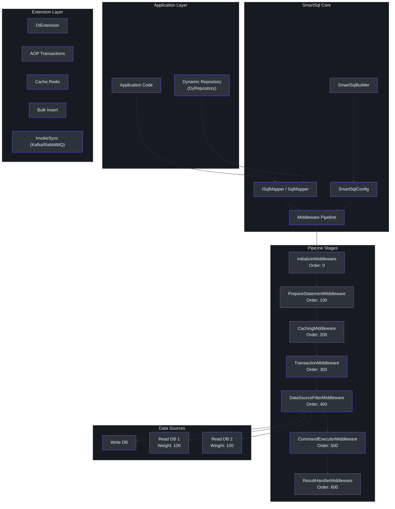
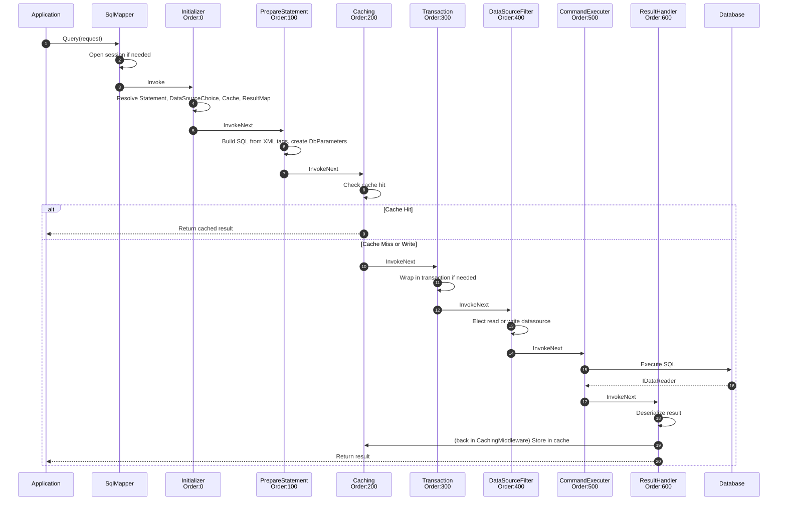
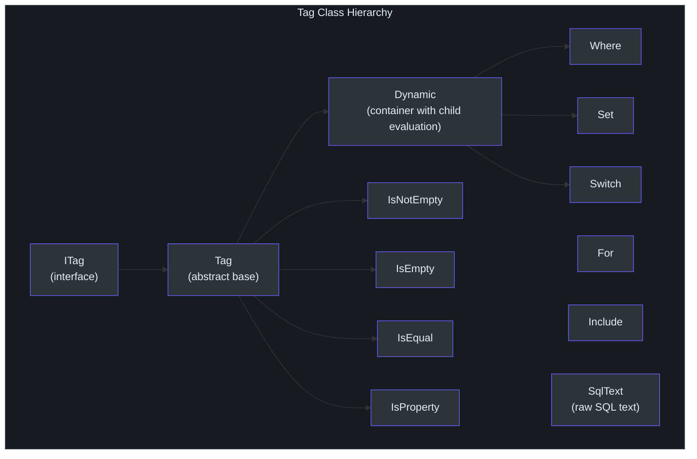
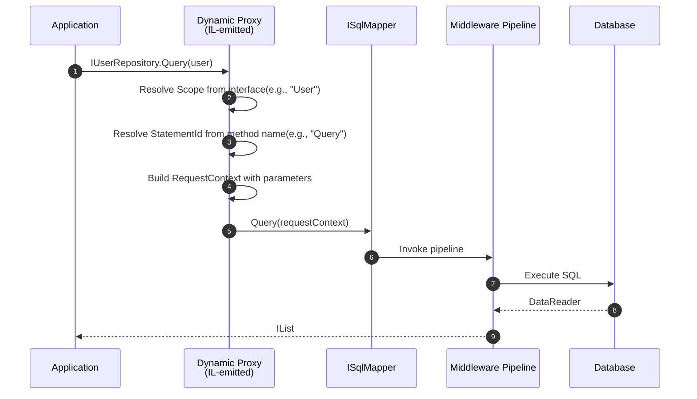

# 贡献者指南

欢迎来到 SmartSql 贡献者指南。本文档将带你从零上下文成为一个高效的贡献者。SmartSql 是一个受 MyBatis 启发的 .NET ORM 库，使用 XML 来管理 SQL 语句。如果你有 .NET 经验但从未接触过 SmartSql，本指南就是为你准备的。

---

## 第一部分：.NET ORM 基础

### 什么是 ORM？

对象关系映射器（ORM）弥合了 C# 中面向对象代码与数据库中关系数据之间的差距。你不再需要编写内联的原始 SQL 字符串，而是声明映射关系，让 ORM 处理参数绑定、结果反序列化和连接管理。

### .NET ORM 生态

.NET 生态中最常见的三个选择：

| 特性 | Entity Framework Core | Dapper | SmartSql |
|------|----------------------|--------|----------|
| SQL 管理 | LINQ / Fluent API | 内联字符串 | XML 文件 |
| 映射策略 | Code-first 或 DB-first | 手动 | XML 声明式 |
| 变更跟踪 | 是 | 否 | 可选（`PropertyChangedTrack`） |
| 迁移支持 | 内置 | 无 | 无 |
| 中间件管道 | 否 | 否 | 是 |
| 缓存 | 二级缓存提供程序 | 否 | 内置 LRU/FIFO/Redis |
| 读写分离 | 通过库 | 手动 | 内置加权路由 |
| 动态仓库 | 否 | 否 | 是（IL emit 代理） |
| 批量插入 | 通过扩展 | 通过 SqlBulkCopy | 内置按提供程序 |
| 学习曲线 | 中高 | 低 | 中 |
| 性能 | 不一 | 非常快 | 快（最小开销） |

### 为什么使用 MyBatis 风格的 XML？

SmartSql 的核心设计选择是 MyBatis 风格的 XML SQL 管理。SmartSql 不是从 LINQ 表达式生成 SQL（EF Core）或将 SQL 作为字符串字面量嵌入（Dapper），而是将 SQL 外部化到 XML 文件中。这有几个实际好处：

- **SQL 可见性**：每个查询都在 XML 文件中，便于在不重新编译的情况下审查、优化和调整 SQL。
- **动态 SQL**：XML 标签（`<Where>`、`<IsNotEmpty>`、`<Switch>`、`<For>`、`<Include>`）让你无需在 C# 代码中进行字符串拼接即可构建条件查询。
- **对 DBA 友好**：数据库管理员可以在不浏览 C# 源代码的情况下阅读和修改 SQL。
- **关注点分离**：应用程序逻辑和 SQL 在不同文件中，遵循分离原则。

### MyBatis 对照

如果你在 Java 中使用过 MyBatis 或 MyBatis-Plus，你会认出很多概念：

| MyBatis 概念 | SmartSql 对应 |
|-------------|--------------|
| `mybatis-config.xml` | `SmartSqlMapConfig.xml` |
| Mapper XML（`<mapper>`） | SmartSqlMap XML（`<SmartSqlMap>`） |
| `<select>`、`<insert>` | 带有 `StatementType` 的 `<Statement>` |
| `<if>`、`<where>`、`<choose>` | `<IsNotEmpty>`、`<Where>`、`<Switch>` |
| `#{param}` | `@Param` |
| `ResultMap` | `ResultMap` |
| `TypeHandler` | `TypeHandler` |

---

## 第二部分：SmartSql 架构

### 高层架构


<!-- Sources: src/SmartSql/SmartSqlBuilder.cs, src/SmartSql/SqlMapper.cs, src/SmartSql/Configuration/SmartSqlConfig.cs -->

### 中间件管道

SmartSql 通过链表中间件管道处理每个 SQL 操作。每个中间件实现 `IMiddleware`，并有一个 `Order` 属性来决定其在链中的位置。


<!-- Sources: src/SmartSql/Middlewares/AbstractMiddleware.cs:15-25, src/SmartSql/SmartSqlBuilder.cs:240-281 -->

#### 中间件顺序参考

| 顺序 | 中间件 | 职责 |
|------|--------|------|
| 0 | `InitializerMiddleware` | 从配置解析 `Statement`，设置 `DataSourceChoice`、`Cache`、`ResultMap`、`AutoConverter` |
| 100 | `PrepareStatementMiddleware` | 从 XML 标签构建最终 SQL，使用类型处理器创建 `DbParameter` 对象 |
| 200 | `CachingMiddleware` | 读取时检查缓存，执行后存储结果（禁用缓存时跳过） |
| 300 | `TransactionMiddleware` | 当 `Request.Transaction` 被设置时将执行包装在事务中 |
| 400 | `DataSourceFilterMiddleware` | 使用加权选择选择写或读数据源 |
| 500 | `CommandExecuterMiddleware` | 对数据库执行 `DbCommand` |
| 600 | `ResultHandlerMiddleware` | 通过反序列化器链将 `IDataReader` 反序列化为类型化结果 |

每个中间件可以通过不调用 `InvokeNext` 来短路管道，这正是 `CachingMiddleware` 处理缓存命中时的方式。

### 配置系统

```mermaid
graph LR
    subgraph ConfigSources["Configuration Sources"]
        style ConfigSources fill:#161b22,stroke:#30363d,color:#e6edf3
        XML["SmartSqlMapConfig.xml"]
        Native["NativeConfigBuilder"]
        Options["Options Pattern<br>(appsettings.json)"]
    end

    subgraph ConfigBuilder["Config Builder Chain"]
        style ConfigBuilder fill:#161b22,stroke:#30363d,color:#e6edf3
        Root["RootConfigBuilder"]
        CfgBuilder["IConfigBuilder impl"]
        CUD["CUDConfigBuilder<br>(auto-generate CRUD)"]
    end

    subgraph FinalConfig["SmartSqlConfig"]
        style FinalConfig fill:#161b22,stroke:#30363d,color:#e6edf3
        Database["Database<br>(Write + Read sources)"]
        SqlMaps["SqlMaps<br>(XML statement definitions)"]
        TypeHandlers["TypeHandlerFactory"]
        TagBuilders["TagBuilderFactory"]
        CacheMgr["CacheManager"]
        IdGens["IdGenerators<br>(SnowflakeId, etc.)"]
        Pipeline["IMiddleware Pipeline"]
        Filters["FilterCollection"]
    end

    XML --> CfgBuilder
    Native --> CfgBuilder
    Options --> CfgBuilder
    Root --> CfgBuilder
    CfgBuilder --> CUD
    CUD --> FinalConfig

    style XML fill:#2d333b,stroke:#6d5dfc,color:#e6edf3
    style Native fill:#2d333b,stroke:#6d5dfc,color:#e6edf3
    style Options fill:#2d333b,stroke:#6d5dfc,color:#e6edf3
    style Root fill:#2d333b,stroke:#6d5dfc,color:#e6edf3
    style CfgBuilder fill:#2d333b,stroke:#6d5dfc,color:#e6edf3
    style CUD fill:#2d333b,stroke:#6d5dfc,color:#e6edf3
    style Database fill:#2d333b,stroke:#6d5dfc,color:#e6edf3
    style SqlMaps fill:#2d333b,stroke:#6d5dfc,color:#e6edf3
    style TypeHandlers fill:#2d333b,stroke:#6d5dfc,color:#e6edf3
    style TagBuilders fill:#2d333b,stroke:#6d5dfc,color:#e6edf3
    style CacheMgr fill:#2d333b,stroke:#6d5dfc,color:#e6edf3
    style IdGens fill:#2d333b,stroke:#6d5dfc,color:#e6edf3
    style Pipeline fill:#2d333b,stroke:#6d5dfc,color:#e6edf3
    style Filters fill:#2d333b,stroke:#6d5dfc,color:#e6edf3

```


<!-- Sources: src/SmartSql/Configuration/SmartSqlConfig.cs:22-113, src/SmartSql/SmartSqlBuilder.cs:155-201 -->

`SmartSqlBuilder` 是流式入口点。它链接配置源、构建 `SmartSqlConfig`、组装中间件管道，并将所有内容注册到 `SmartSqlContainer` 中。

### XML SQL 管理详解

每个 SQL 语句都位于一个 `SmartSqlMap` XML 文件中。每个文件声明一个 `Scope`（命名空间），并包含 `<Statements>`、`<Caches>`、`<ResultMaps>` 和其他定义。

**语句结构**：

```xml
<SmartSqlMap Scope="User" xmlns="http://SmartSql.net/schemas/SmartSqlMap.xsd">
    <Caches>
        <Cache Id="UserCache" Type="Lru">
            <FlushOnExecute Statement="Update"/>
            <FlushOnExecute Statement="Delete"/>
        </Cache>
    </Caches>
    <Statements>
        <Statement Id="Query">
            SELECT T.* FROM T_User T
            <Where>
                <IsNotEmpty Prepend="And" Property="UserName">
                    T.UserName = @UserName
                </IsNotEmpty>
            </Where>
        </Statement>
    </Statements>
</SmartSqlMap>
```

语句通过其完整 ID 引用：`Scope.Id`（例如 `User.Query`）。

### XML 动态标签

SmartSql 提供了一组丰富的 XML 标签用于条件 SQL 构建。这些是动态查询的构建块：

| 标签 | 用途 | 示例 |
|------|------|------|
| `<Where>` | 将子元素包装在 `WHERE` 中，去掉前导 `AND`/`OR` | `<Where><IsNotEmpty Prepend="And" ...>` |
| `<Set>` | 将子元素包装在 `SET` 中，去掉前导逗号 | `<Set><IsProperty Prepend="," ...>` |
| `<IsNotEmpty>` | 如果属性不为 null/空则包含子 SQL | `<IsNotEmpty Property="Name">Name=@Name</IsNotEmpty>` |
| `<IsEmpty>` | 如果属性为 null 或空则包含子 SQL | `IsNotEmpty` 的反义 |
| `<IsEqual>` | 将属性值与 `CompareValue` 比较 | `<IsEqual Property="Status" CompareValue="1">` |
| `<IsNotEqual>` | 如果属性不等于值则包含 | `<IsNotEqual Property="Status" CompareValue="0">` |
| `<IsGreaterThan>` | 数字或字符串比较 | `<IsGreaterThan Property="Age" CompareValue="18">` |
| `<IsLessThan>` | 数字或字符串比较 | `<IsLessThan Property="Price" CompareValue="100">` |
| `<IsProperty>` | 如果属性存在于请求中则包含 | `<IsProperty Property="Status">Status=@Status</IsProperty>` |
| `<IsTrue>` / `<IsFalse>` | 布尔条件 | `<IsTrue Property="IsActive">` |
| `<Switch>` / `<Case>` | 多分支条件 | `<Switch Property="OrderBy"><Case CompareValue="1">ORDER BY Name</Case></Switch>` |
| `<For>` | 遍历集合 | `<For Property="Ids" Open="(" Separator="," Close=")">@Id</For>` |
| `<Include>` | 引用可重用的 SQL 片段 | `<Include RefId="QueryParams"/>` |
| `<Env>` | 特定环境的 SQL | `<Env Name="Production">LIMIT 1000</Env>` |
| `<Range>` | 检查属性值是否在范围内 | `<Range Property="Age" Min="18" Max="65">` |

### 标签层次结构


<!-- Sources: src/SmartSql/Configuration/Tags/ITag.cs, src/SmartSql/Configuration/Tags/Tag.cs, src/SmartSql/Configuration/Tags/Dynamic.cs -->

### 读写分离

SmartSql 内置支持读写数据源分离和加权负载均衡。`DataSourceFilterMiddleware` 使用 `InitializerMiddleware` 确定的 `DataSourceChoice`：

- **写语句**（INSERT、UPDATE、DELETE）始终发送到写数据源。
- **读语句**（SELECT）发送到读数据源，按权重选择。
- **显式路由**：你可以在语句上指定 `ReadDb="ReadDb-2"` 来将其固定到特定的读副本。

`WeightFilter` 使用加权随机选择算法在可用读副本之间进行选择。

### 缓存架构

SmartSql 支持两级缓存：

1. **内置内存缓存**，具有 LRU 和 FIFO 淘汰策略
2. **Redis 缓存**，通过 `SmartSql.Cache.Redis` 扩展

缓存失效是声明式的 -- 你指定哪些语句刷新缓存：

```xml
<Cache Id="UserCache" Type="Lru">
    <FlushOnExecute Statement="Update"/>
    <FlushOnExecute Statement="Delete"/>
</Cache>
```

`CachingMiddleware` 拦截读操作并在可用时返回缓存结果。对于写操作，它刷新相关缓存。在事务中缓存会自动绕过。

### 动态仓库（DyRepository）

`SmartSql.DyRepository` 扩展使用 IL emit 在运行时生成仓库接口的代理实现。接口方法通过命名约定自动映射到 SQL 语句。


<!-- Sources: src/SmartSql.DyRepository/IRepository.cs, src/SmartSql.DyRepository/EmitRepositoryBuilder.cs -->

泛型仓库接口 `IRepository<TEntity, TPrimary>` 提供内置 CRUD 操作（Insert、Update、Delete、GetEntity、Query、QueryByPage、GetRecord、IsExist），通过 `CUDConfigBuilder` 映射到自动生成的 SQL。

### 反序列化链

当查询结果从数据库返回时，`ResultHandlerMiddleware` 委托给反序列化工厂，后者按顺序尝试反序列化器：

```mermaid
graph LR
    subgraph DeserChain["Deserializer Chain"]
        style DeserChain fill:#161b22,stroke:#30363d,color:#e6edf3
        MR["MultipleResultDeserializer"]
        VT["ValueTupleDeserializer"]
        VType["ValueTypeDeserializer"]
        Dyn["DynamicDeserializer"]
        Entity["EntityDeserializer"]
        Custom["Custom Deserializers"]
    end

    Factory["DeserializerFactory"] --> MR
    MR --> VT
    VT --> VType
    VType --> Dyn
    Dyn --> Entity
    Entity --> Custom

    style MR fill:#2d333b,stroke:#6d5dfc,color:#e6edf3
    style VT fill:#2d333b,stroke:#6d5dfc,color:#e6edf3
    style VType fill:#2d333b,stroke:#6d5dfc,color:#e6edf3
    style Dyn fill:#2d333b,stroke:#6d5dfc,color:#e6edf3
    style Entity fill:#2d333b,stroke:#6d5dfc,color:#e6edf3
    style Custom fill:#2d333b,stroke:#6d5dfc,color:#e6edf3
    style Factory fill:#2d333b,stroke:#6d5dfc,color:#e6edf3

```


<!-- Sources: src/SmartSql/SmartSqlBuilder.cs:219-236 -->

每个反序列化器会被询问是否能处理目标类型。链的顺序使得更具体的反序列化器优先尝试。末尾的 `EntityDeserializer` 处理通用 POCO 映射。

### 扩展项目

| 项目 | 位置 | 用途 |
|------|------|------|
| `SmartSql.DyRepository` | `src/SmartSql.DyRepository/` | 通过 IL emit 动态生成仓库代理 |
| `SmartSql.DIExtension` | `src/SmartSql.DIExtension/` | ASP.NET Core 依赖注入集成 |
| `SmartSql.Options` | `src/SmartSql.Options/` | 从 `appsettings.json` 的 Options 模式配置 |
| `SmartSql.AOP` | `src/SmartSql.AOP/` | 使用 `[Transaction]` 特性的 AOP 事务支持（AspectCore） |
| `SmartSql.Cache.Redis` | `src/SmartSql.Cache.Redis/` | Redis 缓存提供程序 |
| `SmartSql.Cache.Sync` | `src/SmartSql.Cache.Sync/` | 跨实例缓存同步 |
| `SmartSql.TypeHandler` | `src/SmartSql.TypeHandler/` | JSON 和自定义类型处理器 |
| `SmartSql.TypeHandler.PostgreSql` | `src/SmartSql.TypeHandler.PostgreSql/` | PostgreSQL 专用类型处理器 |
| `SmartSql.Bulk.SqlServer` | `src/SmartSql.Bulk.SqlServer/` | SQL Server 批量插入 |
| `SmartSql.Bulk.MsSqlServer` | `src/SmartSql.Bulk.MsSqlServer/` | Microsoft.Data.SqlClient 批量插入 |
| `SmartSql.Bulk.MySql` | `src/SmartSql.Bulk.MySql/` | MySQL 批量插入 |
| `SmartSql.Bulk.MySqlConnector` | `src/SmartSql.Bulk.MySqlConnector/` | MySqlConnector 批量插入 |
| `SmartSql.Bulk.PostgreSql` | `src/SmartSql.Bulk.PostgreSql/` | PostgreSQL 批量插入 |
| `SmartSql.InvokeSync` | `src/SmartSql.InvokeSync/` | 数据同步核心 |
| `SmartSql.InvokeSync.Kafka` | `src/SmartSql.InvokeSync.Kafka/` | 基于 Kafka 的同步 |
| `SmartSql.InvokeSync.RabbitMQ` | `src/SmartSql.InvokeSync.RabbitMQ/` | 基于 RabbitMQ 的同步 |
| `SmartSql.ScriptTag` | `src/SmartSql.ScriptTag/` | 动态 SQL 的脚本标签支持 |
| `SmartSql.Extensions` | `src/SmartSql.Extensions/` | 通用扩展 |
| `SmartSql.Oracle` | `src/SmartSql.Oracle/` | Oracle 数据库提供程序 |

---

## 第三部分：提高效率

### 开发环境设置

**前提条件**：

- .NET SDK（目标 netstandard2.0，C# 7.3）
- IDE：Visual Studio、Rider 或带 C# 扩展的 VS Code
- MySQL 数据库（用于运行测试）
- Redis（可选，用于缓存测试）

**步骤**：

1. 克隆仓库：
   ```bash
   git clone https://github.com/dotnetcore/SmartSql.git
   cd SmartSql
   ```

2. 还原依赖：
   ```bash
   dotnet restore SmartSql.sln
   ```

3. 构建整个解决方案：
   ```bash
   dotnet build SmartSql.sln
   ```

4. 运行单元测试：
   ```bash
   dotnet test
   ```

5. 运行特定测试项目：
   ```bash
   dotnet test src/SmartSql.Test.Unit/SmartSql.Test.Unit.csproj
   ```

6. 按名称过滤器运行测试：
   ```bash
   dotnet test src/SmartSql.Test.Unit/SmartSql.Test.Unit.csproj \
     --filter "FullyQualifiedName~SmartSql.Test.Unit.Tests.CacheTest"
   ```

### 解决方案结构

```
SmartSql/
├── build/
│   └── version.props          # Version management (currently 4.1.68)
├── doc/                        # Documentation
├── sample/
│   └── SmartSql.Sample.AspNetCore/  # Demo application
├── src/
│   ├── SmartSql/               # Core library (netstandard2.0)
│   ├── SmartSql.DyRepository/  # Dynamic repository proxies
│   ├── SmartSql.DIExtension/   # ASP.NET Core DI integration
│   ├── SmartSql.Options/       # Options pattern config
│   ├── SmartSql.AOP/           # AOP transaction attribute
│   ├── SmartSql.Cache.Redis/   # Redis cache provider
│   ├── SmartSql.Cache.Sync/    # Cache synchronization
│   ├── SmartSql.TypeHandler/   # JSON and custom type handlers
│   ├── SmartSql.Bulk.*/        # Bulk insert providers
│   ├── SmartSql.InvokeSync.*/  # Kafka/RabbitMQ sync
│   ├── SmartSql.ScriptTag/     # Script tag support
│   ├── SmartSql.Extensions/    # General extensions
│   ├── SmartSql.Oracle/        # Oracle provider
│   ├── SmartSql.Test.Unit/     # Unit tests (xUnit)
│   ├── SmartSql.Test.Performance/ # BenchmarkDotNet tests
│   └── SmartSql.Test/          # Integration test helpers
└── SmartSql.sln
```

### 关键文件参考

| 文件 | 路径 | 功能 |
|------|------|------|
| `SmartSqlBuilder.cs` | [`src/SmartSql/SmartSqlBuilder.cs`](https://github.com/dotnetcore/SmartSql/blob/master/src/SmartSql/SmartSqlBuilder.cs) | 组装整个 SmartSql 运行时的流式构建器 |
| `SqlMapper.cs` | [`src/SmartSql/SqlMapper.cs`](https://github.com/dotnetcore/SmartSql/blob/master/src/SmartSql/SqlMapper.cs) | 所有查询操作的主要入口点 |
| `SmartSqlConfig.cs` | [`src/SmartSql/Configuration/SmartSqlConfig.cs`](https://github.com/dotnetcore/SmartSql/blob/master/src/SmartSql/Configuration/SmartSqlConfig.cs) | 持有所有运行时状态的中央配置对象 |
| `ISqlMapper.cs` | [`src/SmartSql/ISqlMapper.cs`](https://github.com/dotnetcore/SmartSql/blob/master/src/SmartSql/ISqlMapper.cs) | 定义所有 mapper 操作的接口 |
| `AbstractMiddleware.cs` | [`src/SmartSql/Middlewares/AbstractMiddleware.cs`](https://github.com/dotnetcore/SmartSql/blob/master/src/SmartSql/Middlewares/AbstractMiddleware.cs) | 具有链表链接的所有中间件的基类 |
| `InitializerMiddleware.cs` | [`src/SmartSql/Middlewares/InitializerMiddleware.cs`](https://github.com/dotnetcore/SmartSql/blob/master/src/SmartSql/Middlewares/InitializerMiddleware.cs) | 解析语句和初始化请求上下文 |
| `PrepareStatementMiddleware.cs` | [`src/SmartSql/Middlewares/PrepareStatementMiddleware.cs`](https://github.com/dotnetcore/SmartSql/blob/master/src/SmartSql/Middlewares/PrepareStatementMiddleware.cs) | 从 XML 标签构建 SQL 并创建 DbParameters |
| `CachingMiddleware.cs` | [`src/SmartSql/Middlewares/CachingMiddleware.cs`](https://github.com/dotnetcore/SmartSql/blob/master/src/SmartSql/Middlewares/CachingMiddleware.cs) | 缓存读写拦截 |
| `TransactionMiddleware.cs` | [`src/SmartSql/Middlewares/TransactionMiddleware.cs`](https://github.com/dotnetcore/SmartSql/blob/master/src/SmartSql/Middlewares/TransactionMiddleware.cs) | 事务包装 |
| `DataSourceFilterMiddleware.cs` | [`src/SmartSql/Middlewares/DataSourceFilterMiddleware.cs`](https://github.com/dotnetcore/SmartSql/blob/master/src/SmartSql/Middlewares/DataSourceFilterMiddleware.cs) | 读/写数据源选择 |
| `CommandExecuterMiddleware.cs` | [`src/SmartSql/Middlewares/CommandExecuterMiddleware.cs`](https://github.com/dotnetcore/SmartSql/blob/master/src/SmartSql/Middlewares/CommandExecuterMiddleware.cs) | 对数据库执行 DbCommand |
| `ResultHandlerMiddleware.cs` | [`src/SmartSql/Middlewares/ResultHandlerMiddleware.cs`](https://github.com/dotnetcore/SmartSql/blob/master/src/SmartSql/Middlewares/ResultHandlerMiddleware.cs) | 将 IDataReader 反序列化为类型化结果 |
| `Tag.cs` | [`src/SmartSql/Configuration/Tags/Tag.cs`](https://github.com/dotnetcore/SmartSql/blob/master/src/SmartSql/Configuration/Tags/Tag.cs) | 所有 XML 标签的抽象基类 |
| `Dynamic.cs` | [`src/SmartSql/Configuration/Tags/Dynamic.cs`](https://github.com/dotnetcore/SmartSql/blob/master/src/SmartSql/Configuration/Tags/Dynamic.cs) | 带条件子元素评估的容器标签 |
| `Where.cs` | [`src/SmartSql/Configuration/Tags/Where.cs`](https://github.com/dotnetcore/SmartSql/blob/master/src/SmartSql/Configuration/Tags/Where.cs) | 动态 WHERE 子句构建 |
| `Set.cs` | [`src/SmartSql/Configuration/Tags/Set.cs`](https://github.com/dotnetcore/SmartSql/blob/master/src/SmartSql/Configuration/Tags/Set.cs) | 动态 SET 子句构建 |
| `DataSourceFilter.cs` | [`src/SmartSql/DataSource/DataSourceFilter.cs`](https://github.com/dotnetcore/SmartSql/blob/master/src/SmartSql/DataSource/DataSourceFilter.cs) | 加权读/写数据源选择 |
| `AbstractTypeHandler.cs` | [`src/SmartSql/TypeHandlers/AbstractTypeHandler.cs`](https://github.com/dotnetcore/SmartSql/blob/master/src/SmartSql/TypeHandlers/AbstractTypeHandler.cs) | 类型处理器基类 |
| `TypeHandlerFactory.cs` | [`src/SmartSql/TypeHandlers/TypeHandlerFactory.cs`](https://github.com/dotnetcore/SmartSql/blob/master/src/SmartSql/TypeHandlers/TypeHandlerFactory.cs) | 所有类型处理器的注册表 |
| `IRepository.cs` | [`src/SmartSql.DyRepository/IRepository.cs`](https://github.com/dotnetcore/SmartSql/blob/master/src/SmartSql.DyRepository/IRepository.cs) | 动态仓库基础接口 |
| `TransactionAttribute.cs` | [`src/SmartSql.AOP/TransactionAttribute.cs`](https://github.com/dotnetcore/SmartSql/blob/master/src/SmartSql.AOP/TransactionAttribute.cs) | AOP 事务拦截器 |
| `SmartSqlMapConfig.xml` | [`sample/SmartSql.Sample.AspNetCore/SmartSqlMapConfig.xml`](https://github.com/dotnetcore/SmartSql/blob/master/sample/SmartSql.Sample.AspNetCore/SmartSqlMapConfig.xml) | 示例配置文件 |
| `User.xml` | [`sample/SmartSql.Sample.AspNetCore/Maps/User.xml`](https://github.com/dotnetcore/SmartSql/blob/master/sample/SmartSql.Sample.AspNetCore/Maps/User.xml) | 示例 SQL 映射文件 |

### 如何添加新中间件

中间件是 SmartSql 中的主要扩展点。以下是添加自定义中间件的分步指南。

**第 1 步**：创建实现 `AbstractMiddleware` 的中间件类：

```csharp
using SmartSql.Middlewares;
using System.Threading.Tasks;

namespace SmartSql.Middlewares
{
    public class LoggingMiddleware : AbstractMiddleware
    {
        private readonly ILogger _logger;

        // Order determines position in the pipeline.
        // Use a value between existing middleware orders.
        // For example, 150 puts it between PrepareStatement (100) and Caching (200).
        public override int Order => 150;

        public override void SetupSmartSql(SmartSqlBuilder smartSqlBuilder)
        {
            base.SetupSmartSql(smartSqlBuilder);
            _logger = smartSqlBuilder.SmartSqlConfig.LoggerFactory
                .CreateLogger<LoggingMiddleware>();
        }

        protected override void SelfInvoke<TResult>(ExecutionContext executionContext)
        {
            _logger.LogInformation(
                "Executing statement: {FullSqlId}",
                executionContext.Request.FullSqlId);
        }

        protected override Task SelfInvokeAsync<TResult>(ExecutionContext executionContext)
        {
            _logger.LogInformation(
                "Executing statement: {FullSqlId}",
                executionContext.Request.FullSqlId);
            return Task.CompletedTask;
        }
    }
}
```

**第 2 步**：在构建 SmartSql 时注册中间件：

```csharp
var smartSql = new SmartSqlBuilder()
    .UseXmlConfig()
    .AddMiddleware(new LoggingMiddleware())
    .Build();
```

`PipelineBuilder`（在 `SmartSqlBuilder.BuildPipeline()` 内部使用）按 `Order` 排序所有中间件并通过 `Next` 指针链接它们。

**关键要点**：

- 为同步逻辑重写 `SelfInvoke<TResult>`，为异步逻辑重写 `SelfInvokeAsync<TResult>`。
- 调用 `InvokeNext<TResult>(executionContext)` 将控制传递给下一个中间件。如果不调用，管道将被短路。
- 使用 `Order` 属性控制位置。现有顺序为 0、100、200、300、400、500、600。
- 重写 `SetupSmartSql` 以接收 `SmartSqlBuilder` 并提取配置依赖。
- 使用 `Filters`（通过 `FilterType`）附加中间件特定的过滤器钩子。

### 如何添加新 XML 标签

SmartSql 的 XML 标签是其动态 SQL 能力的核心。以下是添加自定义标签的方法。

**第 1 步**：创建标签类：

```csharp
using SmartSql.Configuration.Tags;

namespace SmartSql.Configuration.Tags
{
    public class IsNull : Tag
    {
        public override bool IsCondition(AbstractRequestContext context)
        {
            object reqVal = EnsurePropertyValue(context);
            return reqVal == null;
        }
    }
}
```

**第 2 步**：在 `TagBuilderFactory` 中注册 `TagBuilder`。`TagBuilderFactory` 将 XML 元素名称映射到标签构建器函数。你可以通过 XML 配置或编程方式注册：

```csharp
// In the TagBuilders section of SmartSqlMapConfig.xml
<TagBuilders>
    <TagBuilder Name="IsNull" Type="MyNamespace.IsNull,MyAssembly"/>
</TagBuilders>
```

**第 3 步**：在你的 XML 映射中使用标签：

```xml
<Statement Id="GetUser">
    SELECT * FROM T_User
    <Where>
        <IsNull Property="DeletedAt">
            T.DeletedAt IS NULL
        </IsNull>
        <IsNotEmpty Prepend="And" Property="UserName">
            T.UserName = @UserName
        </IsNotEmpty>
    </Where>
</Statement>
```

**标签设计规则**：

- 对于简单的条件标签（基于条件包含/排除）继承 `Tag`。
- 对于包装子元素并管理前缀的容器标签继承 `Dynamic`（如 `Where` 和 `Set`）。
- 实现 `IsCondition(AbstractRequestContext context)` 在子 SQL 应被包含时返回 `true`。
- 使用 `EnsurePropertyValue(context)` 安全地获取属性值并遵守 `Required` 标志。
- 设置 `Prepend` 来定义前置关键字（例如 `"And"`、`"Or"`、`"Where"`、`"Set"`）。

### 如何添加新类型处理器

类型处理器控制 .NET 类型与数据库类型之间的转换。

**第 1 步**：创建类型处理器类：

```csharp
using SmartSql.TypeHandlers;
using SmartSql.Data;
using System;
using System.Data;

public class DateTimeOffsetTypeHandler : AbstractTypeHandler<DateTimeOffset, DateTime>
{
    public override DateTimeOffset GetValue(
        DataReaderWrapper dataReader,
        int columnIndex,
        Type targetType)
    {
        var dateTime = dataReader.GetDateTime(columnIndex);
        return new DateTimeOffset(dateTime, TimeSpan.Zero);
    }

    protected override object GetSetParameterValueWhenNotNull(object parameterValue)
    {
        var dto = (DateTimeOffset)parameterValue;
        return dto.UtcDateTime;
    }
}
```

**第 2 步**：注册类型处理器：

```csharp
var smartSql = new SmartSqlBuilder()
    .UseXmlConfig()
    .AddTypeHandler(new DateTimeOffsetTypeHandler())
    .Build();
```

或通过 XML 配置注册：

```xml
<TypeHandlers>
    <TypeHandler PropertyType="System.DateTimeOffset, System.Runtime"
                 Type="MyNamespace.DateTimeOffsetTypeHandler, MyAssembly"/>
</TypeHandlers>
```

**类型处理器设计规则**：

- 继承 `AbstractTypeHandler<TProperty, TField>`，其中 `TProperty` 是 .NET 类型，`TField` 是数据库字段类型。
- 重写 `GetValue(DataReaderWrapper, int, Type)` 从数据读取器读取。
- 重写 `GetSetParameterValueWhenNotNull(object)` 为数据库参数转换 .NET 值。
- 可选重写 `Initialize(IDictionary<string, object>)` 接受来自 XML 的配置属性。
- `SetParameter(IDataParameter, object)` 用于将值绑定到 DbParameter。

### 如何编写和运行测试

SmartSql 使用 xUnit 进行所有测试。测试基础设施在 `src/SmartSql.Test.Unit/` 中。

**测试 fixture**：`SmartSqlFixture` 使用 XML 配置初始化 `SmartSqlBuilder`，注册测试仓库，并填充测试数据。测试使用 `IClassFixture<SmartSqlFixture>` 来共享 fixture。

**运行测试**：

```bash
# All tests
dotnet test

# Single test project
dotnet test src/SmartSql.Test.Unit/SmartSql.Test.Unit.csproj

# Specific test class
dotnet test src/SmartSql.Test.Unit/SmartSql.Test.Unit.csproj \
  --filter "FullyQualifiedName~SmartSql.Test.Unit.Tests.MapperTest"

# Specific test method
dotnet test src/SmartSql.Test.Unit/SmartSql.Test.Unit.csproj \
  --filter "FullyQualifiedName~SmartSql.Test.Unit.Tests.MapperTest.Query"
```

**性能基准测试**：`src/SmartSql.Test.Performance/` 包含 BenchmarkDotNet 测试用于测量性能。使用以下命令运行：

```bash
dotnet run -c Release --project src/SmartSql.Test.Performance/SmartSql.Test.Performance.csproj
```

### 调试技巧

1. **启用调试日志**：设置日志工厂以查看 SQL 生成和数据源选择：
   ```csharp
   var smartSql = new SmartSqlBuilder()
       .UseLoggerFactory(loggerFactory)
       .UseXmlConfig()
       .Build();
   ```
   `PrepareStatementMiddleware` 以 Debug 级别记录最终 SQL，`DataSourceFilter` 记录数据源选择。

2. **检查管道**：`SmartSqlConfig.Pipeline` 属性持有中间件的链表。遍历 `Pipeline.Next` 查看链顺序。

3. **检查 XML 标签评估**：在 `Tag.BuildSql()` 和 `Tag.IsCondition()` 中设置断点来跟踪动态 SQL 如何组装。

4. **检查 Statement 解析**：在 `InitializerMiddleware.InitByStatement()` 中，语句从配置中解析。如果找不到语句，`SmartSqlConfig.GetStatement(fullId)` 会抛出 `SmartSqlException`。

### 贡献工作流

1. **Fork 和分支**：Fork 仓库并从 `master` 创建功能分支。
2. **进行修改**：遵循现有代码风格。项目目标是 `netstandard2.0`，C# 7.3 -- 避免使用较新的 C# 特性。
3. **编写测试**：在 `src/SmartSql.Test.Unit/` 中添加或更新 xUnit 测试。
4. **构建和测试**：运行 `dotnet build SmartSql.sln` 和 `dotnet test` 确保一切通过。
5. **提交 PR**：向 `master` 分支发起拉取请求，附带更改的清晰描述。

### 版本管理

版本定义在 [`build/version.props`](https://github.com/dotnetcore/SmartSql/blob/master/build/version.props) 中：

```xml
<Project>
    <PropertyGroup>
        <VersionMajor>4</VersionMajor>
        <VersionMinor>1</VersionMinor>
        <VersionPatch>68</VersionPatch>
        <VersionPrefix>$(VersionMajor).$(VersionMinor).$(VersionPatch)</VersionPrefix>
    </PropertyGroup>
</Project>
```

要发布新版本，在此文件中更新 `VersionPatch`（或对于破坏性变更更新 `VersionMinor`/`VersionMajor`）。

### 许可证

SmartSql 以 MIT 许可证发布。

### 如何添加自定义反序列化器

如果 SmartSql 的内置反序列化器无法处理你的结果形状（例如嵌套图对象、具有私有构造函数的 DDD 值对象），你可以添加自定义反序列化器。

**第 1 步**：实现 `IDataReaderDeserializer` 接口：

```csharp
using SmartSql.Deserializer;
using System;
using System.Collections.Generic;
using System.Data;
using System.Threading.Tasks;

public class GraphDeserializer : IDataReaderDeserializer
{
    public TResult ToSingle<TResult>(ExecutionContext executionContext)
    {
        var dataReader = executionContext.DataReaderWrapper;
        // Custom mapping logic for graph objects
        var result = new TResult();
        // ... populate from dataReader
        return result;
    }

    public IList<TResult> ToList<TResult>(ExecutionContext executionContext)
    {
        var dataReader = executionContext.DataReaderWrapper;
        var results = new List<TResult>();
        while (dataReader.Read())
        {
            results.Add(ToSingle<TResult>(executionContext));
        }
        return results;
    }

    public bool CanDeserialize(ExecutionContext context, Type targetType, bool isMultiple)
    {
        // Return true when this deserializer can handle the target type
        return targetType == typeof(MyGraphEntity);
    }

    // Async variants...
    public Task<TResult> ToSingleAsync<TResult>(ExecutionContext executionContext)
    {
        return Task.FromResult(ToSingle<TResult>(executionContext));
    }

    public Task<IList<TResult>> ToListAsync<TResult>(ExecutionContext executionContext)
    {
        return Task.FromResult(ToList<TResult>(executionContext));
    }
}
```

**第 2 步**：注册反序列化器：

```csharp
var smartSql = new SmartSqlBuilder()
    .UseXmlConfig()
    .AddDeserializer(new GraphDeserializer())
    .Build();
```

自定义反序列化器默认添加到链的末尾。`DeserializerFactory` 遍历所有已注册的反序列化器，使用第一个 `CanDeserialize` 返回 `true` 的。

### 如何添加自定义过滤器

过滤器在中间件执行前后提供钩子。这对于日志记录、指标和审计很有用。

**第 1 步**：实现适当的过滤器接口：

```csharp
using SmartSql.Middlewares.Filters;

public class MetricsFilter : IExecutionFilter
{
    private readonly ILogger _logger;

    public MetricsFilter(ILogger logger)
    {
        _logger = logger;
    }

    public void OnInvoking(ExecutionContext context)
    {
        context.Request.Extend.Set("StartTime", DateTime.UtcNow);
    }

    public void OnInvoked(ExecutionContext context)
    {
        var startTime = (DateTime)context.Request.Extend.Get("StartTime");
        var elapsed = DateTime.UtcNow - startTime;
        _logger.LogInformation(
            "Statement {FullId} executed in {Elapsed}ms",
            context.Request.FullSqlId,
            elapsed.TotalMilliseconds);
    }

    // Async variants
    public Task OnInvokingAsync(ExecutionContext context)
    {
        OnInvoking(context);
        return Task.CompletedTask;
    }

    public Task OnInvokedAsync(ExecutionContext context)
    {
        OnInvoked(context);
        return Task.CompletedTask;
    }
}
```

**第 2 步**：注册过滤器：

```csharp
var smartSql = new SmartSqlBuilder()
    .UseXmlConfig()
    .AddFilter(new MetricsFilter(logger))
    .Build();
```

可用的过滤器接口：
- `IExecutionFilter` -- 围绕执行生命周期的钩子
- `IStatementFilter` -- 围绕语句解析的钩子
- `IPrepareStatementFilter` -- 围绕 SQL 准备的钩子
- `ICommandExecuterFilter` -- 围绕命令执行的钩子

### 如何使用示例应用

仓库在 `sample/SmartSql.Sample.AspNetCore/` 包含一个可工作的示例应用。这是理解 SmartSql 如何在真实应用中工作的最佳起点。

**示例演示的内容**：

1. **配置**：`SmartSqlMapConfig.xml` 展示了如何配置数据库提供程序、数据源（带读写分离）、类型处理器、标签构建器、ID 生成器和 SQL 映射引用。

2. **SQL 映射**：`Maps/User.xml` 文件演示了所有常见模式：动态 `WHERE` 子句、`SET` 子句、`INCLUDE` 引用、`SWITCH` 语句、带 `MultipleResultMap` 的分页和带 `FlushOnExecute` 的 LRU 缓存。

3. **ASP.NET Core 集成**：`Startup.cs` 展示了如何使用 `services.AddSmartSql()` 将 SmartSql 注册到依赖注入容器。

**运行示例**：

```bash
cd sample/SmartSql.Sample.AspNetCore
dotnet run
```

示例使用 SQLite 并在启动时创建数据库架构。不需要外部数据库设置。

### 常见模式和配方

#### 模式：带总数的分页查询

常见需求是获取一页结果以及总数。SmartSql 通过 `MultipleResultMap` 处理：

```xml
<MultipleResultMaps>
    <MultipleResultMap Id="QueryByPageResult">
        <Result Property="List"/>
        <Result Property="Total"/>
    </MultipleResultMap>
</MultipleResultMaps>

<Statement Id="QueryByPage" MultipleResultMap="QueryByPageResult">
    SELECT T.* FROM T_User T
    <Include RefId="QueryParams"/>
    LIMIT @PageSize OFFSET @Offset;
    SELECT COUNT(1) FROM T_User T
    <Include RefId="QueryParams"/>;
</Statement>
```

`MultipleResultMap` 按顺序将每个结果集映射到返回类型的相应属性。

#### 模式：条件更新

仅更新提供的字段：

```xml
<Statement Id="Update">
    UPDATE T_User
    <Set>
        <IsProperty Prepend="," Property="UserName">
            UserName = @UserName
        </IsProperty>
        <IsProperty Prepend="," Property="Status">
            Status = @Status
        </IsProperty>
    </Set>
    WHERE Id = @Id
</Statement>
```

`<Set>` 标签自动去掉前导逗号。`<IsProperty>` 仅在请求中存在该属性时才包含该字段。

#### 模式：带集合的 IN 子句

按 ID 列表查询：

```xml
<Statement Id="QueryByIds">
    SELECT * FROM T_User
    WHERE Id IN
    <For Property="Ids" Open="(" Separator="," Close=")">
        @Id
    </For>
</Statement>
```

`<For>` 标签遍历 `Ids` 集合，生成 `(1, 2, 3)` 语法。

#### 模式：可重用 SQL 片段

使用 `<Statement>` 定义共享 SQL 片段，并使用 `<Include>` 引用：

```xml
<Statement Id="QueryParams">
    <Where>
        <IsNotEmpty Prepend="And" Property="Status">
            T.Status = @Status
        </IsNotEmpty>
        <IsNotEmpty Prepend="And" Property="UserName">
            T.UserName = @UserName
        </IsNotEmpty>
    </Where>
</Statement>

<Statement Id="Query">
    SELECT T.* FROM T_User T
    <Include RefId="QueryParams"/>
</Statement>

<Statement Id="GetRecord">
    SELECT COUNT(1) FROM T_User T
    <Include RefId="QueryParams"/>
</Statement>
```

#### 模式：显式数据源路由

覆盖自动读写路由：

```xml
<Statement Id="Query" ReadDb="ReadDb-2">
    SELECT * FROM T_User WHERE Id = @Id
</Statement>
```

`ReadDb` 属性将此语句固定到特定的读副本。

#### 模式：自定义 ID 生成

使用 SnowflakeId 进行分布式 ID 生成：

```xml
<IdGenerators>
    <IdGenerator Name="SnowflakeId" Type="SnowflakeId">
        <Properties>
            <Property Name="WorkerId" Value="1"/>
        </Properties>
    </IdGenerator>
</IdGenerators>

<Statement Id="Insert">
    INSERT INTO T_User (Id, UserName)
    VALUES (@Id, @UserName)
</Statement>
```

在代码中，在调用插入之前设置 ID：

```csharp
var id = SmartSqlId.Default.NextId();
```

### CI/CD 建议

为 SmartSql 项目构建 CI/CD 流水线时：

1. **验证 XML 架构**：作为构建步骤，对提供的 XSD 架构（`SmartSqlMapConfig.xsd`、`SmartSqlMap.xsd`）运行 XML 验证。

2. **测试 SQL 映射**：包含集成测试，执行 XML 映射中的每个 Statement。测试项目中使用的 `SmartSqlFixture` 模式是一个好的模板。

3. **版本控制 XML 文件**：以与源代码相同的纪律对待 XML SQL 映射。对 SQL 更改使用拉取请求审查。

4. **数据库测试容器**：使用 Testcontainers 或类似工具在 CI 中启动测试数据库，确保 XML SQL 映射针对实际数据库引擎进行验证。

5. **监控缓存效果**：在预发布环境中，记录缓存命中率以验证缓存配置在生产部署前是否有效。

---

## 术语表

| 术语 | 定义 |
|------|------|
| **SmartSqlBuilder** | 组装完整 SmartSql 运行时的流式构建器：配置、管道、缓存、类型处理器和过滤器 |
| **SmartSqlConfig** | 持有数据库连接、SQL 映射、中间件管道、类型处理器、缓存管理器和所有已解析设置的中央配置对象 |
| **ISqlMapper** | 执行 SQL 操作的主要接口（Execute、ExecuteScalar、Query、QuerySingle、GetDataTable、GetDataSet） |
| **SqlMapper** | 管理会话生命周期的 ISqlMapper 具体实现 |
| **中间件管道** | 按顺序处理每个 SQL 操作的 `IMiddleware` 节点链表 |
| **Statement** | XML 中定义的单个 SQL 操作，由 `Scope.Id` 标识 |
| **SqlMap** | 包含 Statements、Caches、ResultMaps 和其他定义的 XML 文件，由其 `Scope` 标识 |
| **Scope** | SmartSqlMap XML 文件的命名空间；用作完整语句 ID 的前缀 |
| **Tag** | Statement 中条件性构建 SQL 的 XML 元素（例如 `<Where>`、`<IsNotEmpty>`） |
| **TagBuilder** | 从 XML 元素创建 Tag 实例的工厂 |
| **TypeHandler** | 在参数绑定和结果读取期间在 .NET 类型和数据库类型之间进行转换 |
| **TypeHandlerFactory** | 所有 TypeHandler 的注册表，为给定 .NET 类型解析正确的处理器 |
| **ResultMap** | 从数据库列到对象属性的映射定义 |
| **ParameterMap** | 具有显式类型处理器分配的存储过程参数映射定义 |
| **MultipleResultMap** | 定义单个语句的多个结果集如何映射到不同属性 |
| **ExecutionContext** | 在管道中携带 `SmartSqlConfig`、`IDbSession`、`AbstractRequestContext` 和 `ResultContext` |
| **AbstractRequestContext** | 持有语句引用、SQL 构建器、参数、数据源选择、缓存 ID 和执行选项 |
| **DataSourceChoice** | 枚举：`Read` 或 `Write`，确定使用哪个数据源 |
| **WeightFilter** | 加权随机选择读数据源的算法 |
| **IDbSession** | 包装连接和可选事务的数据库会话 |
| **IDbSessionStore** | 当前线程的会话本地存储（使用 `AsyncLocal`） |
| **DyRepository** | 动态仓库 -- IL 发射的代理，将接口方法映射到 SQL 语句 |
| **CUDConfigBuilder** | 为注册的实体类型自动生成 Create/Update/Delete SQL 语句 |
| **SnowflakeId** | 内置分布式 ID 生成器（Twitter Snowflake 算法） |
| **AOP 事务** | 通过 `[Transaction]` 特性使用 AspectCore 的声明式事务管理 |
| **DiagnosticSource** | 用于命令执行、会话生命周期和错误的 .NET 诊断事件发射器 |
| **FullId** | 语句的组合标识符：`Scope.StatementId`（例如 `User.Query`） |
| **InvokeSucceedListener** | SQL 成功执行后调用的事件监听器，用于缓存刷新和同步 |
| **SmartSqlContainer** | 按别名持有所有 SmartSqlBuilder 实例的单例注册表 |
