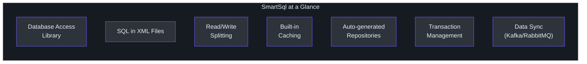
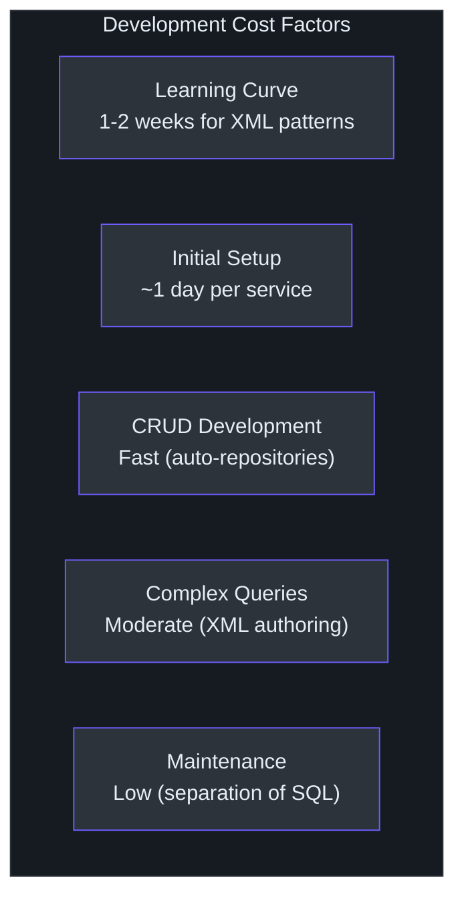
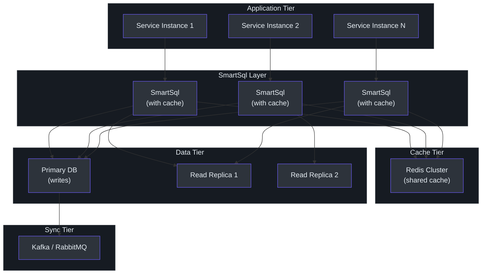

# 管理层指南

本指南为 VP 级别和总监级别的工程领导编写，用于评估 SmartSql 作为技术投资。它关注能力、风险、成本模型和可操作建议 -- 而非实现细节。

---

## SmartSql 是什么

SmartSql 是一个开源 .NET 库（MIT 许可证），用于连接应用程序和数据库。它是 4.1.68 版本，一直处于积极开发中，并在生产环境中使用。

其显著特点是**基于 XML 的 SQL 管理**：数据库查询写在专用的 XML 文件中，而非嵌入在应用代码中。这种方法起源于 Java 生态系统（MyBatis），并已在数千个企业应用中得到大规模验证。

<!-- Sources: src/SmartSql/SmartSqlBuilder.cs, src/SmartSql/Configuration/SmartSqlConfig.cs -->

---

## 能力地图

### 核心能力

| 能力 | 描述 | 业务价值 |
|------|------|---------|
| **XML SQL 管理** | SQL 写在 XML 文件中，与应用代码分离 | 数据库管理员可以在不需要 C# 专业知识的情况下审查和优化查询。更快的查询调优周期。 |
| **读写分离** | 自动将读取路由到副本，写入路由到主库 | 通过分发读取流量减少数据库负载。无需外部负载均衡器。 |
| **内置缓存** | LRU、FIFO 和 Redis 缓存支持 | 减少频繁访问数据的数据库往返。降低数据库成本。 |
| **动态仓库** | 自动生成的数据访问接口 | 减少样板代码。CRUD 操作开发更快。 |
| **事务管理** | 通过特性的声明式事务支持 | 减少事务相关 Bug。简化多步骤操作。 |
| **批量插入** | 按数据库的批量插入支持 | 用于迁移、ETL 和批处理操作的快速数据加载。 |
| **数据同步** | Kafka 和 RabbitMQ 集成 | 支持事件驱动架构和数据管道同步。 |
| **诊断** | 内置性能监控事件 | 与 APM 工具集成，实现生产可观测性。 |

### 数据库支持

| 数据库 | 支持级别 |
|--------|---------|
| SQL Server | 完全（包括批量插入） |
| MySQL | 完全（包括批量插入） |
| PostgreSQL | 完全（包括批量插入） |
| SQLite | 完全 |
| Oracle | 支持（通过扩展） |
| 任何 ADO.NET 提供程序 | 通过标准接口的基础支持 |

### 部署兼容性

SmartSql 目标 .NET Standard 2.0，这意味着它运行在：

- .NET Framework 4.6.1 及更高版本
- .NET Core 2.0 及更高版本
- .NET 5、6、7、8 及更高版本
- Azure App Service、AWS Lambda、Docker 容器、Kubernetes

---

## 技术投资论点

### 为什么考虑 SmartSql

**1. SQL 是长期资产。** 应用代码每 3-5 年重写一次。数据库架构和查询往往比使用它们的应用更长寿。SmartSql 基于 XML 的方法将 SQL 视为一等的、受版本控制的资产，增加了 SQL 投资的长期价值。

**2. 数据库团队自治。** 当 SQL 存在于 XML 文件中时，数据库管理员和性能工程师可以独立于应用开发者工作。这种并行工作流程减少了性能调优周期中的瓶颈。

**3. 基础设施成本降低。** 内置的读写分离和缓存减少了对外部基础设施（负载均衡器、独立缓存层）的需求。这简化了架构并降低了运维成本。

**4. 数据密集型应用的开发速度。** 自动生成的仓库、批量插入支持和声明式事务管理减少了开发者为数据库操作需要编写的样板代码量。

**5. 迁移就绪。** 对于从 Java/MyBatis 迁移到 .NET 的组织，SmartSql 提供最接近的等价体验，降低再培训成本并保留现有 SQL 资产。

### 风险因素

| 风险 | 严重程度 | 缓解措施 |
|------|---------|---------|
| 比 EF Core 或 Dapper **社区更小** | 中 | 代码库结构良好且可扩展。关键问题可以自行修复。 |
| **无迁移工具** | 中 | 在 SmartSql 旁边使用独立的迁移工具（Flyway、DbUp）。 |
| **XML 是运行时验证的** | 低 | 在 CI/CD 流水线中包含 XML 架构验证。SmartSql 提供 XSD 架构。 |
| **有限的第三方生态系统** | 中 | 核心功能（缓存、批量插入、DI、事务）是内置的。对第三方插件的需求较少。 |
| **依赖单个 OSS 项目** | 中 | MIT 许可证。可以 fork。核心 ADO.NET 抽象是标准 .NET 类型。 |

---

## 成本和扩展模型

### 开发成本

<!-- Sources: src/SmartSql.DyRepository/IRepository.cs, src/SmartSql.DIExtension/SmartSqlDIExtensions.cs -->

- **学习曲线**：熟悉 .NET 的开发者需要 1-2 周才能熟练使用 XML SQL 管理。有 MyBatis 经验的开发者需要 2-3 天。
- **CRUD 操作**：动态仓库系统自动生成标准 CRUD 操作，与手动实现相比估计减少 40-60% 的开发时间。
- **复杂查询**：自定义查询需要 XML 编写。这比基于 LINQ 的查询构建稍慢，但产生更可维护和可优化的 SQL。
- **维护**：SQL 与代码的分离减少了维护数据访问层的认知负担。SQL 更改不需要 C# 重新编译。

### 运维成本

| 因素 | 没有 SmartSql | 有 SmartSql |
|------|--------------|------------|
| 读副本的负载均衡器 | 必需 | 内置加权路由 |
| 外部缓存层（Redis 设置） | 手动集成 | 通过 `Cache.Redis` 扩展内置 |
| 数据库监控 | 单独的 APM 设置 | 内置 DiagnosticSource 事件 |
| 连接管理 | 每次操作手动 | 自动每操作会话 |
| 事务错误处理 | 手动 try/catch/rollback | 声明式 `[Transaction]` 特性 |

### 扩展特性

- **水平扩展**：SmartSql 在应用层是无状态的。每个实例管理自己的连接。通过添加应用实例水平扩展。
- **数据库**：读写分离将读取负载分布到副本上。批量插入支持大数据量。无 ORM 级连接池（依赖 ADO.NET 池化）。
- **缓存**：LRU 内存缓存是每实例的。Redis 缓存通过 `Cache.Redis` + `Cache.Sync` 扩展跨实例共享。

---

## 服务级别架构

<!-- Sources: src/SmartSql/DataSource/DataSourceFilter.cs, src/SmartSql.Cache.Redis/, src/SmartSql.InvokeSync/ -->

此图展示了使用 SmartSql 处理跨多个服务实例的数据库访问层的生产部署，具有通过 Redis 的共享缓存和通过消息队列的数据同步。

---

## 决策框架

### 采用 SmartSql 的场景：

- 你的团队重视 SQL 质量并希望 DBA 参与查询优化
- 你需要读写分离而无需外部负载均衡器
- 你正在从 Java/MyBatis 迁移并想要熟悉的模式
- 你的应用是数据密集型的，具有复杂查询需求
- 你想要内置缓存而无需额外的库集成
- 你需要跨多个数据库提供程序的批量插入支持

### 不采用 SmartSql 的场景：

- 你的团队强烈优先考虑编译时安全性和基于 LINQ 的查询构建
- 你需要同一库中的数据库迁移工具
- 你的应用是简单 CRUD，Dapper 的最小开销就足够
- 你的团队没有 XML 经验且拒绝采用它
- 你需要 Entity Framework Core 的广泛生态系统和工具

### 推荐方法

1. **试点**：从一个服务或模块开始。将 SmartSql 用于 SQL 可见性和读写分离能提供明确价值的数据密集型组件。
2. **评估**：对照你当前的方法衡量开发速度、SQL 质量和运维简便性。
3. **标准化**：如果试点成功，创建内部标准用于 XML SQL 文件组织、命名约定和审查流程。
4. **推广**：在能从 SmartSql 优势中受益的服务中推广。对于更适合 EF Core 或 Dapper 的服务继续使用它们。

---

## 可操作建议

### 面向工程领导

1. **评估你的 SQL 管理痛点。** 如果你的团队经常调试嵌入在 C# 代码中的 SQL，或者 DBA 审查是瓶颈，SmartSql 的基于 XML 的方法直接解决了这个问题。

2. **评估迁移路径。** 如果你正在考虑将 Java 服务（特别是基于 MyBatis 的服务）迁移到 .NET，SmartSql 可以以最小的更改保留你现有的 SQL 资产。

3. **考虑你的缓存策略。** 如果你计划添加缓存基础设施，SmartSql 的内置 LRU/FIFO 和 Redis 集成可能消除对单独缓存库的需求。

4. **计划共存。** SmartSql 不需要在所有地方替代 EF Core。将其用于 SQL 控制最重要的服务。对于迁移工具和 LINQ 查询是优先事项的服务保留 EF Core。

5. **投资 XML 编写工具。** SmartSql 提供的 XML 架构文件（XSD）支持 IDE 验证和自动完成。确保你的团队使用这些以获得更好的编写体验。

---

## 常见问题

**问：SmartSql 是生产就绪的吗？**
答：是的。4.1.68 版本表明持续开发和迭代。架构稳定且经过充分测试。

**问：它与 Entity Framework Core 相比如何？**
答：SmartSql 让你完全控制 SQL（写在 XML 文件中）。EF Core 从 LINQ 表达式生成 SQL。SmartSql 包含内置读写分离和缓存；EF Core 依赖外部库。EF Core 包含迁移工具；SmartSql 不包含。

**问：我们可以同时使用 SmartSql 和 EF Core 吗？**
答：可以。它们是独立的库。你可以对数据密集型服务使用 SmartSql，对其他服务使用 EF Core。

**问：安全性如何？**
答：SmartSql 默认使用参数化查询（`@Param` 语法），防止 SQL 注入。参数通过 ADO.NET 的标准参数机制绑定。

**问：有哪些支持可用？**
答：SmartSql 是开源的（MIT 许可证）。社区支持通过 GitHub issues 提供。代码库结构良好，便于自助支持和自定义。

**问：性能开销是多少？**
答：最小。中间件管道与数据库 I/O 相比增加的开销可忽略不计。该库底层使用标准 ADO.NET，具有相同的连接池和性能特性。

**问：支持 async/await 吗？**
答：支持。所有查询操作都有异步变体（QueryAsync、ExecuteAsync 等）。会话管理通过 `AsyncLocal` 与异步调用链兼容。

**问：如果需要，我们能从 SmartSql 迁移走吗？**
答：可以。SmartSql 使用标准 ADO.NET 接口。XML 文件中的 SQL 可以提取。迁移成本与从任何 ORM 迁移到原始 ADO.NET 相当。
