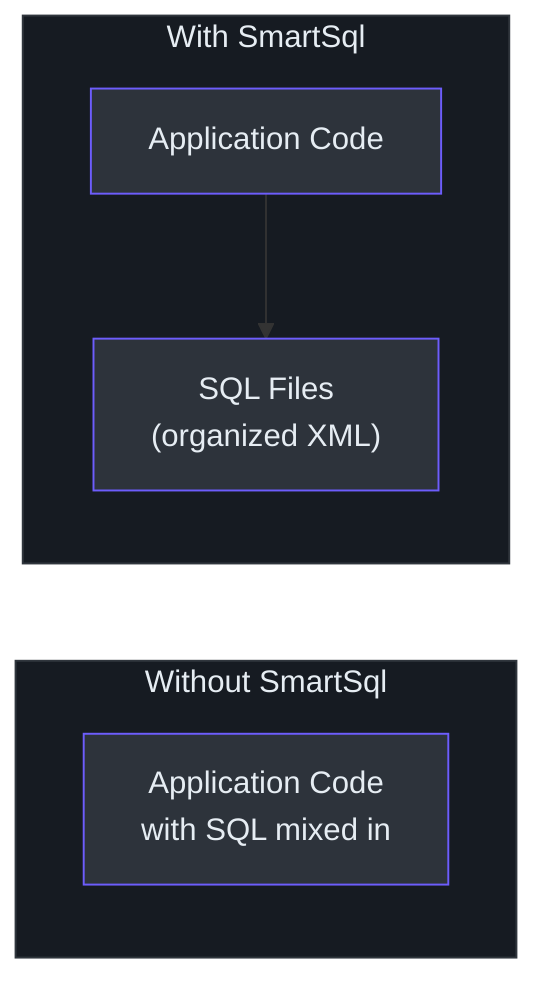
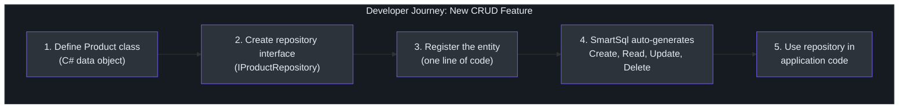
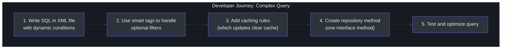
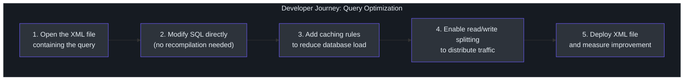
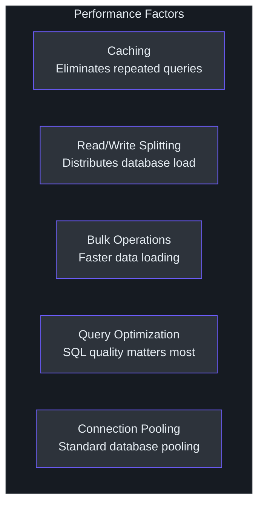
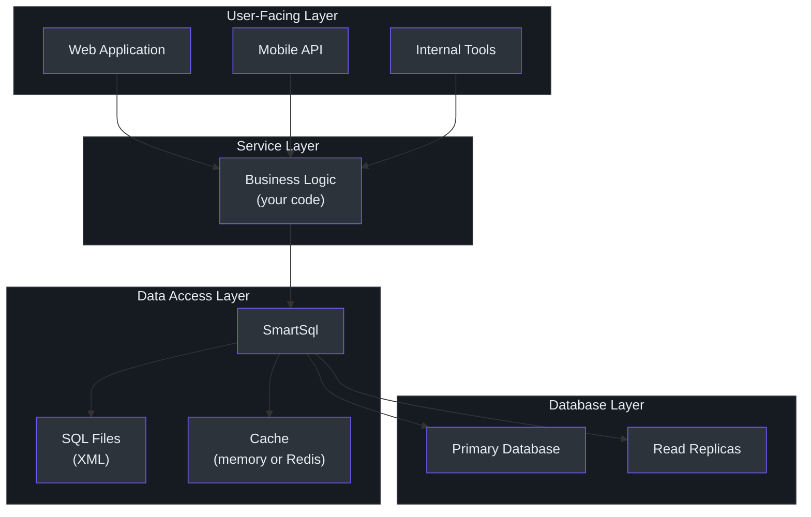

# 产品经理指南

本指南用通俗语言为产品经理和非工程利益相关者解释 SmartSql。它关注 SmartSql 能做什么、开发者的使用体验如何，以及它的优势和局限性对你的产品路线图意味着什么。

---

## SmartSql 做什么（通俗语言）

SmartSql 是一个帮助软件应用程序与数据库通信的工具。当你的应用需要保存或检索数据（用户资料、订单、库存等）时，它需要向数据库发送指令。SmartSql 管理这些指令。

与其他工具的关键区别：**SmartSql 将数据库指令存储在单独的 XML 文件中**，而非混入应用程序的源代码。可以把它想象成拥有一个专用的文件柜来存放所有数据库指令，而不是把它们分散在整个笔记本中。

<!-- Sources: sample/SmartSql.Sample.AspNetCore/Maps/User.xml -->

---

## 功能能力地图

### 开发者可以使用 SmartSql 做什么

| 功能 | 对你产品的意义 |
|------|--------------|
| **SQL 在 XML 文件中** | 数据库查询组织在专用文件中。团队可以在不理解完整应用代码的情况下审查和优化查询。 |
| **智能查询** | 开发者可以编写根据用户提供的数据自动调整的查询。例如，如果搜索表单有可选过滤器，查询只包含用户实际填写的过滤器。 |
| **读写分离** | 系统可以自动将"读"请求（如查看产品页面）发送到数据库副本，将"写"请求（如下单）发送到主数据库。这在无需额外基础设施的情况下提升性能。 |
| **内置缓存** | 频繁请求的数据可以临时存储在快速访问内存（或 Redis）中，这样不需要每次都查询数据库。这减少了加载时间和数据库成本。 |
| **自动生成数据访问** | 对于标准操作（创建、读取、更新、删除），开发者可以定义一个简单的接口，SmartSql 自动生成底层代码。这减少了常规功能的开发时间。 |
| **事务安全** | 多步骤操作（如账户间转账）可以包装在安全网中：要么所有步骤都成功，要么都不生效。 |
| **批量数据导入** | 大批量数据可以快速加载，这对数据迁移、导入和批处理很有用。 |
| **数据同步** | 数据更改可以自动发送到消息系统（Kafka、RabbitMQ）供其他服务消费。这支持实时数据管道。 |

### 支持的数据库

SmartSql 支持所有主要数据库：SQL Server、MySQL、PostgreSQL、SQLite 和 Oracle。它还支持任何具有标准 .NET 连接器的数据库。

---

## 开发者体验：用户旅程图

### 旅程 1：标准 CRUD 新功能

这是开发者添加典型功能（如管理"Product"实体）的旅程。

<!-- Sources: src/SmartSql.DyRepository/IRepository.cs, src/SmartSql/CUD/ -->

**时间估计**：熟悉系统的开发者几个小时。标准操作的自动生成消除了最重复的工作。

### 旅程 2：自定义复杂查询

这是开发者构建更复杂功能（如带多个可选过滤器的高级搜索）的旅程。

<!-- Sources: sample/SmartSql.Sample.AspNetCore/Maps/User.xml -->

**时间估计**：半天到一天。XML 编写需要一些学习，但产生的查询易于独立审查和优化。

### 旅程 3：性能优化

当查询变慢时，优化工作流是精简的：

<!-- Sources: src/SmartSql/Middlewares/CachingMiddleware.cs, src/SmartSql/DataSource/DataSourceFilter.cs -->

---

## 性能概览

### 速度如何？

SmartSql 对数据库操作增加的开销最小。实际花在 SmartSql 代码中的时间只是总请求时间的一小部分 -- 数据库查询本身占主导。实际上：

- **简单查询**（按 ID 获取用户）：开销可忽略不计（微秒）。数据库往返决定响应时间。
- **复杂查询**（带多个过滤器的搜索）：查询构建增加少量处理时间，但与数据库执行相比微不足道。
- **缓存查询**：当数据在缓存中时，响应显著更快 -- 完全不需要数据库往返。
- **批量操作**：使用 SmartSql 的批量插入，加载数千条记录比逐条插入快得多。

### 影响性能的因素

<!-- Sources: src/SmartSql/Middlewares/CachingMiddleware.cs, src/SmartSql/Middlewares/CommandExecuterMiddleware.cs -->

最大的性能杠杆始终是 SQL 本身的质量。SmartSql 的 XML 方法使 SQL 更易于阅读和优化，从而可以带来更好的整体应用性能。

---

## 已知局限性

了解局限性有助于你围绕它们进行规划。

| 局限性 | 影响 | 解决方法 |
|--------|------|---------|
| **无数据库迁移工具** | SmartSql 不包含在数据模型更改时自动更新数据库架构的工具。 | 使用单独的迁移工具（Flyway、DbUp 或手动脚本）。许多团队已有迁移流程。 |
| **XML 是运行时检查的** | 如果 XML 文件中有拼写错误或错误，只在应用运行时才会发现，而非编译时。 | 在构建/CI 流水线中包含 XML 验证。SmartSql 提供 XML 架构（XSD）文件用于验证。 |
| **社区比替代方案小** | 与最流行的 .NET ORM 相比，博客文章、教程和 Stack Overflow 答案较少。 | 文档和代码库结构良好。MyBatis 社区（Java）有大量可迁移的知识。 |
| **无可视化查询构建器** | 没有图形化工具用于构建查询。开发者直接使用 XML。 | IDE 的 XML 编辑插件提供语法高亮和验证。XML 格式简单直接。 |
| **XML SQL 的学习曲线** | 不熟悉基于 XML SQL 管理的开发者需要 1-2 周才能高效工作。 | MyBatis 文档是很好的参考。这些模式已经很成熟。 |

---

## SmartSql 如何融入你的技术栈

### 典型集成

<!-- Sources: src/SmartSql.DIExtension/SmartSqlDIExtensions.cs, src/SmartSql/DataSource/Database.cs -->

SmartSql 位于业务逻辑和数据库之间。它不是一个完整的应用框架 -- 它专门关注数据库访问。你的业务逻辑、API 层和用户界面使用其他工具和框架构建。

---

## 常见问题

**问：我们的开发者需要学习一个全新的系统吗？**
答：SmartSql 建立在标准 .NET 模式之上。已经熟悉 .NET 数据库访问的开发者会认出底层概念。主要的新技能是在 XML 文件中编写 SQL，这遵循来自 Java 生态系统（MyBatis）的成熟模式。预计 1-2 周的上手时间。

**问：我们可以将它与现有的数据库代码一起使用吗？**
答：可以。SmartSql 是一个库，而非框架。它可以添加到应用的特定部分，不影响现有代码。团队通常渐进式采用 -- 从一个服务或功能开始。

**问：如果 SmartSql 项目停止维护会怎样？**
答：SmartSql 是在 MIT 许可证下的开源项目。代码可以 fork 并独立维护。它使用标准 .NET 接口，因此迁移走需要替换数据访问层 -- 这是一个重大但可控的工作量。

**问：它能与我们的数据库一起工作吗？**
答：如果你的数据库有 .NET 连接器（所有主要数据库都有），SmartSql 就能与之配合。对 SQL Server、MySQL、PostgreSQL、SQLite 和 Oracle 有完整的一等支持。

**问：它安全吗？**
答：安全。SmartSql 默认使用参数化查询，这是防止 SQL 注入攻击的标准防线。用户输入永远不会直接拼接到 SQL 字符串中。

**问：它如何影响部署？**
答：包含 SQL 的 XML 文件与应用一起部署。它们通常包含在部署包中。SQL 更改（在 XML 文件中）可以在不重新编译应用代码的情况下部署，这可以简化某些类型的更新。

**问：它能处理我们的规模吗？**
答：SmartSql 在生产环境中使用。它支持水平扩展（添加更多应用实例）、数据库读副本（自动负载分配）和缓存（减少数据库负载）。库本身增加的开销可忽略不计 -- 数据库和查询质量是典型的瓶颈。

**问：监控和故障排查呢？**
答：SmartSql 发出诊断事件，可与 .NET 监控工具集成（Application Insights、Prometheus、SkyWalking 等）。开发者可以看到哪些查询正在运行、运行了多长时间以及是否命中了缓存。

**问：它花费多少？**
答：SmartSql 是免费开源的（MIT 许可证）。成本是采用、学习和维护的工程时间 -- 与任何数据库访问库相当。

---

## 术语表

| 术语 | 通俗解释 |
|------|---------|
| **ORM** | 帮助应用代码与数据库通信的工具，通过在两种格式之间进行翻译 |
| **XML** | 一种用于存储数据的结构化文本格式。在 SmartSql 中，它存储数据库指令 |
| **SQL** | 用于与数据库通信的语言（例如"获取所有状态为活跃的用户"） |
| **中间件** | 链中的一个处理步骤。SmartSql 通过一系列步骤处理每个数据库请求（构建查询、检查缓存、路由到正确的数据库、执行、返回结果） |
| **读写分离** | 自动将"读"请求（如查看数据）发送到数据库副本，将"写"请求（如保存数据）发送到主数据库 |
| **缓存** | 将频繁请求的数据临时存储在快速访问内存中，以避免每次都查询数据库 |
| **LRU 缓存** | 最近最少使用 -- 一种缓存策略，当缓存满时移除最近最少访问的项目 |
| **仓库** | 处理特定类型数据访问的组件（例如"Product 仓库"处理所有产品相关的数据库操作） |
| **事务** | 一组必须全部成功或全部失败的数据库操作，确保数据一致性 |
| **批量插入** | 一次向数据库加载多条记录，比逐条加载快得多 |
| **动态仓库** | SmartSql 功能，自动从简单的接口定义创建数据访问代码 |
| **类型处理器** | 在应用数据类型和数据库数据类型之间进行转换的组件 |
| **Redis** | 一种流行的内存数据存储，用于缓存。SmartSql 可以使用 Redis 在多个应用实例之间共享缓存 |
| **Kafka / RabbitMQ** | 消息流系统。SmartSql 可以将数据更改发送到这些系统供其他服务消费 |
| **DiagnosticSource** | .NET 功能，用于发出监控工具可以收集的性能和行为数据 |
