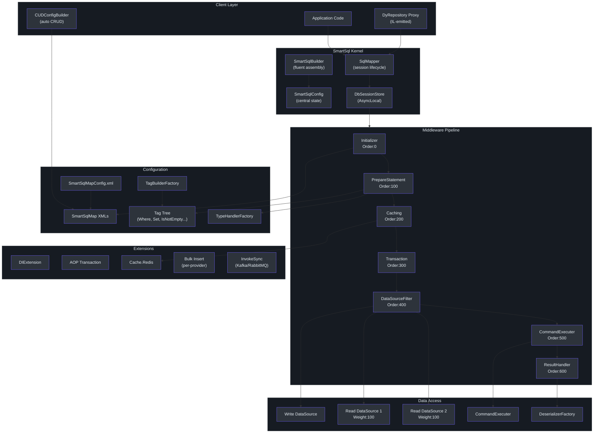
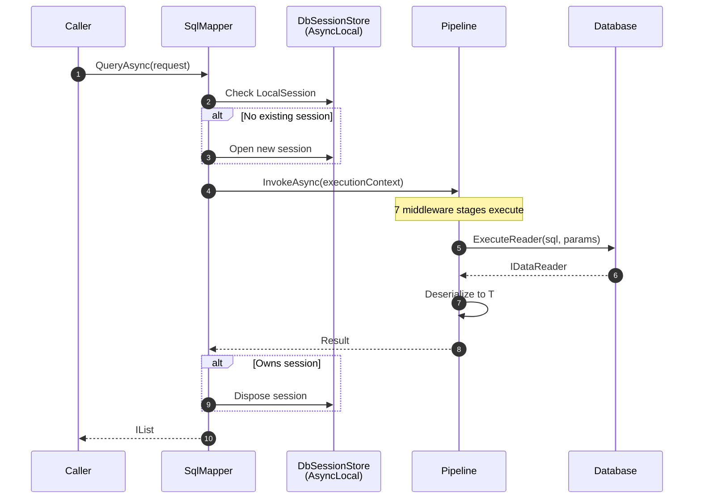
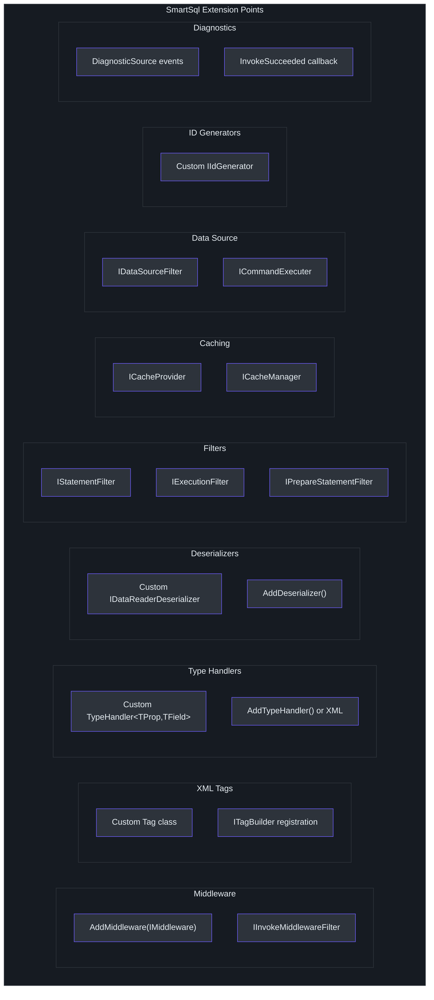
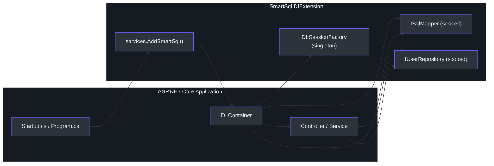

# 高级工程师指南

本指南提供对 SmartSql 密集的、带有观点的架构分析。它面向评估、扩展或在生产系统中主导采用 SmartSql 的高级和首席工程师。

---

## 核心洞察

SmartSql 将 MyBatis 风格的 XML SQL 管理带入 .NET 生态系统。这不仅仅是一个技术特性 -- 它是一种哲学承诺，即 **SQL 作为一等制品**而非事后生成的附属品。

在 EF Core 中，SQL 从 LINQ 表达式派生。在 Dapper 中，SQL 作为字符串字面量嵌入在 C# 代码中。SmartSql 将 SQL 外部化到 XML 文件中，使其成为一个独立的、可审查的、受版本控制的制品。这一个设计决策塑造了系统中的所有其他架构选择。

实际后果是：DBA 可以在不阅读 C# 的情况下审查和优化 SQL。运维团队可以通过编辑 XML 来修改查询行为，而无需重新编译。SQL 不是实现细节 -- 它是一个契约。

---

## 系统架构

### 完整架构图


<!-- Sources: src/SmartSql/SmartSqlBuilder.cs, src/SmartSql/Configuration/SmartSqlConfig.cs, src/SmartSql/SqlMapper.cs -->

### 请求生命周期


<!-- Sources: src/SmartSql/SqlMapper.cs:90-111, src/SmartSql/SqlMapper.cs:143-164 -->

会话所有权模型很重要：`SqlMapper` 遵循"谁打开，谁释放" -- 如果它打开了会话，它就释放它。如果调用者已有活跃会话（例如通过 `BeginTransaction()`），mapper 会复用它而不释放。

---

## 设计权衡分析

### XML vs Attributes vs Code-First

| 维度 | XML（SmartSql） | Attributes（Dapper/RepoDB） | Code-First（EF Core） |
|------|----------------|---------------------------|---------------------|
| **SQL 可见性** | 优秀 -- 专用 XML 文件 | 差 -- SQL 埋在代码中 | 差 -- SQL 在运行时生成 |
| **DBA 协作** | 强 -- XML 对 DBA 可读 | 弱 -- 需要 C# 熟练度 | 很弱 -- 不透明的生成 |
| **动态 SQL** | 丰富的标签系统（`Where`、`Switch`、`For`） | 字符串拼接或手动 | LINQ 组合 |
| **重构安全性** | 弱 -- XML 不被 C# 重构工具跟踪 | 强 -- 编译时检查 | 强 -- 编译时检查 |
| **代码生成** | XML 易于模板化/生成 | 更难模板化 | 成熟的工具（迁移） |
| **版本控制差异** | 清晰 -- XML 差异可读 | 混合 -- 代码差异混淆逻辑和 SQL | 差 -- 迁移文件可能很杂乱 |
| **运行时灵活性** | 高 -- XML 可从多种来源加载 | 低 -- 编译到程序集中 | 中 -- 一些运行时配置 |

**SmartSql 的赌注**：SQL 重要到足以拥有自己的文件格式，与应用代码分开管理。这在数据库性能是优先考虑且 DBA 参与查询优化的团队中回报最大。

### 中间件管道 vs 直接执行

SmartSql 的中间件管道是其最复杂的架构特性。每个 SQL 操作遍历 7 个中间件阶段，每个阶段都有明确定义的职责。

**优势**：

- 清晰的关注点分离（初始化、SQL 构建、缓存、事务、路由、执行、反序列化）
- 每个中间件可独立测试
- 自定义中间件可以在管道的精确位置插入
- 缓存和事务行为是声明式的，而非命令式的
- 短路能力（例如缓存命中完全跳过执行）

**代价**：

- 每个请求分配 `ExecutionContext`、`AbstractRequestContext` 和 `ResultContext`
- 链表遍历开销（与 I/O 相比可忽略不计）
- 调试需要理解哪个中间件对给定行为负责
- 管道排序是隐式的（按 `Order` 整数）而非显式的（按组合）

**观点**：中间件管道是需要支持多样化横切关注点（缓存、事务、路由、诊断）的 ORM 的正确架构。代价很小 -- 管道开销与数据库 I/O 相比微不足道。该架构镜像了 ASP.NET Core 中间件模型，.NET 开发者对此非常熟悉。

### 会话管理策略

SmartSql 使用 `AsyncLocal<IDbSession>` 进行会话存储，支持跨异步调用链的环境会话传播。这类似于 .NET 中 `TransactionScope` 的工作方式。

关键设计选择：**SqlMapper 中的自动会话生命周期**。如果不存在会话，则每个操作打开并释放一个。如果存在会话（由 `BeginTransaction()` 或 AOP `[Transaction]` 特性启动），则复用它。

这是务实的，但有以下影响：

- 没有显式事务时，每个操作获得自己的连接（无连接池问题，但也没有事务批处理）
- 有显式事务时，调用者必须管理生命周期
- AOP `[Transaction]` 特性提供声明式事务边界

---

## 比较矩阵

### SmartSql vs EF Core vs Dapper vs RepoDB

| 标准 | SmartSql | EF Core | Dapper | RepoDB |
|------|----------|---------|--------|--------|
| **SQL 控制** | 完全 -- XML 声明 | 部分 -- LINQ 生成 | 完全 -- 内联字符串 | 完全 -- 流式/内联 |
| **动态 SQL** | 丰富的 XML 标签 | LINQ 组合 | 手动字符串拼接 | 流式条件 |
| **缓存** | 内置 LRU/FIFO/Redis | 二级（第三方） | 无 | 无 |
| **读写分离** | 内置加权路由 | 通过 DI 手动 | 手动 | 手动 |
| **批量操作** | 内置按提供程序 | EF Extensions | SqlBulkCopy | Bulk operations |
| **仓库模式** | IL 发射的动态代理 | 手动或泛型仓库 | 手动 | 手动 |
| **事务管理** | AOP 特性 + 编程式 | TransactionScope / SaveChanges | 手动（TransactionScope） | 手动 |
| **诊断** | DiagnosticSource 事件 | DiagnosticSource 事件 | 无 | 无 |
| **架构迁移** | 无 | 内置 | 无 | 无 |
| **变更跟踪** | 可选（PropertyChangedTrack） | 内置 | 无 | 无 |
| **学习曲线** | 中 | 高 | 低 | 低到中 |
| **异步支持** | 完全 | 完全 | 完全 | 完全 |
| **连接管理** | 自动（每操作会话） | DbContext 池化 | 手动 | 手动 |

### SmartSql 获胜的场景

- 将 SQL 视为一等关注点并想要 DBA 友好工作流的团队
- 需要读写分离而无需外部基础设施的系统
- 从声明式缓存（LRU/Redis）中受益而无需额外库的应用
- 从 Java/MyBatis 迁移并在 .NET 中想要熟悉模式的项目
- 具有复杂动态查询需求且在 XML 中比 C# 字符串构建中更清晰的系统

### SmartSql 失败的场景

- 强烈偏好编译时安全性和代码生成工具的团队（EF Core 获胜）
- Dapper 最小开销就足够的简单 CRUD 应用
- 需要数据库迁移的项目（EF Core 是唯一成熟的选项）
- 拒绝将 SQL 与应用代码分开管理的团队

---

## 性能特性

### 开销分析

SmartSql 的每次查询开销来自：

1. **XML 标签评估**：遍历标签树以构建 SQL 字符串。这是带有条件检查的 CPU 密集型字符串拼接。对于简单查询，这可以忽略不计（<1ms）。对于深层嵌套的标签树，它与标签数量线性增长。

2. **管道遍历**：7 个中间件阶段，每个做最少的工作（主要是空检查和委托）。与 I/O 相比实际上免费。

3. **参数绑定**：类型处理器将 .NET 值转换为数据库参数。`AbstractTypeHandler` 对热路径使用 `MethodImpl(AggressiveInlining)`。

4. **结果反序列化**：`EntityDeserializer` 使用 `IObjectFactoryBuilder`（默认：基于表达式树）来创建和填充对象。首次调用成本较高（由于表达式编译）；后续调用很快。

5. **会话管理**：`AsyncLocal` 访问成本低。"谁打开，谁释放"模型意味着每次独立操作有一次连接获取/释放。

### 基准测试基础设施

SmartSql 在 [`src/SmartSql.Test.Performance/`](https://github.com/dotnetcore/SmartSql/blob/master/src/SmartSql.Test.Performance/) 中包含 BenchmarkDotNet 测试。这些测量原始 mapper 操作，可用于检测性能回归。

### 性能调优点

- **XML 标签复杂度**：更简单的标签树构建 SQL 更快。当扁平设计足够时，避免深层嵌套的条件结构。
- **缓存**：内置 LRU 缓存对缓存命中完全消除 I/O。`CachingMiddleware` 在命中时短路剩余的管道阶段。
- **读写分离**：将读取分布到副本上减少主库的负载。
- **批量插入**：使用 `SmartSql.Bulk.*` 提供程序进行大批量操作，而不是逐行插入。
- **类型处理器选择**：自定义类型处理器可以针对特定转换模式进行优化。
- **连接字符串池化**：标准 ADO.NET 连接池化适用。SmartSql 不添加自己的池化层。

---

## 扩展点和自定义策略

### 扩展点地图


<!-- Sources: src/SmartSql/SmartSqlBuilder.cs:331-395, src/SmartSql/Configuration/SmartSqlConfig.cs:22-46 -->

### 自定义策略建议

1. **横切关注点**（日志、指标、审计）：通过 `AddMiddleware()` 使用自定义中间件。将其放在正确的 `Order` 上以在所需点进行拦截。

2. **自定义 SQL 行为**：使用自定义 XML 标签处理特定领域的 SQL 模式。通过配置中的 `<TagBuilders>` 注册。

3. **特殊类型**：使用自定义类型处理器处理复杂的 .NET 类型（加密字段、压缩数据、自定义值对象）。

4. **自定义结果处理**：实现 `IDataReaderDeserializer` 处理非标准结果形状（例如图反序列化、DDD 值对象映射）。

5. **数据源路由**：实现 `IDataSourceFilter` 用于超出加权轮询的自定义路由逻辑（例如基于地理位置的路由、基于延迟的路由）。

6. **自定义 ID 生成**：实现 `IIdGenerator` 用于 UUID v7、ULID 或数据库顺序 ID 策略。

7. **APM 集成**：订阅 `DiagnosticSource` 事件或使用 `InvokeSucceeded` 回调进行指标和追踪。

---

## 决策日志：架构选择

### D1：XML 基于代码的 SQL 管理

**决策**：SQL 语句在 XML 文件中定义，而非在 C# 代码中。

**理由**：SQL 与应用逻辑的分离实现了 DBA 协作、独立版本控制和运行时 XML 加载。这镜像了在 Java 企业系统中已被证明成功的 MyBatis 方法。

**后果**：失去了编译时 SQL 验证。XML 中的拼写错误是运行时错误。IDE 对 XML SQL 的支持相比 LINQ 有限。

### D2：链表中间件管道

**决策**：SQL 执行通过由 `Next` 指针链接的中间件对象链进行，按整数 `Order` 排序。

**理由**：每个横切关注点（初始化、SQL 构建、缓存、事务、路由、执行、反序列化）隔离在自己的中间件中。管道可以在不修改现有代码的情况下进行扩展。

**后果**：调试需要跟踪管道。按整数隐式排序在两个中间件使用相同顺序值时可能很脆弱。

### D3：AsyncLocal 会话存储

**决策**：会话状态存储在 `AsyncLocal<IDbSession>` 中，支持跨异步调用链的环境传播。

**理由**：这是 .NET 环境上下文的标准模式（类似于 `TransactionScope`、`ExecutionContext`）。它与 `async/await` 正确配合工作，不需要显式参数传递。

**后果**：会话生命周期绑定到异步调用链。生成并行任务的代码可能不共享同一会话。

### D4：IL-Emit 动态仓库

**决策**：仓库接口在运行时通过 IL emit 实现，而非通过 Roslyn 源代码生成器或反射。

**理由**：IL emit 产生的运行时类型具有高性能（无每次调用的反射开销）。这是 .NET Framework 时代的标准方法。

**后果**：没有仓库接口与 XML 语句兼容性的编译时验证。IL emit 代码比源生成代码更难调试。

### D5：加权读写分离

**决策**：读数据源通过加权随机选择进行选举。权重在 XML 中配置。

**理由**：对于常见的读副本拓扑简单有效。加权随机提供自然的负载分配，无需外部负载均衡器。

**后果**：没有内置健康检查或断路器。如果读副本宕机，应用将经历连接失败，直到权重被手动调整或副本恢复。

### D6：声明式缓存失效

**决策**：缓存在 XML 中声明失效（`FlushOnExecute`），而非在应用代码中。

**理由**：使缓存管理接近 SQL 定义。SQL 映射的作者声明哪些写操作应该刷新哪些缓存。

**后果**：仅语句级别的粒度。没有实体级别或行级别的缓存失效。复杂的缓存失效模式（例如跨聚合）需要外部解决方案。

### D7：C# 7.3 / netstandard2.0 目标

**决策**：核心库目标为 netstandard2.0，C# 7.3。

**理由**：在 .NET Framework 4.6.1+、.NET Core 2.0+ 和 .NET 5+ 之间实现最大兼容性。确保 SmartSql 在传统和现代环境中都能工作。

**后果**：不能使用较新的 C# 特性（可空引用类型、模式匹配增强、records、spans）。较新运行中可用的性能优化未被利用。

---

## 集成模式

### ASP.NET Core 集成


<!-- Sources: src/SmartSql.DIExtension/SmartSqlDIExtensions.cs -->

`DIExtension` 提供 `services.AddSmartSql()`，注册构建器、mapper、会话工厂，以及可选地扫描程序集中的仓库接口以注册为动态代理。

### AOP 事务模式

`[Transaction]` 特性（使用 AspectCore）提供声明式事务管理：

```csharp
[Transaction(Alias = "SmartSql", Level = IsolationLevel.ReadCommitted)]
public async Task TransferFunds(int fromId, int toId, decimal amount)
{
    await _accountRepo.DebitAsync(fromId, amount);
    await _accountRepo.CreditAsync(toId, amount);
}
```

拦截器检查是否存在现有会话。如果不存在，它打开一个会话、开始事务，并在方法完成后释放会话。

---

## 风险评估

### 成熟度

- SmartSql 自早期版本以来一直在生产中运行（当前 4.1.68），表明持续开发。
- 架构稳定 -- 中间件管道模式没有根本变化。
- 目标框架（netstandard2.0）确保广泛兼容性，但限制了对现代 .NET 性能改进的访问。

### 社区

- 项目托管在 `dotnetcore` GitHub 组织下。
- 主要作者是 Ahoo Wang。
- 代码库显示一致的质量和清晰的关注点分离。

### .NET 生态系统适配

- SmartSql 占据独特的生态位：没有其他 .NET ORM 提供具有相同特性集的 MyBatis 风格 XML SQL 管理。
- 它与 Dapper（简洁性）和 EF Core（生态系统工具）间接竞争，但提供不同的权衡。
- 对于从 Java/MyBatis 迁移的团队，SmartSql 提供最接近的 .NET 等价物。

### 运维考虑

- XML 配置文件需要与应用一起部署（通常在内容根目录）。
- XML 语法错误是运行时错误，而非编译时错误。CI/CD 流水线应包含 XML 验证。
- `SmartSqlMapConfig.xml` 和映射文件应以与 C# 代码相同的严格性在源代码控制中。

---

## 关键文件参考

| 组件 | 文件 | 架构意义 |
|------|------|---------|
| 运行时组装 | [`src/SmartSql/SmartSqlBuilder.cs`](https://github.com/dotnetcore/SmartSql/blob/master/src/SmartSql/SmartSqlBuilder.cs) | 编排所有组件创建的流式构建器 |
| 中央状态 | [`src/SmartSql/Configuration/SmartSqlConfig.cs`](https://github.com/dotnetcore/SmartSql/blob/master/src/SmartSql/Configuration/SmartSqlConfig.cs) | 持有所有运行时状态的上帝对象 |
| 查询入口 | [`src/SmartSql/SqlMapper.cs`](https://github.com/dotnetcore/SmartSql/blob/master/src/SmartSql/SqlMapper.cs) | 会话生命周期管理 + 查询分发 |
| 管道基类 | [`src/SmartSql/Middlewares/AbstractMiddleware.cs`](https://github.com/dotnetcore/SmartSql/blob/master/src/SmartSql/Middlewares/AbstractMiddleware.cs) | 带有过滤器支持的链表中间件 |
| SQL 构建 | [`src/SmartSql/Middlewares/PrepareStatementMiddleware.cs`](https://github.com/dotnetcore/SmartSql/blob/master/src/SmartSql/Middlewares/PrepareStatementMiddleware.cs) | XML 标签树评估和 DbParameter 创建 |
| 数据路由 | [`src/SmartSql/DataSource/DataSourceFilter.cs`](https://github.com/dotnetcore/SmartSql/blob/master/src/SmartSql/DataSource/DataSourceFilter.cs) | 加权读/写选举 |
| 仓库代理 | [`src/SmartSql.DyRepository/EmitRepositoryBuilder.cs`](https://github.com/dotnetcore/SmartSql/blob/master/src/SmartSql.DyRepository/EmitRepositoryBuilder.cs) | IL emit 代理生成 |
| AOP 事务 | [`src/SmartSql.AOP/TransactionAttribute.cs`](https://github.com/dotnetcore/SmartSql/blob/master/src/SmartSql.AOP/TransactionAttribute.cs) | 声明式事务拦截器 |
| DI 集成 | [`src/SmartSql.DIExtension/SmartSqlDIExtensions.cs`](https://github.com/dotnetcore/SmartSql/blob/master/src/SmartSql.DIExtension/SmartSqlDIExtensions.cs) | ASP.NET Core 服务注册 |
| 标签基类 | [`src/SmartSql/Configuration/Tags/Tag.cs`](https://github.com/dotnetcore/SmartSql/blob/master/src/SmartSql/Configuration/Tags/Tag.cs) | 所有 XML 动态标签的抽象基类 |
| 类型处理器 | [`src/SmartSql/TypeHandlers/AbstractTypeHandler.cs`](https://github.com/dotnetcore/SmartSql/blob/master/src/SmartSql/TypeHandlers/AbstractTypeHandler.cs) | 类型转换基类 |
| 版本 | [`build/version.props`](https://github.com/dotnetcore/SmartSql/blob/master/build/version.props) | 版本的唯一真实来源 |

---

## 总结

SmartSql 是一个成熟的、有明确观点的 ORM，它做出了一个清晰的架构赌注：SQL 属于 XML，而不是代码。中间件管道提供了横切关注点的清晰分离。扩展模型（自定义中间件、标签、类型处理器、反序列化器、数据源过滤器）覆盖了自定义需求的全部表面区域。内置的读写分离和缓存减少了额外基础设施的需求。

权衡是真实的：没有编译时 SQL 验证，没有迁移工具，XML 文件和 C# 接口之间的隐式耦合需要纪律。但对于重视 SQL 可见性和 DBA 协作的团队，SmartSql 是 .NET 生态系统中最强大的选择。
